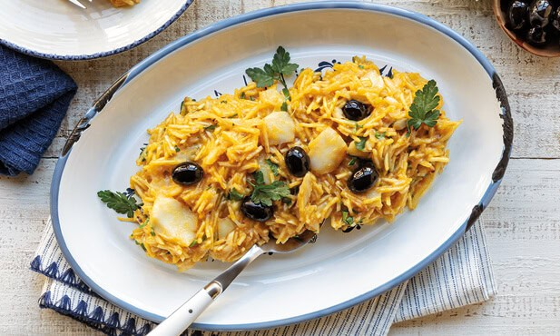

# Bacalhau à Brás

*Lisbon's most-loved bacalhau: shredded salt cod scrambled with matchstick fries, soft caramelised onion, eggs and parsley, held by the egg.*

**Serves:** 4

**Prep Time:** 20 minutes (plus overnight desalting)

**Cook Time:** 25 minutes

## Overview
Bacalhau à Brás is the dish Portugal turns to when the salt cod, the onions and the eggs all need to find their place in one pan: scrambled together with a tangle of fine matchstick chips so the whole thing reads as somewhere between a hash and a loose carbonara. The salt cod needs the usual day or two of cold soaks to draw the salt down, then a brief simmer to soften it; the onions take their time in olive oil with a few smashed garlic cloves until almost jam-like; the matchstick chips (palha) are fried separately so they stay crisp. Everything comes together in a wide pan, the eggs are whisked in over a low heat, and you stop the moment the eggs coat the cod and potato like a sauce. Never let them set firm. Olives, parsley and a wedge of lemon at the table.

## Ingredients

- 600 g salt cod (bacalhau)
- 600 g potatoes (cut into matchsticks, 4-5 mm thick - palha cut)
- Vegetable oil (for deep-frying - about 800 ml)
- 5 tablespoons olive oil
- 3 onions (large, sliced thin)
- 6 garlic cloves (crushed)
- 6 eggs (large, lightly beaten)
- 1 teaspoon salt (or to taste)
- ½ teaspoon black pepper
- A small bunch flat-leaf parsley (chopped)

### To serve
- A handful of black olives (oil-cured)
- 1 lemon (cut into wedges)

## Method

### Stage 1 - Desalt the cod
1. Rinse the salt cod under cold running water 2 minutes.
1. Place in a large bowl; cover with cold water by 5 cm.
1. Refrigerate 24-48 hours, changing the water every 6-8 hours. Taste a small piece on the second day - it should be lightly salted, not aggressively so.

### Stage 2 - Poach and shred
1. Bring a wide pan of fresh water to a gentle simmer.
1. Add the desalted cod; poach 5 minutes (don't boil hard or it goes tough).
1. Lift out; cool slightly. Pull the flesh from the skin and bones; flake into small shreds. Set aside.

### Stage 3 - Fry the potatoes
1. Heat the vegetable oil in a deep pan to 175°C.
1. Fry the matchstick potatoes in 2-3 batches for 3-4 minutes per batch until pale gold and crisp.
1. Drain on kitchen paper. Salt lightly. (Or: use ready-made shoestring fries to save time - about 200 g of pre-fried.)

### Stage 4 - Onions
1. Heat the olive oil in a wide heavy pan over medium-low heat.
1. Add the onions; cook 12-15 minutes until very soft and lightly golden.
1. Stir in the garlic; cook 1 minute.

### Stage 5 - Combine
1. Add the shredded cod to the onions; toss for 1 minute.
1. Add the fried potato sticks; toss to combine.

### Stage 6 - Eggs
1. Reduce the heat to low.
1. Beat the eggs with the salt and black pepper.
1. Pour into the pan; stir gently and continuously with a wooden spoon for 1-2 minutes - the eggs should just-coat everything, like a loose risotto, never fully set.

### Stage 7 - Serve
1. Off the heat, stir in most of the parsley.
1. Pile onto plates; top with olives, the remaining parsley, and a wedge of lemon.
1. Eat immediately.

## Notes
- **Don't overcook the eggs:** This is the make-or-break step. Pull off the heat the moment the eggs look just-set; they'll continue cooking from residual heat. Hard-scrambled eggs ruin the dish.
- **Matchstick fries, not chips:** Thin shoestring fries are correct; thick chips give a stodgy result. Pre-fried at 175°C for 3-4 minutes is right.
- **Quality of salt cod matters:** Look for thick centre-cut bacalhau at Portuguese / Mediterranean grocers. Frozen bacalhau is fine; vacuum-pack supermarket varieties tend to be over-salted scraps.

## Storage
- Best fresh; the eggs go rubbery on reheat. Eat the day made.
