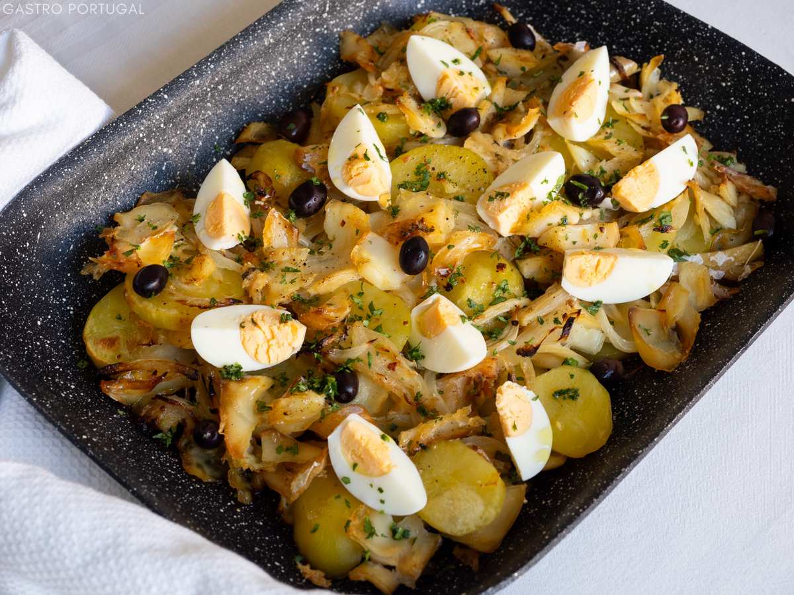

# Bacalhau à Gomes de Sá

*Portugal's salt cod and potato bake: layers of desalted salt cod, sliced potato, caramelised onions, garlic and black olives, baked with olive oil till the top crisps golden, finished with quartered hard-boiled eggs and fresh parsley. The Porto-Portuguese classic, one of Portugal's "365 ways with bacalhau" traditional dishes.*

**Serves:** 6

**Prep Time:** 30 minutes (plus overnight cod desalting)

**Cook Time:** 50 minutes

## Overview
Bacalhau à Gomes de Sá is one of Portugal's most iconic salt cod dishes. Portugal has a folk saying of "365 ways with bacalhau", one for every day of the year, and this is one of the most beloved: layers of desalted salt cod (shredded or in chunks), sliced boiled potatoes, deeply caramelised onions, garlic and pitted black olives, all bound with plenty of olive oil and baked till the top crisps slightly golden. Finished with quartered hard-boiled eggs scattered over and fresh chopped parsley. Invented in Porto in the 19th century by José Luís Gomes de Sá, a salt-cod merchant who reportedly gave the recipe away free with his cod sales as a marketing strategy. The salt cod must be properly desalted: 18 to 24 hours in cold water with multiple changes. The onions must be cooked deeply, slowly, till deep gold; rushed onions ruin the dish. The olive oil is generous: it is a key flavour, not just a cooking medium.

## Ingredients

### Salt cod
- 600 g salt cod (bacalhau); desalted (see method)

### Potatoes
- 1 kg waxy potatoes (Maris Piper or similar; left whole with skin)

### Onions
- 4 large onions (sliced into thin half-moons)
- 8 garlic cloves (sliced)
- 6 tablespoons extra virgin olive oil (more for drizzling)

### Other ingredients
- 4 large eggs (hard-boiled)
- 120 g pitted black olives (the traditional Portuguese cured black olives)
- 1 small bunch fresh flat-leaf parsley (chopped)
- 2 bay leaves
- 1 teaspoon dried oregano
- 1 teaspoon fine sea salt (taste; cod is salty)
- 1 teaspoon ground black pepper
- 100 ml extra virgin olive oil (for finishing the dish)

## Method

### Stage 1 - Desalt the cod (the night before)
1. Place the salt cod in a wide bowl.
2. Cover with cold water by 5 cm; refrigerate.
3. Change the water every 4-6 hours for 18-24 hours.
4. Test by tasting a small piece - should be pleasantly salty.
5. Drain.

### Stage 2 - Cook the cod
1. Place desalted cod in a saucepan; cover with cold water.
2. Bring to a simmer; cook 8-10 minutes till the cod flakes easily.
3. Lift out; cool slightly.
4. Remove skin and bones; flake or shred into chunky pieces.

### Stage 3 - Boil the potatoes
1. Place whole potatoes (with skin) in a pot of salted water.
2. Boil 25-30 minutes till tender.
3. Drain; cool slightly; peel; slice into 5-mm rounds.

### Stage 4 - Caramelise the onions
1. Heat 6 tablespoons of olive oil in a wide pan over medium-low heat.
2. Add the sliced onions; cook slowly for 18-22 minutes, stirring occasionally, till deeply golden and sweet.
3. Add the sliced garlic; cook 2 minutes more.
4. Add the bay leaves, oregano, pepper.
5. Take off the heat.

### Stage 5 - Assemble
1. Preheat the oven to 200°C (400°F).
2. Choose a wide ovenproof baking dish (25 cm × 30 cm).
3. Layer half the potato slices on the bottom.
4. Top with half the cooked onions-and-garlic.
5. Layer all the flaked cod.
6. Add the rest of the onions over.
7. Top with the remaining potato slices.
8. Scatter olives over.
9. Drizzle generously with the remaining 100 ml olive oil.

### Stage 6 - Bake
1. Bake at 200°C for 20-25 minutes till the top is golden and the dish is hot through.

### Stage 7 - Garnish and serve
1. Take out; let rest 5 minutes.
2. Quarter the hard-boiled eggs; arrange decoratively on top.
3. Scatter chopped parsley over.
4. Serve with crusty bread.

## Notes
- **Desalt properly:** 18-24 hours.
- **Slow-cooked onions:** essential.
- **Generous olive oil:** the dish needs it.
- **Don't dry out:** the oil keeps everything moist.
- **Eggs at the end:** decorative not cooked in.

## Variations
**Bacalhau à Brás (related):** shredded salt cod fried with matchstick potatoes and scrambled egg.
**With cream:** add 200 ml of cream to the layers; gives a richer version.
**Spicier:** add 1 tablespoon of piri-piri to the onions.
**Modern minimalist:** mash the potatoes instead of slicing; gives a more cottage-pie-like result.

## Serving
With crusty Portuguese bread, sliced ripe tomato salad and a glass of cold vinho verde.

## Storage
- Keeps refrigerated 4 days.
- Reheat in covered oven dish at 180°C for 20 minutes.
- Don't freeze; potatoes suffer.
- Day-old is excellent.
