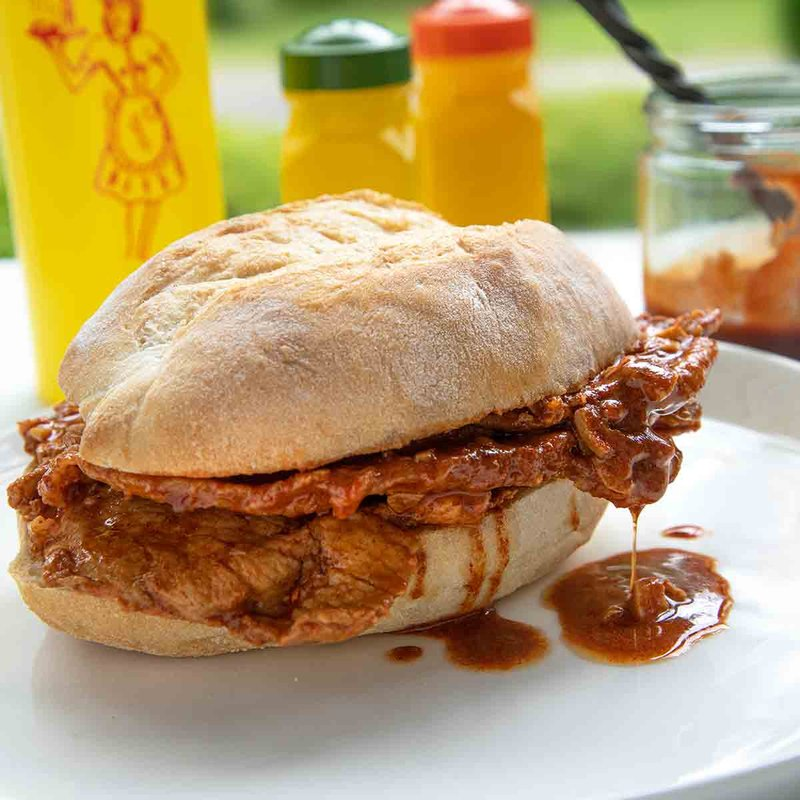

# Bifana

*Portugal's street sandwich: thin pork loin slices marinated in garlic, white wine and paprika, fried hard, piled into a soft papo-seco roll.*

**Serves:** 4 (4 sandwiches)

**Prep Time:** 15 minutes (plus 2 hours marinating)

**Cook Time:** 15 minutes

## Overview
Pork loin (or pork shoulder) is sliced very thin across the grain, 3 mm thick, 5-6 cm wide. Marinated for 2 hours in white wine, garlic, paprika, bay leaves, black pepper and salt. Fried in olive oil and butter over high heat 1 minute per side; the marinade reduces in the pan to a thin sauce. Piled into halved papo-seco rolls (or sturdy white rolls), the bread soaked in the pan-juices. Mustard or piri-piri sauce alongside.

## Ingredients

### Pork
- 600 g pork loin (or boneless pork shoulder, sliced 3 mm thin across the grain - about 12 slices)

### Marinade
- 200 ml dry white wine (vinho verde or any dry white)
- 8 garlic cloves (crushed)
- 1 tablespoon sweet paprika
- 1 teaspoon smoked paprika
- 2 bay leaves
- 1 teaspoon black pepper
- 1 ½ teaspoons salt
- 2 tablespoons olive oil

### To cook
- 3 tablespoons olive oil
- 2 tablespoons butter

### To serve
- 4 papo-seco rolls (or soft white rolls/baguettes)
- Mustard, piri-piri sauce, hot pepper paste

## Method

### Stage 1 - Slice
1. Place pork in the freezer 20 minutes (firms it for easier slicing).
1. Slice 3 mm thick across the grain. Each slice should be about a palm size.
1. Bash slices lightly between baking paper with a meat mallet (or rolling pin) to thin them further to 2 mm - this is important for the texture.

### Stage 2 - Marinate
1. In a wide bowl, combine all marinade ingredients.
1. Add the pork slices; toss to coat thoroughly.
1. Cover; refrigerate 2-4 hours.

### Stage 3 - Cook
1. Heat olive oil and butter in a wide pan over high heat until shimmering.
1. Lift pork slices out of the marinade (reserve the marinade); add to the hot pan in a single layer (work in 2 batches).
1. Fry 1 minute per side, no longer - the slices should be coloured and cooked through but not dried out.
1. Lift onto a plate; cover.

### Stage 4 - Pan sauce
1. Pour the reserved marinade into the hot pan.
1. Bring to a boil; reduce 3-4 minutes until thickened slightly into a syrupy sauce.

### Stage 5 - Combine
1. Return the pork to the pan; toss in the sauce 30 seconds to coat.

### Stage 6 - Assemble
1. Slice the rolls in half.
1. Lift 3 slices of pork (with sauce) onto each roll bottom.
1. Spoon some pan-juices over the top piece of bread; the bread should be visibly soaked.
1. Close the roll.

### Stage 7 - Serve
1. Eat immediately, standing up if possible.
1. Mustard, piri-piri or hot sauce alongside.
1. A glass of cold beer is mandatory.

## Notes
- **Thin slices, fast cook:** The pork is too thin for slow cooking. High heat, fast sear, 1 minute per side - any longer and you have shoe leather.
- **Soak the bread:** Half the pleasure of a bifana is the marinade-soaked bread underneath. Don't be shy with the pan-juices - spoon them generously.
- **Pork shoulder or loin:** Loin is leaner and slightly drier. Shoulder is more flavourful but tougher. Both work; loin is more traditional in Lisbon, shoulder in the north.

## Storage
- Best within 5 minutes of cooking. Bifana doesn't keep.
- The marinated pork (uncooked) refrigerates 24 hours.
- Cooked pork without bread refrigerates 2 days; reheat in a pan.
