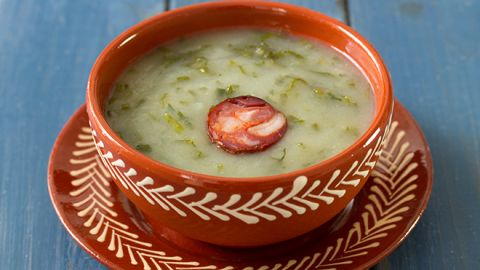

# Caldo Verde

*Portugal's beloved soup: a smooth potato base with finely shredded collard kale, slices of chouriço floating on top and a generous slick of olive oil.*

**Serves:** 6

**Prep Time:** 15 minutes

**Cook Time:** 35 minutes

## Overview
This is the soup Portugal eats in winter and at every wedding, christening and Christmas Eve: a velvety potato base, a confetti of impossibly thin kale shredded in right at the end, and a few slices of chouriço floating on top to flavour the broth. You sweat onions in olive oil, simmer potatoes in stock until soft, blend the lot smooth, then drop the kale in for the final two minutes (which is when the colour brightens and the texture stays alive). Lay the chouriço on top, drizzle olive oil at the table, tear bread in. It is a five-ingredient soup that depends entirely on the quality of the olive oil and the kale being cut almost transparently thin, ribbon by ribbon.

## Ingredients

- 4 tablespoons olive oil (plus more for serving)
- 1 onion (large, chopped)
- 4 garlic cloves (crushed)
- 800 g floury potatoes (Maris Piper, King Edward; peeled and cubed)
- 1 ½ litres water (or vegetable stock)
- 2 teaspoons salt (or to taste)
- ½ teaspoon black pepper
- 250 g kale (couve galega, or curly kale; tough stems removed and shredded as finely as you can - 2-3 mm wide)
- 200 g chouriço (sliced 5 mm thick)

### To serve
- Crusty country bread (or broa de milho, Portuguese cornbread)
- Extra-virgin olive oil

## Method

### Stage 1 - Base
1. Heat the olive oil in a large heavy pot over medium heat.
1. Cook the onion 8 minutes until soft.
1. Add the garlic; cook 1 minute.
1. Add the potatoes; toss to coat.
1. Pour in the stock; add the salt and pepper.
1. Bring to the boil; reduce to a simmer.
1. Cook 18-22 minutes until the potatoes are completely soft.

### Stage 2 - Blend
1. Blend the soup smooth with a stick blender (or in batches in a jug blender, be careful with hot liquid).
1. Return to medium heat; the soup should be thick enough to coat a spoon. Loosen with hot water if too thick.

### Stage 3 - Kale
1. Bring back to a steady simmer.
1. Stir in the shredded kale.
1. Cook 2-4 minutes only, the kale should stay bright green and just-wilted, never sludgy.

### Stage 4 - Chouriço
1. Meanwhile, cook the chouriço slices in a dry pan over medium-high heat 1-2 minutes per side until lightly crisped at the edges.

### Stage 5 - Serve
1. Ladle into wide bowls.
1. Top each with 3-4 slices of chouriço.
1. Drizzle with extra-virgin olive oil.
1. Serve with crusty bread.

## Notes
- **Shred the kale thin:** This is the technique. The thinner you cut, the better, proper Portuguese cooks shave it almost to threads. A food processor with a slicing disc helps; otherwise stack leaves, roll tight, and slice with a sharp knife.
- **Don't overcook the kale:** Sludgy grey-green caldo verde is bad caldo verde. The whole point is bright green confetti against the pale potato cream.
- **Olive oil at the table:** A heavy pour at serving time isn't optional, it's part of the dish.

## Storage
- Keeps 3 days refrigerated; reheat the soup base, then add fresh kale and chouriço each time so the kale stays bright.
- Freezes 3 months without the kale; add fresh on reheat.
