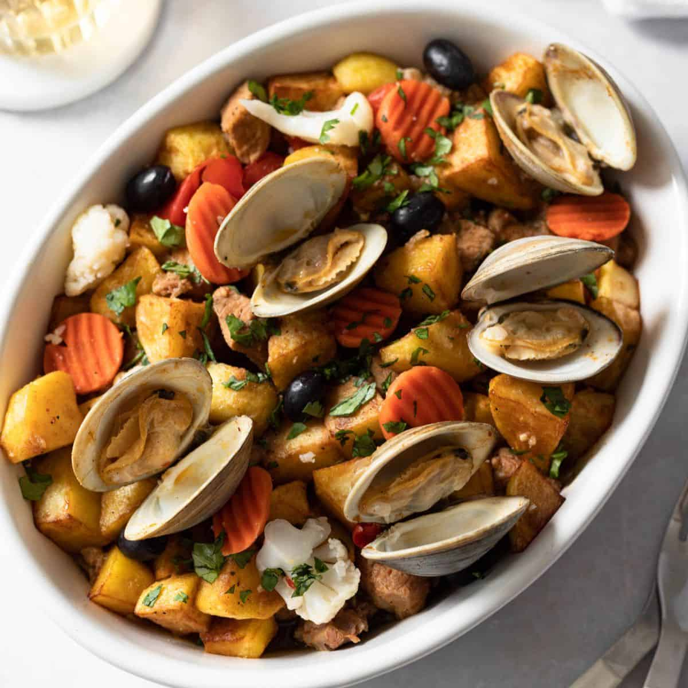

# Carne de Porco à Alentejana

*Portugal's pork-and-clams: cubes of pork marinated in massa de pimentão (red pepper paste), white wine and garlic, then pan-fried and combined with fresh clams that steam open in the pan, finished with chopped coriander, lemon and fried potato cubes. The iconic Alentejo dish that pairs land and sea - surf-and-turf, Portuguese style.*

**Serves:** 4

**Prep Time:** 30 minutes (plus 4 hours marinating)

**Cook Time:** 45 minutes

## Overview
Carne de porco à Alentejana is the iconic dish of the Alentejo region in southern Portugal and one of the most famous Portuguese surf-and-turf dishes: cubes of pork loin or shoulder marinated in massa de pimentão (the Portuguese red pepper paste), garlic, white wine, bay leaves and salt, pan-fried till browned, then simmered briefly with fresh clams in their shells till they open and the sauce reduces. Finished with chopped fresh coriander, lemon juice and a generous heap of fried potato cubes (batatas a cubinhos). The dish is a study in Portuguese flavours: smoky-sweet pepper paste, briny clams releasing their liquor into the pork, herbal coriander and crispy potatoes. Served on a wide platter at the centre of the Alentejo table. Massa de pimentão is essential; smoked paprika, tomato paste and a touch of vinegar approximate. Fresh clams in shell give the briny depth; canned won't substitute. The fried potato cubes are part of the dish, not a side; proper diced and pan-fried potatoes, not chips.

## Ingredients

### Pork and marinade
- 800 g pork shoulder (cut into 3 cm cubes)
- 3 tablespoons massa de pimentão (or substitute: 2 tablespoons sweet paprika + 1 tablespoon tomato paste + 1 tablespoon olive oil + 1 teaspoon white wine vinegar)
- 200 ml dry white wine
- 6 garlic cloves (crushed)
- 2 bay leaves
- 1 tablespoon piri-piri sauce
- 1 tablespoon dried oregano
- 1 ½ teaspoons fine sea salt
- 1 teaspoon ground black pepper

### Cooking
- 4 tablespoons olive oil
- 1 large onion (finely chopped)
- 4 garlic cloves (additional; crushed)
- 1 tablespoon massa de pimentão (additional)
- 200 ml white wine (additional)
- 200 ml chicken stock

### Clams
- 800 g fresh clams (cleaned, debearded)

### Potatoes (batatas a cubinhos)
- 600 g waxy potatoes (peeled and cubed into 1 cm cubes)
- Vegetable oil for deep-frying
- 1 teaspoon flaky sea salt

### To finish
- 1 large bunch fresh coriander (chopped)
- Juice of 1 lemon
- Lemon wedges
- Crusty bread

## Method

### Stage 1 - Marinate the pork (4+ hours)
1. Combine all marinade ingredients in a wide bowl.
2. Add the pork cubes; toss to coat.
3. Refrigerate 4 hours (or overnight).

### Stage 2 - Fry the potato cubes
1. Heat oil to 175°C (350°F).
2. Fry potato cubes in batches 5-6 minutes till deep golden and crispy.
3. Drain on kitchen paper; sprinkle salt.

### Stage 3 - Sear the pork
1. Heat the olive oil in a wide heavy pan over medium-high heat.
2. Lift the pork from the marinade (reserve the marinade).
3. Brown the pork cubes in batches 3 minutes per side.
4. Set aside.

### Stage 4 - Build the sauce
1. Reduce heat to medium.
2. Add the chopped onion; cook 6 minutes till soft.
3. Add the additional crushed garlic; cook 30 seconds.
4. Add the additional massa de pimentão; cook 1 minute.

### Stage 5 - Combine
1. Return the seared pork (with the reserved marinade) to the pan.
2. Pour in the additional white wine; let bubble 2 minutes.
3. Add the chicken stock.
4. Simmer 12-15 minutes till the pork is tender and the sauce has reduced.

### Stage 6 - Add the clams
1. Add the cleaned clams to the pan.
2. Cover; cook 5-7 minutes till the clams open.
3. Discard unopened clams.

### Stage 7 - Finish
1. Stir in the chopped coriander.
2. Squeeze lemon juice over.

### Stage 8 - Serve
1. Tip onto a wide platter.
2. Top with the crispy potato cubes.
3. Lemon wedges and crusty bread.

## Notes
- **Massa de pimentão essential:** Portuguese pepper paste; substitute with smoked paprika + tomato paste.
- **Fresh clams in shell:** essential.
- **Crispy potato cubes:** part of the dish.
- **Don't overcook clams:** 5-7 minutes max.

## Variations
**Spicier:** double the piri-piri; add 2 fresh chillies.
**With chorizo:** add 100 g of sliced chouriço to the pan with the onion.
**Vegetarian (impossible to keep traditional):** skip the meat and clams; use mushrooms and white beans; less traditional.
**With mussels instead:** swap clams for mussels; same technique.

## Serving
On a wide platter with crispy potatoes piled over the pork-and-clams. Crusty bread, lemon, salad. Cold Portuguese white wine or Sagres beer.

## Storage
- Best eaten fresh; clams don't reheat well.
- The pork-only base keeps refrigerated 3 days and freezes 3 months.
- Cook fresh clams in reheated sauce.
