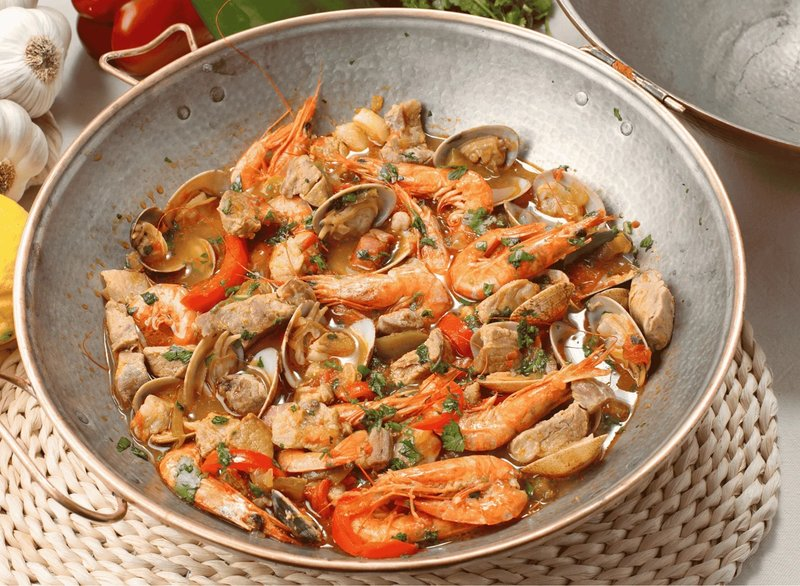

# Cataplana de Marisco

*The Algarve's clam-shell stew: prawns, clams, mussels and chouriço cooked in a tomato-and-white-wine base inside a copper pot.*

**Serves:** 4

**Prep Time:** 25 minutes

**Cook Time:** 30 minutes

## Overview
Onion, garlic, red and green peppers sweat slowly in olive oil. Sliced chouriço joins and renders its red fat. Smoked paprika, bay leaves, fresh tomatoes (or tinned) and a glug of white wine go in; simmer for 10 minutes until reduced. Clams and mussels (pre-cleaned) tip in; lid clamps on; 4 minutes until they open. Prawns and chunks of firm white fish (monkfish, hake) join; lid back on; 4 more minutes. Finished with fresh coriander, lemon juice and a glug of olive oil. Brought to the table in the pot; lid lifted at the table.

## Ingredients

### Aromatics
- 4 tablespoons olive oil
- 1 onion (large, sliced)
- 6 garlic cloves (sliced)
- 1 red bell pepper (sliced thin)
- 1 green bell pepper (sliced thin)
- 150 g chouriço sausage (sliced thin)
- 1 tablespoon smoked paprika
- 1 teaspoon sweet paprika
- 2 bay leaves
- 1 fresh red chilli (sliced, or 1 teaspoon piri-piri sauce)
- 4 ripe tomatoes (chopped) - OR 1 (400 g) tin chopped tomatoes
- 250 ml dry white wine
- 1 teaspoon salt (to taste)
- ½ teaspoon black pepper

### Seafood
- 500 g clams (live, well-rinsed and purged in salted water 30 min)
- 500 g mussels (debearded, scrubbed)
- 400 g large raw prawns (shelled, with tails on)
- 400 g firm white fish - monkfish, hake (or cod, cut into 4 cm chunks)

### To finish
- 1 large bunch fresh coriander (chopped, about 50 g)
- 1 large bunch fresh parsley (chopped, about 30 g)
- 1 lemon (juice)
- 2 tablespoons extra-virgin olive oil
- Crusty bread

## Method

### Stage 1 - Prep the seafood
1. Place clams in cold salted water 30 minutes to purge sand; rinse. Discard any that don't close when tapped.
1. Debeard the mussels; discard any that don't close when tapped.
1. Pat prawns and fish dry.

### Stage 2 - Base
1. Heat olive oil in a cataplana (or a wide heavy lidded pot or Dutch oven) over medium heat.
1. Add onion, garlic, red and green pepper.
1. Cook 10 minutes, stirring, until soft and slightly golden at the edges.

### Stage 3 - Chouriço
1. Add sliced chouriço; cook 3 minutes - the red fat releases and stains the oil.

### Stage 4 - Spice and tomato
1. Stir in paprika (both kinds), bay leaves and chilli.
1. Add chopped tomatoes; cook 5 minutes until they break down.
1. Pour in the white wine; bring to a simmer.
1. Cook 5 minutes uncovered to reduce slightly.
1. Season with salt and pepper.

### Stage 5 - Add the shellfish
1. Tip in the clams and mussels in a single layer.
1. Cover tightly with the cataplana lid (or pot lid).
1. Cook 4-5 minutes - the shells should open. Discard any that stay shut.

### Stage 6 - Add prawns and fish
1. Add the prawns and fish chunks on top.
1. Cover; cook 4-5 minutes until the prawns are pink and the fish is just opaque.

### Stage 7 - Finish
1. Scatter coriander and parsley.
1. Squeeze lemon over.
1. Drizzle olive oil.

### Stage 8 - Serve
1. Bring the pot to the table; open the lid in front of your guests for full effect.
1. Ladle into deep bowls; serve with crusty bread for the broth.

## Notes
- **Cataplana is dramatic but optional:** A real Algarve cataplana is a copper clam-shell pot, brought to the table sealed and opened at the table. Wonderful theatre. A heavy lidded pot or Dutch oven cooks the same dish identically.
- **Don't overcook the seafood:** Prawns and fish go from done to rubbery in 90 seconds. Pull off the heat as soon as the fish is just opaque and the prawns just curled.
- **Discard unopened shells:** Clams or mussels that don't open during cooking were dead before they hit the pot - don't eat. Tapping live ones before cooking and watching them close is the safety check.

## Storage
- Best within an hour of cooking. Seafood doesn't keep.
- Leftovers refrigerate 1 day; eat cold or reheat gently. Don't reheat aggressively.
