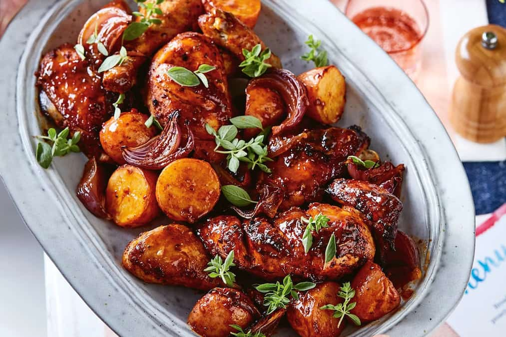

# Chanfana

*Portugal's Beira lamb-in-wine: bone-in lamb (or goat) slow-cooked in a heavy clay pot, submerged in red wine with onion, garlic, bay leaves, paprika and a touch of lard, for 3 hours till the meat falls from the bone and the wine reduces to a glossy dark sauce. The Beira Alta region's signature dish, wine-braised meat that takes its time.*

**Serves:** 6

**Prep Time:** 25 minutes (plus overnight marinating)

**Cook Time:** 3 hours

## Overview
Chanfana is the signature dish of Portugal's Beira Alta region (central Portugal, particularly the towns of Vila Nova de Poiares and Miranda do Corvo) and one of the country's most distinctive slow-braised meat dishes: bone-in older lamb or goat marinated overnight in red wine, garlic, onion, bay leaves and paprika, then slow-cooked in a heavy clay pot (the caçoila de barro) in even more red wine, with sliced onions, bay leaves, paprika, a touch of lard, salt and pepper, for three hours in a low oven (traditionally wood-fired), till the meat falls from the bone and the wine reduces to a glossy dark mahogany sauce. Served with boiled potatoes, broa (Portuguese cornbread) and a glass of Beira red. The meat is submerged in wine, not stock; this is the Beira signature. Three hours is the proper cook; don't rush. A clay pot is ideal; a heavy Dutch oven substitutes.

## Ingredients

### Meat
- 1500 g bone-in lamb shoulder or leg (cut into 6 cm pieces; the bone-in is important)

### Marinade (overnight)
- 1 bottle (750 ml) Portuguese red wine (Dão or Bairrada from Beira region)
- 2 large onions (sliced)
- 12 garlic cloves (crushed)
- 4 bay leaves
- 2 tablespoons sweet paprika
- 1 tablespoon piri-piri sauce (or 1 chopped fresh chilli)
- 1 tablespoon dried oregano
- 2 teaspoons fine sea salt
- 1 teaspoon ground black pepper
- 4 tablespoons olive oil
- 1 tablespoon lard (or extra olive oil)

### For cooking
- 1 large onion (sliced; additional)
- 2 bay leaves
- 1 tablespoon paprika (additional)
- 200 ml red wine (additional, for cooking)
- 1 teaspoon fine sea salt
- 100 g lard (or olive oil; for the traditional richness)

### To finish
- 1 small bunch fresh parsley (chopped)
- Lemon wedges

### To serve
- Boiled potatoes (with skin on)
- Broa (Portuguese cornbread; or any sturdy white bread)
- Sautéed greens (couves) or steamed cabbage
- Red wine

## Method

### Stage 1 - Marinate (overnight)
1. Place lamb pieces in a wide container.
2. Combine all marinade ingredients.
3. Pour over the lamb; toss to coat.
4. Cover and refrigerate 12-24 hours.

### Stage 2 - Set up the clay pot (or Dutch oven)
1. Preheat the oven to 150°C (300°F).
2. Place the additional sliced onion in the bottom of a heavy clay pot or Dutch oven.
3. Lift the marinated lamb from the marinade; place over the onion.
4. Pour the marinade over (including all the onions and herbs).
5. Add the additional red wine, paprika, salt and lard.
6. The meat should be at least 2/3 submerged in liquid.

### Stage 3 - Slow-cook
1. Cover tightly with the lid (or seal with foil and lid).
2. Transfer to the oven.
3. Cook 3 hours; turn the meat halfway.
4. The lamb should be fork-tender; the wine reduced to a glossy dark sauce.

### Stage 4 - Rest
1. Take out; let rest 15 minutes covered.

### Stage 5 - Serve
1. Lift the lamb pieces onto a serving platter.
2. Strain the sauce; reduce briefly if too thin (5 minutes hard boil).
3. Pour sauce over the meat.
4. Scatter chopped parsley.
5. Serve with boiled potatoes, broa, greens.

## Notes
- **Bone-in lamb:** essential for flavour.
- **Marinade overnight:** the meat needs time in the wine.
- **Slow-cook 3 hours:** don't rush.
- **Clay pot ideal:** Dutch oven is workable.
- **Reduce the sauce:** for proper glossy finish.

## Variations
- **Goat chanfana (traditional):** the original dish was older goat (cabra velha); modern lamb is the substitute.
- **With chestnuts:** add 200 g peeled chestnuts in the last hour; gives autumn richness.
- **With dried fruits:** add prunes and apricots in the last hour; gives a sweet-savoury twist.
- **Pressure-cooker version:** 90 minutes high pressure; finish under the grill briefly.

## Serving
- With boiled potatoes, broa and sautéed greens. A glass of the same Beira red wine used in cooking. As a Sunday lunch or special-occasion meal.

## Storage
- Keeps refrigerated 5 days; flavour deepens significantly.
- Reheat covered in a 160°C oven for 25 minutes.
- Freezes 3 months in portions.
- Day-after chanfana is famously even better.
