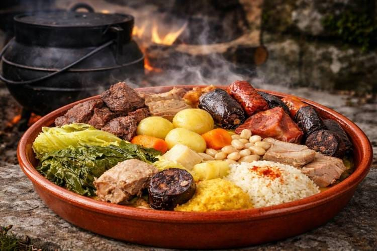

# Cozido à Portuguesa

*Portugal's mixed-meat boiled feast: a slow-cooked one-pot of beef, pork, ham, smoked sausages, blood sausages, cabbage, carrot, potato, turnip and rice (cooked separately in the broth). The Portuguese Sunday feast - a full meat-and-vegetable boiled dinner served in courses over hours.*

**Serves:** 8-10

**Prep Time:** 45 minutes

**Cook Time:** 3 hours

## Overview
Cozido à Portuguesa is Portugal's most substantial traditional one-pot feast and a Sunday-family-lunch institution across the country: a slow-cooked combination of mixed meats (beef shin, pork belly, smoked ham, smoked Portuguese sausages - linguiça, chouriço, morcela/blood sausage; and sometimes chicken), and vegetables (cabbage, carrot, potato, turnip, sweet potato - every Portuguese vegetable goes in), all simmered together in one large pot over several hours, with rice cooked separately in some of the cooking broth (arroz de cozido) for the carb. The dish is served in courses: first the broth, then the vegetables and rice, finally the meats arranged on a large platter. Sundays in rural Portugal famously begin with making the cozido and end hours later still eating it. Three details define proper cozido. First, multiple meats. The variety is the point - beef + pork + ham + at least 3 different sausages. Second, vegetables added in stages. Heartier ones first, leafy/quick ones at the end. Third, served in courses. Don't dump everything on the same plate; the dish is meant to be enjoyed slowly.

## Ingredients

### Meats
- 600 g beef shin (or brisket)
- 400 g pork belly (in one piece)
- 300 g smoked ham hock
- 200 g linguiça (Portuguese smoked sausage; or chorizo)
- 200 g chouriço (Portuguese spicy sausage)
- 200 g morcela (Portuguese blood sausage; or black pudding)
- 200 g farinheira (Portuguese smoked sausage with bread)
- 4 bone-in chicken legs (optional but common)

### Vegetables (added in stages)
- 4 medium potatoes (peeled, halved)
- 3 medium carrots (peeled, halved)
- 2 medium turnips (peeled, halved)
- 1 sweet potato (peeled, cubed)
- 1 large head Savoy cabbage (cut into wedges)

### Aromatics and cooking
- 2 large onions (quartered)
- 8 garlic cloves
- 4 bay leaves
- 2 tablespoons whole black peppercorns
- 2 tablespoons dried oregano
- 2 teaspoons fine sea salt
- 3 litres water

### Rice (arroz de cozido)
- 300 g long-grain rice
- 2 tablespoons olive oil
- 500 ml cozido cooking broth (drawn from the pot)

### To finish
- 1 large bunch fresh parsley (chopped)
- 1 small bunch fresh coriander (chopped, optional)

### To serve
- Coarse mustard
- Pickled chillies
- Crusty Portuguese bread
- Red wine (Portuguese; Douro or Alentejano)

## Method

### Stage 1 - Start the meats
1. Place beef, pork belly and ham hock in a very large pot.
2. Add the onions, garlic, bay leaves, peppercorns, oregano, salt and 3 litres of water.
3. Bring to a boil; reduce to a simmer; skim any foam.
4. Cover; cook 90 minutes.

### Stage 2 - Add the sausages
1. After 90 minutes, add all the sausages.
2. Add the chicken (if using).
3. Continue simmering 30 minutes.

### Stage 3 - Add hearty vegetables
1. Add the potatoes, carrots, turnips and sweet potato.
2. Continue cooking 25 minutes.

### Stage 4 - Add cabbage
1. Add the cabbage wedges (push them under the broth).
2. Cook 10-15 minutes till tender.

### Stage 5 - Make the rice (in parallel)
1. Heat the olive oil in a wide saucepan over medium heat.
2. Add the rice; stir to coat.
3. Pour in 500 ml of the hot cozido broth.
4. Bring to a simmer; cover; cook 15-18 minutes till the rice is tender.

### Stage 6 - Serve in courses
1. **Course 1:** Strain a small ladle of broth into each soup bowl; serve as a starter with a pinch of fresh parsley.
2. **Course 2:** Pile the vegetables and rice on a large platter; serve.
3. **Course 3:** Arrange all the sliced meats on another large platter; serve with mustard, pickled chillies, bread.

## Notes
- **Multiple meats:** variety is the point.
- **Vegetables added in stages:** different cooking times.
- **Serve in courses:** part of the experience.
- **The broth is the secret:** use it for the rice and as a starter.

## Variations
**Cozido das Furnas (Azorean):** the famous Azores variation cooked in the volcanic ground heat at Furnas; impossible to replicate exactly but the recipe is the same.
**Smaller version (4 people):** halve everything; cook in a smaller pot.
**Vegetarian (impossible to keep canonical):** the dish is a meat feast; vegetarian doesn't work.
**With kale (couves):** add Portuguese kale (couves) instead of cabbage.

## Serving
On large platters served in courses over hours. Portuguese red wine. The canonical Portuguese Sunday lunch.

## Storage
- Keeps refrigerated 5 days; flavour deepens.
- The day-after cozido is excellent in soup form (rebanada).
- Freezes 3 months in portions.
- Day-old leftover sausages and meats are perfect for sandwiches.
