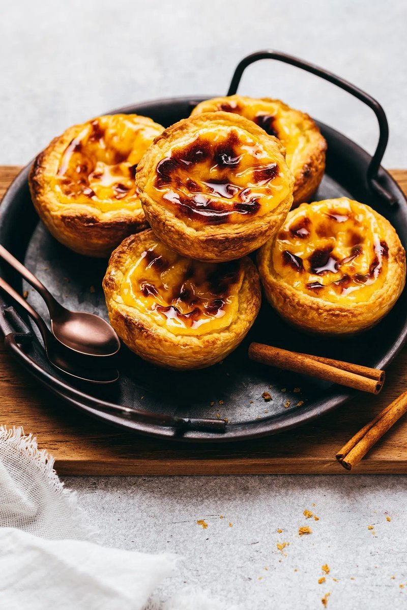

# Pastéis de Nata

*Lisbon's egg custard tart: shatter-flaky puff pastry filled with a silky cream-and-yolk custard, blasted in a hot oven till the surface chars.*

**Makes:** 12 pastéis

**Prep Time:** 30 minutes (plus chilling)

**Cook Time:** 18 minutes

## Overview
Pastéis de nata are Portugal's answer to a cup of coffee, and you would never have one without the other. The puff pastry shells are rolled thin, brushed with butter, rolled back into a tight cylinder, then sliced into pinwheels and pressed into the cups of a deep muffin tin (the swirl of the slice becomes the spiral shell). The custard is a hot sugar syrup whisked into milk thickened with cornflour and tempered into egg yolks. Filled three-quarters full, baked at the hottest temperature your oven will go (the original Belém bakery uses 290°C). The blackened, blistered top is the signature, the custard underneath is silky and only just set, and you eat them warm with a dusting of cinnamon and a strong espresso at eleven in the morning.

## Ingredients

### Pastry shells
- 1 sheet ready-rolled all-butter puff pastry (about 320 g, or 250 g block)
- 30 g unsalted butter (very soft, almost melted)
- A little flour for rolling

### Custard
- 250 ml whole milk
- 25 g plain flour
- 200 g caster sugar
- 100 ml water
- 1 cinnamon stick
- A strip of lemon peel
- 6 egg yolks (large)
- ½ teaspoon vanilla extract

### To serve
- Ground cinnamon
- Icing sugar

## Method

### Stage 1 - Sugar syrup
1. Combine the sugar, water, cinnamon stick and lemon peel in a small saucepan.
1. Heat to a boil; simmer 5 minutes until slightly thickened.
1. Off the heat, leave to infuse and cool slightly. Discard the cinnamon and lemon peel.

### Stage 2 - Milk thickener
1. Whisk the flour into 50 ml of the milk in a small bowl until smooth.
1. Heat the rest of the milk in a saucepan to just below boiling.
1. Whisk the flour-milk slurry into the hot milk; cook 2-3 minutes, whisking, until thick and glossy.

### Stage 3 - Combine
1. Pour the warm sugar syrup slowly into the milk mixture, whisking.
1. Off the heat, whisk in the egg yolks one at a time, then the vanilla.
1. Strain through a fine sieve into a jug.

### Stage 4 - Shape pastry shells
1. Heat the oven to 250°C (230°C fan, or as hot as your oven goes).
1. Unroll the puff pastry on a lightly floured surface; if it's a block, roll to a 25 x 30 cm rectangle.
1. Brush all over with the soft butter.
1. From a long edge, roll up tightly into a log.
1. Cut the log into 12 equal slices (about 2 cm thick).
1. Place each slice cut-side up in a muffin tin (deep cups, not flat trays).
1. Wet your thumb; press each slice down and out from the centre, stretching the spiral up the sides into a shell. The centre should be thin; the rim slightly proud.

### Stage 5 - Fill and bake
1. Pour the custard into the shells, filling ¾ full (about 2 tablespoons each).
1. Bake on the highest rack 12-15 minutes until the custard tops are dark brown / blackened in spots and the pastry is deeply golden.
1. The aggressive char on top is correct - it's what makes pastéis de nata taste like pastéis de nata.

### Stage 6 - Cool briefly
1. Cool 5 minutes in the tin.
1. Lift out carefully (a thin knife runs around each shell helps).
1. Cool 10 more minutes on a wire rack.

### Stage 7 - Serve
1. Dust with cinnamon and icing sugar.
1. Eat warm or at room temperature, ideally within a few hours.

## Notes
- **Hot oven:** The custard needs to set fast and the pastry needs to puff before the cream weeps. 250°C minimum; 280-300°C if your oven goes higher. Many home ovens cap at 250°C - that works.
- **Deep cups:** The traditional pastel mould is deep and slightly flared. Standard muffin tins work; small fluted brioche moulds are even better.
- **Eat fresh:** The pastry shell's shatter is the dish. Pastéis de nata go limp by day 2; refrigerated they're sad. Best in the first 4 hours.

## Storage
- Best the day made. Refrigerated keeps 2 days; re-crisp in a 200°C oven for 4-5 minutes before serving.
