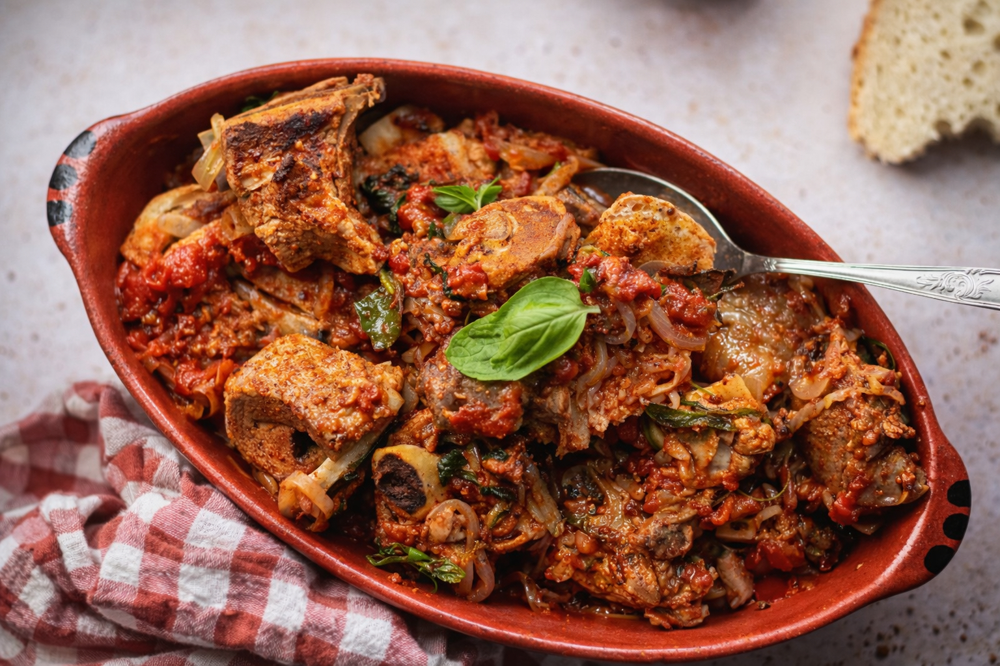

# Ensopado de Borrego

*Portugal's brothy lamb stew: cubes of lamb slow-cooked with onion, garlic, white wine, mint, coriander, paprika and bay leaves into a deeply savoury soupy stew, served over thick slices of stale bread that soak up the broth. The Alentejo countryside classic, bread is the carb, the broth is the prize.*

**Serves:** 6

**Prep Time:** 20 minutes

**Cook Time:** 1 hour 45 minutes

## Overview
Ensopado de borrego (literally "soaked lamb") is one of Portugal's most beloved countryside stews and the traditional Alentejo countryside dish: cubes of lamb (typically shoulder; sometimes leg) slow-cooked with chopped onion, garlic, fresh tomato, white wine, paprika, fresh mint, fresh coriander, bay leaves and lamb stock into a deeply savoury soupy stew (not thick, properly brothy), then served ladled over thick slices of stale bread (the Portuguese "broa", corn bread; or any sturdy stale white bread) that soak up the broth and become the carb. The dish is the Portuguese answer to a French bourguignon (with bread instead of mashed potato) or an Italian pasta-and-broth, bread is the traditional Portuguese carb in countryside cooking, and ensopado uses the stale-bread tradition. Stale bread is essential; fresh bread goes too soggy, and day-old or two-day-old is right. Mint and coriander together is the traditional Alentejo herb combination, not one or the other. The stew is meant to be soupy, not thick.

## Ingredients

### Lamb
- 1 kg lamb shoulder (cubed into 3 cm pieces)
- 2 tablespoons olive oil
- 1 ½ teaspoons fine sea salt
- 1 teaspoon ground black pepper
- 1 tablespoon plain flour

### Cooking base
- 4 tablespoons olive oil
- 2 large onions (chopped)
- 8 garlic cloves (crushed)
- 4 medium ripe tomatoes (chopped)
- 3 tablespoons tomato paste
- 300 ml dry white wine
- 800 ml hot lamb or chicken stock
- 1 tablespoon sweet paprika
- 1 tablespoon piri-piri (optional)
- 1 tablespoon ground cumin
- 4 bay leaves
- 1 cinnamon stick (small; optional)
- 1 large bunch fresh mint (about 30 g; chopped, half for cooking, half for finishing)
- 1 large bunch fresh coriander (about 30 g; chopped, half for cooking, half for finishing)

### To serve
- Stale broa (Portuguese cornbread) or any sturdy stale white bread (8 thick slices)
- 1 tablespoon olive oil for drizzling
- Lemon wedges

## Method

### Stage 1 - Brown the lamb
1. Pat lamb dry; toss with salt, pepper and flour.
2. Heat 2 tablespoons olive oil in a heavy pot over medium-high heat.
3. Brown lamb in batches 3 minutes per side.
4. Set aside.

### Stage 2 - Build the base
1. Reduce heat to medium.
2. Add the remaining 4 tablespoons olive oil.
3. Add chopped onions; cook 8 minutes till soft.
4. Add crushed garlic; cook 30 seconds.
5. Add tomato paste; cook 2 minutes.
6. Add chopped tomatoes; cook 5 minutes till they break down.

### Stage 3 - Add wine and stock
1. Pour in the white wine; let bubble 2 minutes.
2. Add the hot stock.
3. Stir in paprika, piri-piri (if using), cumin.
4. Add bay leaves and cinnamon stick.
5. Add half the chopped mint and coriander.

### Stage 4 - Return lamb and simmer
1. Return the lamb to the pot.
2. Bring to a simmer.
3. Cover with the lid slightly ajar.
4. Cook 60-75 minutes till the lamb is fork-tender.
5. The stew should remain brothy; add stock if it reduces too much.

### Stage 5 - Finish
1. Take off the heat.
2. Stir in the remaining mint and coriander.
3. Taste; adjust salt.

### Stage 6 - Serve
1. Place 1-2 thick slices of stale bread in the bottom of each deep bowl.
2. Ladle the hot stew generously over the bread (it soaks up).
3. Drizzle with olive oil.
4. Add lemon wedges.
5. Eat with a spoon; the bread-and-broth is the heart of the dish.

## Notes
- **Stale bread:** soaks up the broth; fresh is too soggy.
- **Mint AND coriander:** Alentejo signature.
- **Brothy, not thick:** keep it soupy.
- **Slow-cook properly:** 60-75 minutes for fork-tender.

## Variations
**Goat (cabrito) version:** swap lamb for young goat; common Alentejo variation.
**With chickpeas:** add 1 tin of drained chickpeas in the last 30 minutes.
**Spicier:** double the piri-piri.
**Without cinnamon (purist):** some Alentejo cooks omit; both versions are valid.

## Serving
In deep bowls over the bread, drizzled with olive oil. Portuguese red wine (Alentejo region). As a Sunday Alentejo lunch.

## Storage
- Keeps refrigerated 5 days; flavour deepens.
- Freezes 3 months.
- Day-old ensopado is excellent.
