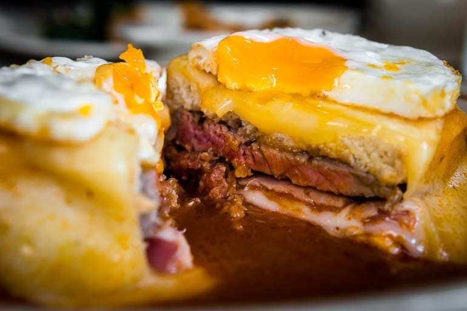

# Francesinha

*Porto's iconic over-the-top sandwich: layers of steak, sausage, ham and cheese sandwiched between thick bread, smothered in melted cheese, drowned in a hot spicy beer-and-tomato sauce, often served with a fried egg on top and a heap of fries on the side. The Porto-Portuguese gut-buster that defines northern Portuguese diner culture.*

**Serves:** 4

**Prep Time:** 25 minutes

**Cook Time:** 35 minutes

## Overview
Francesinha (literally "little French girl") is Porto's iconic over-the-top sandwich and one of the most distinctive dishes in northern Portugal: thick slices of toasted white bread layered with pan-fried steak, linguiça, chouriço, thinly sliced ham, fresh sausage and Swiss or Gouda cheese, the whole stack smothered in more melted cheese, drowned in a hot spicy red beer-tomato-port sauce (molho de francesinha), traditionally topped with a fried egg with a runny yolk. Served in a deep dish or wide bowl with a heap of crispy fries on the side. Invented in Porto in the 1960s, supposedly by a returning Portuguese emigrant from France who wanted to recreate the croque-monsieur in Portuguese style; the result was characteristically excessive and has become a Porto cultural icon. The traditional version stacks at least three meats: steak, ham, and a smoked sausage. The sauce is everything (port wine, beer, tomato, paprika, piri-piri and stock); it is the defining element, not a finishing flourish. Ladled generously till the sandwich is partly submerged.

## Ingredients

### Meats and sandwich
- 4 thin steaks (sirloin or rump; about 100 g each)
- 200 g linguiça or smoked Portuguese sausage (sliced); or substitute with Spanish chorizo
- 200 g chouriço (sliced); or other spicy smoked sausage
- 200 g sliced cooked ham
- 8 thick slices white bread (Portuguese "pão de forma" or any sturdy white sandwich bread)
- 300 g sliced Gouda or Edam cheese
- 200 g grated mature cheddar (for topping)

### Sauce (molho de francesinha)
- 4 tablespoons butter
- 1 large onion (finely chopped)
- 6 garlic cloves (crushed)
- 2 tablespoons plain flour
- 3 tablespoons tomato paste
- 1 tin (400 g) chopped tomatoes
- 200 ml port wine
- 200 ml red wine
- 200 ml light beer (lager)
- 400 ml beef stock
- 2 tablespoons Worcestershire sauce
- 2 bay leaves
- 1 tablespoon piri-piri sauce (or 1 chopped fresh chilli + 1 teaspoon paprika)
- 1 tablespoon sweet paprika
- 1 teaspoon smoked paprika
- 1 teaspoon dried thyme
- 1 ½ teaspoons fine sea salt
- 1 teaspoon ground black pepper

### To finish
- 4 large eggs (one per person)
- 2 tablespoons vegetable oil

### To serve
- Crispy fries (papas fritas; thick-cut, twice-fried)
- Cold beer (Super Bock, Sagres)

## Method

### Stage 1 - Make the sauce
1. Melt the butter in a wide saucepan over medium heat.
2. Add the chopped onion; cook 8 minutes till soft.
3. Add the crushed garlic; cook 30 seconds.
4. Sprinkle the flour; stir 1 minute (light roux).
5. Add the tomato paste; cook 2 minutes.
6. Add the chopped tomatoes; cook 3 minutes.
7. Pour in the port and red wine; let bubble 3 minutes.
8. Add the beer; let bubble 2 minutes.
9. Pour in the beef stock.
10. Add the Worcestershire sauce, bay leaves, piri-piri, both paprikas, thyme, salt and pepper.
11. Simmer 20-25 minutes till the sauce thickens to a glossy gravy-like consistency.
12. Strain through a fine sieve (or leave chunky, depending on preference).

### Stage 2 - Cook the meats
1. Heat a heavy pan over medium-high heat.
2. Sear the steaks briefly (2 minutes per side); set aside.
3. Cook the sausages and chouriço slices in the same pan till browned; set aside.

### Stage 3 - Toast the bread
1. Lightly toast the bread slices (just dry the surface).

### Stage 4 - Build the sandwiches
1. Place 1 slice of toasted bread in the bottom of an oven-safe deep dish (one per person).
2. Layer: ham → steak → sausage → chouriço → cheese.
3. Top with the second slice of bread.
4. Cover the whole sandwich generously with the sliced Gouda and grated cheddar.

### Stage 5 - Bake
1. Preheat the oven to 220°C (425°F).
2. Bake the sandwiches 5-7 minutes till the cheese is bubbly and golden.

### Stage 6 - Fry the eggs
1. Heat vegetable oil in a pan; fry the eggs sunny-side up for 3 minutes (yolks runny).

### Stage 7 - Assemble and serve
1. Place each cheese-topped sandwich in a deep wide bowl or shallow plate.
2. Ladle the hot sauce generously over each sandwich; it should partly submerge.
3. Top each with a fried egg.
4. Add the heap of fries on the side (or in the sauce).
5. Serve immediately.

## Notes
- **Multiple meats:** the traditional excess is the point.
- **The sauce is everything:** worth the effort.
- **Submerge in sauce:** don't drizzle.
- **Eat with a fork:** the dish is too messy for hands.
- **Best with cold beer:** the traditional Portuguese pairing.

## Variations
**Francesinha do mar (seafood):** swap the meats for shrimp, salt cod and grilled fish; coastal Porto variation.
**Vegetarian francesinha:** swap meats for grilled mushrooms, eggplant and roasted peppers.
**Spicier:** double the piri-piri; properly Porto-Portuguese fierce.
**With chips inside the sandwich:** some Porto restaurants put fries inside the sandwich; even more excess.

## Serving
In a deep wide dish with fries piled alongside (or in the sauce). Cold Portuguese beer (Super Bock, Sagres). At any Porto diner or as a Portuguese-themed weekend meal.

## Storage
- Best eaten immediately.
- The sauce keeps refrigerated 5 days and freezes 3 months.
- Don't refrigerate assembled francesinha.
