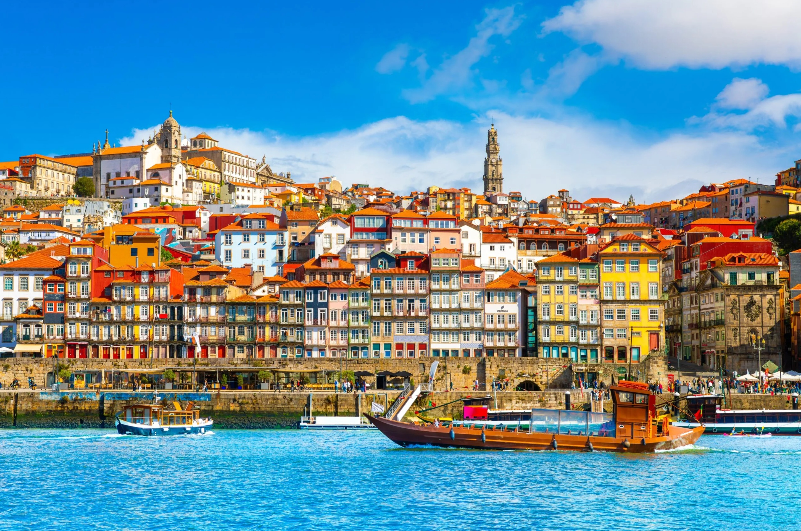

# Portuguese Cuisine

Maritime, garlic-and-coriander-rich Iberian cooking distinct from its Spanish neighbour. Bacalhau (salt cod, the famous "365 ways"), caldo verde (kale-and-potato soup with chouriço), sardines, octopus and seafood rice (arroz de marisco) anchor the savoury table; pastéis de nata, queijadas and arroz doce close meals. Olive oil, smoked paprika, bay, coriander, lemon and piri-piri chillies do the seasoning; cataplana, slow-braised stews and grilling over coals dominate the techniques.
