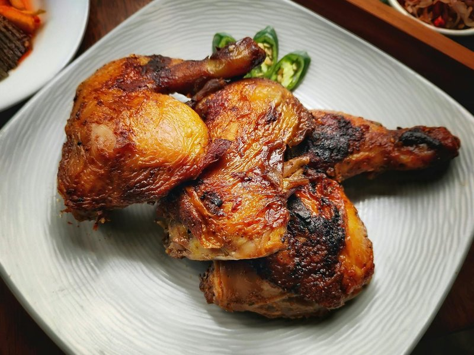

# Piri Piri Chicken

*Portugal's grill plate: spatchcocked chicken marinated in a fiery piri-piri sauce, then charred hard over flame.*

**Serves:** 4

**Prep Time:** 25 minutes (plus 4 hours marinating)

**Cook Time:** 35 minutes

## Overview
Piri-piri chicken is the dish that travelled from Mozambique to Portugal to the high street, and the original is still the best: a whole chicken spatchcocked flat, marinated overnight in a vivid red paste of bird's-eye chillies, garlic, paprika, lemon and olive oil, then grilled hard over charcoal until the skin is darkly blistered and the meat just-cooked through. The marinade itself takes five minutes in a blender. The bird wants a minimum of four hours in it, ideally overnight. A home broiler on max works if you do not have a barbecue, but the smoke from the coals is half the dish. Serve with a second bowl of the same marinade as a sauce, a green salad, and chips.

## Ingredients

### Chicken
- 1 ½ kg whole chicken (spatchcocked - backbone removed, bird flattened)

### Marinade and sauce
- 8-12 African bird's-eye chillies (piri-piri, also sold as African Devil chilli, adjust to heat tolerance)
- 8 garlic cloves
- 1 tablespoon smoked paprika
- 1 teaspoon sweet paprika
- 1 lemon (zest)
- 2 lemons (about 4 tablespoons, juice)
- 3 tablespoons white wine vinegar
- 4 tablespoons olive oil
- 2 teaspoons salt
- 1 teaspoon dried oregano
- 1 bay leaf (torn)
- ½ teaspoon black pepper

### To serve
- Lemon wedges
- French fries (skin-on)
- Tomato and onion salad
- Extra piri-piri sauce on the side

## Method

### Stage 1 - Marinade
1. In a blender, blitz chillies, garlic, both paprikas, lemon zest, lemon juice, vinegar, 2 tablespoons of the olive oil, salt, oregano, bay leaf and black pepper to a smooth red paste.
1. Reserve a third of the sauce in a small jar for serving (refrigerate).

### Stage 2 - Marinate
1. Place the spatchcocked chicken in a wide dish skin-side up.
1. Rub two-thirds of the marinade thoroughly all over and under the skin where possible.
1. Cover; refrigerate 4-24 hours.

### Stage 3 - Bring to room temperature
1. Remove from the fridge 30 minutes before cooking.

### Stage 4 - Cook
1. **Charcoal grill (best):** Build a medium-hot fire. Place chicken skin-side up on the grill 15 cm above the coals; cook 18 minutes. Flip; cook 15 minutes skin-side down for crispness. Baste with the remaining 2 tablespoons olive oil mixed with a spoon of the reserved sauce.
1. **Oven + grill (broiler) alternative:** Heat oven to 220°C. Place chicken skin-side up on a rack over a tray. Roast 25 minutes. Switch to broil; flip; broil skin-side down 5 minutes, then skin-side up 4 minutes until charred at the edges.

### Stage 5 - Rest
1. Lift onto a board; rest 8 minutes.
1. Cut into pieces along the joints.

### Stage 6 - Serve
1. Pile chicken on a platter.
1. Serve with french fries, tomato-onion salad, lemon wedges and a small bowl of the reserved piri-piri sauce for those who want more heat.

## Notes
- **Spatchcock for even cooking:** A whole bird grilled flat cooks more evenly than a roasted one. Ask the butcher to remove the backbone, or do it at home with sturdy kitchen scissors.
- **Real bird's-eye chillies:** African piri-piri (also known as African Devil chilli) is the traditional. Bird's-eye chilli (Thai-style) is the same plant and a fine substitute. Cayenne in a pinch but the flavour is slightly off.
- **Adjust heat:** 12 chillies is hot but not punishing. Tone down to 6 for moderate; up to 18 if you've got the tolerance.

## Storage
- Refrigerate cooked chicken 3 days; reheat covered at 180°C 8 minutes (microwave makes it rubbery).
- Marinade keeps refrigerated 2 weeks in a sealed jar.
