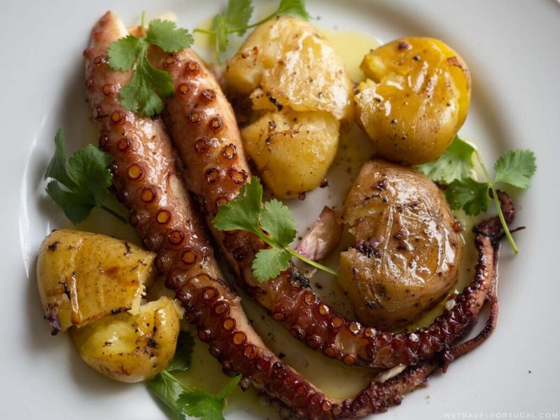

# Polvo à Lagareiro

*Portugal's olive-press-day plate: tender octopus and punched new potatoes roasted hard under a generous flood of garlicky olive oil.*

**Serves:** 4

**Prep Time:** 25 minutes

**Cook Time:** 2 hours

## Overview
A whole octopus (frozen-then-thawed is best, freezing tenderises it; OR pre-cleaned and beaten by a fishmonger) is simmered in a covered pot with onion, bay and lemon peel for 50-60 minutes until tender. Lifted out; cut into segments at the joints. Small new potatoes parboil for 12 minutes; drained, "punched" gently with the back of a wooden spoon to fracture them but not break them apart. Octopus and potatoes go into a wide oven dish; slathered with olive oil, garlic, paprika, bay; baked at 220°C 25 minutes until the edges are deep colour. Garnished with parsley, lemon, and an additional drizzle of raw olive oil.

## Ingredients

### Octopus
- 1 octopus (about 1 ½-2 kg, frozen then thawed, or pre-tenderised from the fishmonger)
- 1 onion (halved)
- 2 bay leaves
- A strip of lemon peel
- 1 teaspoon salt
- Water (enough to cover)

### Potatoes
- 800 g small new potatoes (the smaller, the better - about walnut-sized)
- 2 teaspoons salt (for boiling)

### To roast
- 200 ml extra-virgin olive oil (generous - this is "lagareiro" - the olive-oil press style)
- 8 garlic cloves (sliced thin)
- 2 bay leaves
- 1 teaspoon smoked paprika
- 1 teaspoon sweet paprika
- 1 teaspoon coarse salt
- ½ teaspoon black pepper

### Garnish
- 3 tablespoons fresh flat-leaf parsley (chopped)
- 1 lemon (cut into wedges)
- 2 tablespoons raw olive oil (drizzle)

## Method

### Stage 1 - Cook the octopus
1. Place octopus in a large pot with onion, bay leaves, lemon peel and salt.
1. Cover with water (just to submerge).
1. Bring to a boil; reduce to a low simmer; partially cover.
1. Cook 50-60 minutes until tender - a knife should slip easily through the thickest part of the tentacle.
1. Off heat; let cool 15 minutes in the cooking liquid (continues to tenderise).

### Stage 2 - Parboil and punch potatoes
1. Bring a pot of well-salted water to a boil.
1. Add the new potatoes whole (skins on); boil 10-12 minutes until just tender.
1. Drain.
1. With the back of a wooden spoon (or your palm), gently press each potato - they should crack open slightly without breaking apart entirely.

### Stage 3 - Cut the octopus
1. Lift octopus from the cooking liquid.
1. Cut each tentacle off the body where it meets the head.
1. Cut the head into 4 pieces; discard the eye-and-beak section.
1. Pat dry on kitchen paper.

### Stage 4 - Roast
1. Heat oven to 220°C (200°C fan).
1. Drizzle 100 ml olive oil into a wide oven dish.
1. Scatter sliced garlic, bay leaves, paprika (both), salt and pepper.
1. Arrange the punched potatoes and octopus tentacles in the dish - overlap loosely.
1. Drizzle the remaining 100 ml olive oil over the top - yes, that much.
1. Toss to coat.

### Stage 5 - Bake
1. Roast 25-30 minutes - the potatoes crisp at the edges; the octopus tentacles slightly char and curl; the olive oil bubbles.

### Stage 6 - Serve
1. Tip onto a wide serving platter.
1. Scatter chopped parsley.
1. Squeeze a wedge of lemon over.
1. Drizzle extra olive oil - the "lagareiro" finish.

## Notes
- **Frozen octopus, thawed:** Freezing breaks down the connective tissue and gives a tender octopus without other tricks. If your octopus is fresh, bash it on a rock or against the sink before cooking (or pre-freeze it for 24 hours).
- **Generous olive oil:** Lagareiro means "the press worker's style" - generous oil is the point. 200 ml across the dish is not too much. Use a good olive oil; this is its showcase.
- **Don't pre-salt heavily:** Octopus shrinks in salt brine. Light salting only during the simmer; final salt is applied during roasting.

## Storage
- Refrigerate 3 days; reheat covered in a 180°C oven 12 minutes.
- Freezes 2 months.
