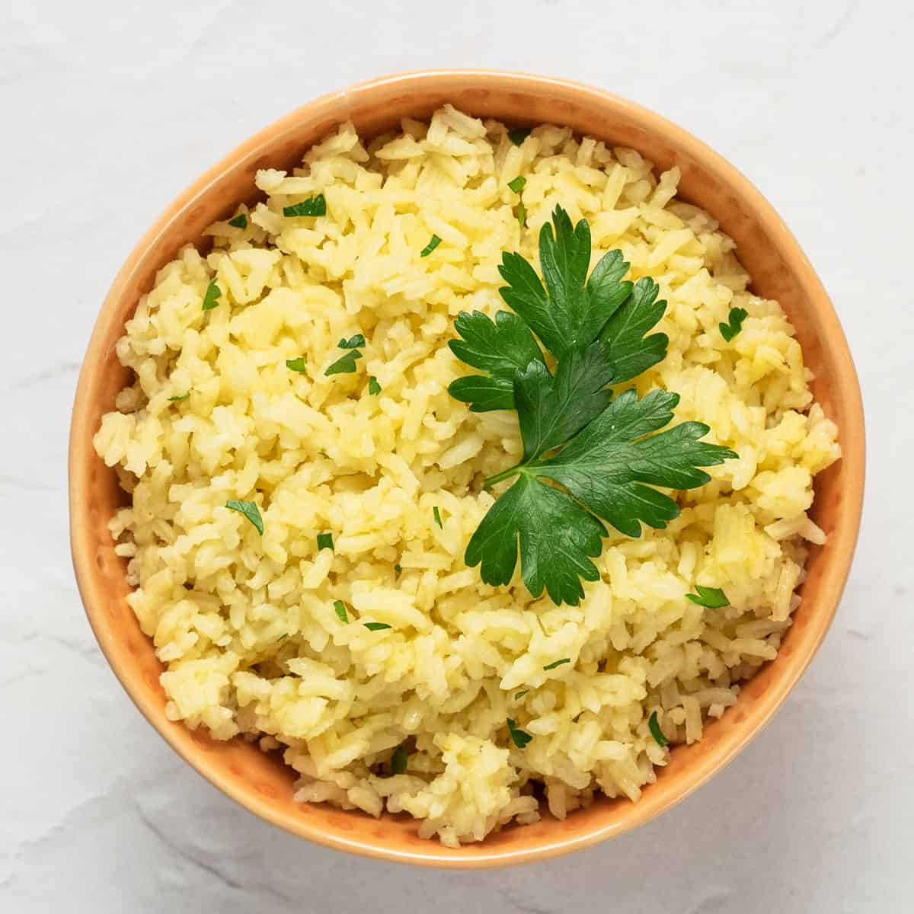

# Arroz Português

*Portugal's everyday rice: medium-grain rice cooked in butter and stock with sautéed onion, garlic and bay leaves till tender and slightly creamy. The simple Portuguese rice side that accompanies every fish, meat or vegetable main; the traditional Portuguese rice technique.*

**Serves:** 4-6

**Prep Time:** 10 minutes

**Cook Time:** 25 minutes

## Overview
Arroz Português is Portugal's everyday rice side and the traditional accompaniment to virtually every Portuguese main course: medium-grain rice (the Portuguese carolino) cooked in olive oil and chicken stock with sautéed onion, crushed garlic, bay leaves and a touch of butter, till the grains are tender and slightly creamy (slightly stickier than long-grain because of the medium-grain choice). The dish distinguishes itself from Spanish or Italian rices by the simpler aromatic base (just onion-garlic; no saffron, no wine, no piri-piri in the basic version) and the medium-grain choice. Served alongside bitoque, bacalhau dishes, grilled fish, or stewed meats. Medium-grain rice (carolino or calrose); long-grain works but the texture is different. The rice gets a brief sauté in olive oil before the stock (the tostar o arroz step) for proper character. The aromatics stay simple: onion, garlic, bay leaves; don't over-complicate.

## Ingredients

- 400 g medium-grain rice (carolino; or Calrose; or arborio as substitute)
- 4 tablespoons olive oil
- 2 tablespoons butter
- 1 medium onion (finely chopped)
- 6 garlic cloves (crushed)
- 3 bay leaves
- 800 ml hot chicken stock (or vegetable stock; or water)
- 1 ½ teaspoons fine sea salt
- ½ teaspoon ground white pepper
- 1 tablespoon fresh parsley (chopped, optional)

## Method

### Stage 1 - Sauté the base
1. Heat the olive oil and butter in a wide saucepan over medium heat.
2. Add the chopped onion; cook 6 minutes till soft.
3. Add the crushed garlic; cook 30 seconds.

### Stage 2 - Toast the rice
1. Add the rinsed rice; stir to coat in the buttery oil.
2. Toast 1-2 minutes till the grains are coated and slightly glossy.

### Stage 3 - Add stock and aromatics
1. Pour in the hot chicken stock.
2. Add the bay leaves, salt and pepper.
3. Stir once.

### Stage 4 - Cook covered
1. Bring to a simmer.
2. Reduce heat to lowest; cover with the lid.
3. Cook 18-20 minutes covered.

### Stage 5 - Rest off heat
1. Take off the heat; keep the lid on.
2. Rest 10 minutes.

### Stage 6 - Fluff and serve
1. Uncover; lift out the bay leaves.
2. Fluff with a fork.
3. Scatter chopped parsley if using.

## Notes
- **Medium-grain rice:** carolino traditional.
- **Toast briefly in oil:** standard Portuguese technique.
- **Simple aromatics:** don't over-complicate.
- **Don't lift the lid during cooking.**

## Variations
- **Arroz de feijão:** add 1 tin of drained kidney beans in the last 5 minutes; gives Portuguese rice-and-beans.
- **Tomato variation:** add 2 chopped tomatoes with the onion; gives a closer-to-arroz-de-tomate version.
- **With chouriço:** add 100 g of sliced chouriço with the onion.
- **Coconut variation:** swap half the stock for coconut milk; less traditional Portuguese (more Mozambican).

## Serving
- Alongside any Portuguese main course. With bacalhau, frango piri-piri, bitoque, grilled fish.

## Storage
- Keeps refrigerated 3 days; reheat with a splash of stock.
- Freezes 2 months.
- Day-old rice makes excellent fried rice or stuffed peppers.
