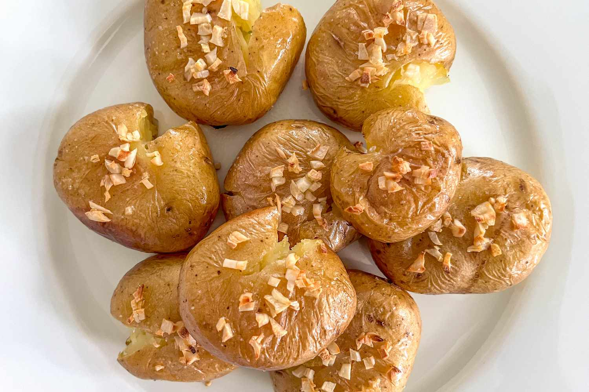

# Batatas a Murro

*Portugal's "punched potatoes": small potatoes boiled in their skins, then smashed with the heel of the hand (or a fork), drizzled with olive oil, garlic and fresh herbs, and roasted till the smashed edges crisp golden. The Portuguese countryside potato side, the canonical accompaniment to grilled meats and fish.*

**Serves:** 4-6

**Prep Time:** 15 minutes

**Cook Time:** 50 minutes

## Overview
Batatas a murro (literally "punched potatoes"; murro = a punch with the fist) is one of Portugal's most beloved potato sides and the canonical accompaniment to grilled meats and fish: small whole potatoes (egg-sized, waxy) boiled in their skins till tender, then smashed flat with the heel of the hand (the murro), drizzled with olive oil, sliced garlic, sea salt, parsley and a touch of paprika, then roasted in a hot oven till the smashed edges crisp golden-brown. The combination of soft creamy interior and crispy edges is what makes the dish special. Waxy potatoes (new or small charlotte) are essential; floury ones break apart. The smashing creates cracks and surface area for the oil and garlic to penetrate and crisp. The olive oil is generous; the potatoes should come out glossy.

## Ingredients

- 1 kg small waxy potatoes (new potatoes, charlotte, or small Yukon Gold)
- 2 tablespoons fine sea salt (for boiling)
- 8 garlic cloves (sliced; some whole, some sliced)
- 100 ml extra virgin olive oil
- 2 teaspoons flaky sea salt
- 1 teaspoon ground black pepper
- 1 tablespoon sweet paprika
- 1 large bunch fresh flat-leaf parsley (chopped)
- 2 tablespoons fresh thyme leaves (optional)
- Lemon wedges (to serve)

## Method

### Stage 1 - Boil the potatoes
1. Place potatoes (with skins) in a large pot of cold salted water.
2. Bring to a boil; cook 15-20 minutes till the potatoes are tender (a knife slides through easily).
3. Drain.

### Stage 2 - Smash the potatoes
1. Preheat the oven to 220°C (425°F).
2. Place the cooked potatoes on a wide baking sheet lined with parchment.
3. Smash each potato lightly with the heel of your hand (or with a flat-bottomed glass) to break it into a flat disc with rough cracked edges.
4. Don't smash too hard; you want the potato to mostly hold together with cracks and rough edges.

### Stage 3 - Drizzle and season
1. Drizzle generously with olive oil over each smashed potato.
2. Scatter the sliced garlic, flaky salt, pepper, paprika and half the chopped parsley.

### Stage 4 - Roast
1. Roast at 220°C for 25-30 minutes till the smashed edges are deep golden and crisp.
2. Toss halfway through (gently) for even browning.

### Stage 5 - Finish
1. Take out; scatter the remaining parsley and fresh thyme.
2. Drizzle with a final bit of olive oil.

### Stage 6 - Serve
1. Pile on a serving platter.
2. Lemon wedges alongside.

## Notes
- **Waxy potatoes:** new potatoes, charlotte, or small Yukon Gold.
- **Smash, don't pulverise:** keep some shape.
- **Generous olive oil:** the canonical Portuguese touch.
- **Smashed edges crisp:** the texture contrast is the point.

## Variations
**With rosemary:** add 2 sprigs of fresh rosemary; gives a more Italian-Portuguese twist.
**Spicier:** add 1 tablespoon of piri-piri sauce.
**With sea salt and lemon zest:** add zest of 1 lemon over the finished potatoes.
**Garlic-confit version:** roast whole peeled garlic cloves alongside the potatoes; gives soft garlic to mash and eat.

## Serving
Alongside grilled meats (frango piri-piri, bitoque), grilled fish (sardinhas assadas, robalo grelhado), or as a vegetarian side with salad.

## Storage
- Best eaten warm and crispy.
- Keeps refrigerated 3 days; reheat in a hot oven 5 minutes.
- Don't microwave; soggy.
- Don't freeze.
