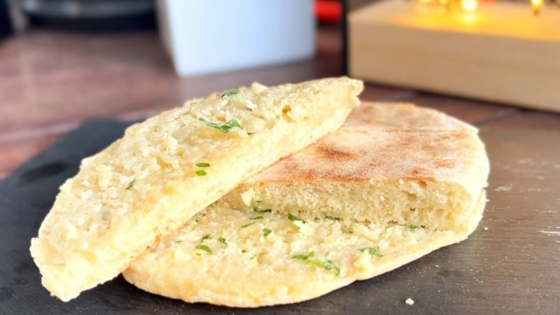

# Bolo do Caco

*Madeira's iconic flatbread: a round-disc bread made with sweet potato in the dough (the Madeiran twist), traditionally cooked on a hot basalt stone (caco) - hence the name - and served warm split open and slathered with garlic-and-parsley butter (manteiga de alho). Soft, chewy, slightly sweet from the sweet potato, irresistible with garlic butter melting in. The Madeira beach café staple; a fine snack with a glass of poncha.*

**Serves:** 4 (makes 4 round breads)

**Prep Time:** 25 minutes (plus 1 hour rising)

**Cook Time:** 20 minutes

## Overview
A small orange sweet potato is boiled, peeled, mashed to a smooth purée. The dough: strong flour, mashed sweet potato, yeast, salt, sugar and water mix to a soft slightly sticky dough; rises 1 hour. Divides into 4; each shapes into a flat 18 cm round disc. Cooked on a hot dry griddle (or a heavy heavy frying pan, since basalt stones are rare in domestic kitchens) 5 minutes per side until both sides are charred-spotted. Split horizontally; the garlic-parsley butter slathers inside; close like a sandwich.

## Ingredients

### Dough
- 1 medium orange sweet potato (about 250 g)
- 500 g strong white bread flour
- 1 sachet (7 g) fast-action yeast
- 1 ½ teaspoons salt
- 1 tablespoon caster sugar
- 200 ml warm water (more if needed)
- 2 tablespoons sunflower oil

### Garlic butter
- 100 g unsalted butter (very soft)
- 6 garlic cloves (crushed to a paste)
- 3 tablespoons fresh flat-leaf parsley (chopped fine)
- ½ teaspoon salt
- Pepper

## Method

### Stage 1 - Cook the sweet potato
1. Bring a pot of water to a boil.
1. Add the whole unpeeled sweet potato; boil 25 minutes until tender.
1. Drain; cool slightly; peel; mash to a smooth purée (no lumps).
1. Measure 200 g of the purée for the dough.

### Stage 2 - Dough
1. In a wide bowl, whisk flour, yeast, salt and sugar.
1. Add the mashed sweet potato, warm water and oil.
1. Mix to a soft sticky dough. Add a few more tablespoons of water if too stiff, or a few tablespoons of flour if too wet - the dough should be soft enough to be slightly tacky but cohesive.
1. Knead 8 minutes by hand (or 6 minutes in a stand mixer) until smooth.
1. Cover; rise 1 hour until doubled.

### Stage 3 - Garlic butter (make ahead - improves with rest)
1. In a small bowl, mash the soft butter with crushed garlic, parsley, salt and pepper until uniformly green-flecked.
1. Cover; refrigerate until needed (but soften before use).

### Stage 4 - Shape
1. Knock back the dough; divide into 4 balls.
1. Cover; rest 10 minutes.
1. Flatten each ball into a round disc, 18 cm across, about 1 cm thick.
1. Cover loosely; rest 15 minutes (proof a little).

### Stage 5 - Cook
1. Heat a wide heavy dry frying pan (or cast-iron griddle) over medium-high heat 3 minutes.
1. Cook each disc 5-6 minutes per side, pressing gently with a spatula - the bread puffs slightly; both sides become spotted-brown.
1. Lift onto a plate; cover with a tea towel to keep soft.
1. Repeat with remaining discs.

### Stage 6 - Serve
1. While the bread is still warm, split each disc horizontally (like a pita).
1. Slather the inside with garlic butter (1-2 tablespoons per bread, generous).
1. Close.

### Stage 7 - Eat
1. Eat warm, with napkins - the butter drips out.
1. Excellent with the cataplana, with espetada (Madeira's grilled meat skewers), or just on its own.

## Notes
- **Orange sweet potato, not white:** The orange variety gives bolo do caco its distinctive faint sweetness and warm golden colour. White-fleshed sweet potatoes (boniato) make a paler, less interesting bread.
- **Don't skip the garlic butter:** The butter is the dish's identity. Bolo do caco served without garlic butter is just a bread.
- **Dry pan, no oil:** The discs cook on a dry hot surface (mimicking the basalt stone). Don't add oil to the pan; the bread chars naturally.

## Storage
- Best within 4 hours of cooking.
- Refrigerate 3 days; refresh in a dry pan 1 minute per side.
- Freeze cooked 2 months; reheat from frozen in a hot dry pan 2 minutes per side, then add butter.
- Garlic butter alone refrigerates 1 week, freezes 2 months.
