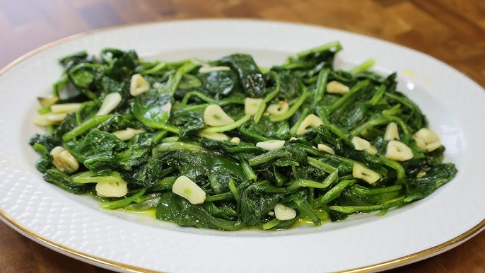

# Grelos com Alho

*Portugal's garlic greens: turnip tops (or broccoli rabe, kale, or any sturdy bitter greens) blanched, then sautéed in olive oil with crushed garlic and a touch of red pepper flakes. The Portuguese green side, the everyday accompaniment to grilled meats, fish and cozido that bridges the gap between Mediterranean Italian and Iberian cooking.*

**Serves:** 4

**Prep Time:** 10 minutes

**Cook Time:** 12 minutes

## Overview
Grelos com alho (literally "turnip-tops with garlic") is Portugal's beloved garlic-greens side and a fixture of every Portuguese family meal: grelos (the Portuguese name for turnip tops; the leafy greens that grow on top of turnips before the root is harvested; closely related to broccoli rabe or rapini) are blanched briefly in salted water, drained, then sautéed in generous olive oil with sliced garlic, dried red pepper flakes (piri-piri optional), salt and a squeeze of lemon at the end. Outside Portugal where grelos are hard to find, substitute with broccoli rabe (rapini; the closest substitute), turnip greens, kale, or cavolo nero. The dish is what Portuguese families serve alongside virtually every main course; the bitter pungent greens are the canonical Mediterranean-Iberian green vegetable. Three details define proper grelos com alho. First, blanch briefly first. The greens need a 90-second blanch to soften slightly before sautéing; raw straight in the pan gives uneven cooking. Second, plenty of garlic, sliced. Lots of garlic is the canonical Portuguese touch. Third, generous olive oil. The dish should be glossy with oil.

## Ingredients

- 600 g grelos (turnip tops); or broccoli rabe (rapini); or cavolo nero (Tuscan kale); or curly kale
- 2 tablespoons fine sea salt (for blanching water)
- 6 tablespoons extra virgin olive oil
- 10 garlic cloves (sliced thin)
- 1 teaspoon dried red pepper flakes (or piri-piri sauce)
- 1 ½ teaspoons fine sea salt
- 1 teaspoon ground black pepper
- Juice of 1 lemon
- Extra olive oil for finishing

## Method

### Stage 1 - Blanch the greens
1. Trim any tough stems from the greens.
2. Bring a large pot of salted water to a rolling boil.
3. Add the greens; blanch 90 seconds.
4. Drain immediately; rinse under cold water briefly to stop cooking; squeeze out excess water.
5. Roughly chop into 4 cm pieces.

### Stage 2 - Sauté the garlic
1. Heat the olive oil in a wide heavy pan over medium heat.
2. Add the sliced garlic; cook 90 seconds till just pale gold (don't brown).
3. Add the red pepper flakes; cook 30 seconds.

### Stage 3 - Add the greens
1. Add the blanched chopped greens; toss to coat in the garlic-oil.
2. Add the salt and pepper.
3. Cook 4-5 minutes, stirring occasionally, till the greens are tender and properly hot.

### Stage 4 - Finish
1. Squeeze the lemon juice over.
2. Drizzle with extra olive oil for shine.

### Stage 5 - Serve
1. Tip onto a serving plate.
2. Serve warm or at room temperature.

## Notes
- **Blanch first:** essential for even cooking.
- **Don't brown the garlic:** pale gold only.
- **Generous olive oil:** Portuguese standard.
- **Lemon at the end:** brightness.
- **Bitter greens:** the bitterness is the point.

## Variations
**With chouriço:** add 100 g of sliced chouriço with the garlic; gives extra richness.
**Spicier:** double the red pepper flakes; add 1 tablespoon piri-piri.
**With anchovy:** add 2 anchovy fillets to the oil with the garlic; gives umami.
**With pine nuts:** add 30 g of toasted pine nuts; gives Italian-leaning texture.

## Serving
Alongside any Portuguese main: bitoque, francesinha, bacalhau dishes, cozido, grilled fish.

## Storage
- Best eaten warm.
- Keeps refrigerated 3 days; reheat briefly in a pan.
- Don't freeze; texture suffers.
