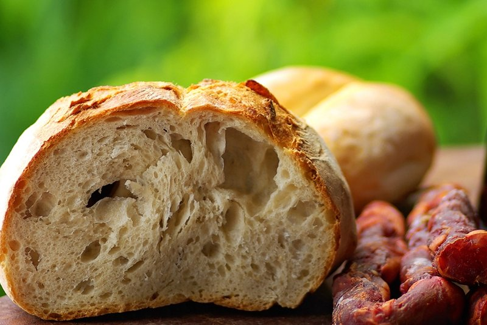

# Pão Alentejano

*The Alentejo's dense crusty country bread: a slow-fermented sourdough-style loaf made from a high-extraction wheat flour, with a tight chewy crumb and a thick deeply-coloured crust. The signature bread of southern Portugal; the bread you tear into to soak up açorda or migas, or eat with fresh cheese, presunto and olive oil. Bakes for over an hour to develop that characteristic crust. Keeps for a week and only gets better for soaking.*

**Serves:** 8 (makes 1 large loaf)

**Prep Time:** 25 minutes (plus 12 hours starter, plus 3-4 hours rises)

**Cook Time:** 50 minutes

## Overview
A poolish (overnight starter) of flour, water and a tiny pinch of yeast ferments 12 hours. Combined with the rest of the flour, water, salt and a small additional yeast amount. Kneaded into a shaggy dough; rises 2 hours with stretch-and-folds every 30 minutes. Shaped into a round; final proof 1-1 ½ hours. Baked at 240°C for 15 minutes (with steam), then 220°C 30-35 minutes, on a baking stone if available. The result: deep dark crust, slightly sour smell, dense chewy crumb.

## Ingredients

### Poolish (starter)
- 200 g strong white bread flour
- 200 g warm water
- ¼ teaspoon (1 g) fast-action yeast

### Dough
- 400 g strong white bread flour
- 100 g whole-wheat flour
- 1 teaspoon (3 g) fast-action yeast
- 12 g salt
- 280 ml warm water (more if needed)

## Method

### Stage 1 - Poolish (the night before)
1. In a wide bowl, whisk the poolish flour, water and pinch of yeast until smooth.
1. Cover with cling film or a plate; rest at room temperature 12-16 hours. It should be bubbly on top and smell faintly sour-sweet.

### Stage 2 - Mix the dough
1. Add the poolish to a large mixing bowl.
1. Add the additional flour, yeast, salt and warm water.
1. Mix to a shaggy sticky dough.

### Stage 3 - Stretch and fold
1. Cover the bowl; rest 30 minutes (autolyse).
1. Wet your hand; lift one side of the dough, stretch it up, fold over the centre. Rotate the bowl 90°; repeat. Do 4 stretch-and-folds in total.
1. Cover; rest 30 minutes; repeat. Total: 4 rounds of stretch-and-folds over 2 hours.
1. By the end, the dough should be smooth, slightly sticky but cohesive, and about 50% bigger.

### Stage 4 - Shape
1. Tip the dough onto a lightly floured surface.
1. Shape into a tight round: fold the edges into the centre, then turn over and tighten the surface by dragging it across the surface with cupped hands.
1. Place seam-side up in a heavily floured banneton (or a bowl lined with a floured tea towel).

### Stage 5 - Final proof
1. Cover; rise at room temperature 1-1 ½ hours, until poking the dough leaves a slow-springing indent (not totally springing back).

### Stage 6 - Bake
1. Heat oven to maximum (260°C or as high as it goes) with a baking stone or upside-down baking tray for 30 minutes.
1. Place a small tray of water on the bottom of the oven for steam.
1. Carefully tip the dough seam-side down onto the hot stone (or a piece of baking paper, slid onto the stone).
1. Score the top with a sharp blade in a single deep cross or 3 parallel slashes.
1. Bake 15 minutes at maximum.
1. Reduce heat to 220°C (200°C fan).
1. Bake 30-35 minutes more, until deep dark brown and the loaf sounds hollow when tapped on the bottom.
1. The internal temperature should be 95°C+ at the centre.

### Stage 7 - Cool
1. Cool on a wire rack at least 1 hour before slicing - cutting hot bread gives a gummy crumb.

## Notes
- **Poolish overnight is non-negotiable:** The fermentation builds the flavour. A quick same-day bread is a different (perfectly fine) thing, but not pão alentejano.
- **Steam in the first 15 minutes:** The tray of water at the bottom is what gives the crust its characteristic crackled deep crust. After 15 minutes, the steam has done its work and you can remove the tray.
- **Cool fully before slicing:** Hot bread sliced has a doughy texture; cool to room temperature for the crumb to fully set.

## Storage
- Wrapped in a clean tea towel at room temperature: 5 days. Crust softens by day 2 but the crumb stays good.
- Sliced and frozen: 2 months. Toast slices from frozen.
- Gets better at soaking up broth as it stales - perfect for açorda or migas.
