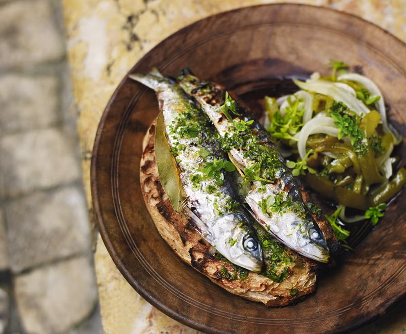

# Sardinhas Assadas

*Portugal's summer festival fish: whole fresh sardines salted heavily and grilled hard over open coals till the skin chars and the flesh just flakes.*

**Serves:** 4

**Prep Time:** 10 minutes (plus 1 hour salting)

**Cook Time:** 12 minutes

## Overview
Grilled sardines are the smell of a Portuguese summer. From June to August the small finger-length sardines come into season, you buy them from the fishmonger in the morning, salt them with coarse salt for an hour to firm the flesh, then grill them whole over charcoal (or under a domestic broiler) for three or four minutes a side until the skin chars and the flesh just lifts off the spine. Eat them with your fingers, off torn bread, with a glass of vinho verde and the lights low. The sea, in a single mouthful.

## Ingredients

- 12 fresh whole sardines (small, about 600 g total - ideally finger-length, no longer than your hand)
- 4 tablespoons coarse sea salt (yes, that much)
- Olive oil (for the grill or pan)

### To serve
- 4 thick slices of crusty country bread
- 2 red bell peppers (roasted, peeled, sliced, optional)
- 1 small bunch fresh parsley
- 2 lemons (cut into wedges)
- 4 boiled new potatoes (optional)
- A glass of cold vinho verde

## Method

### Stage 1 - Salt
1. Rinse sardines briefly under cold water; don't gut them (intact sardines hold their shape better on the grill - Portuguese tradition is to grill whole; the guts are discarded after).
1. Pat dry on kitchen paper.
1. Lay on a wide tray.
1. Sprinkle generously with coarse salt on both sides and inside the cavity.
1. Rest 1 hour at room temperature (the salt firms the flesh and seasons through; excess salt absorbs and is wiped off).

### Stage 2 - Wipe off excess salt
1. After the salt rest, lift each sardine; rub off any remaining surface salt crystals with your hands.
1. Pat dry on kitchen paper.

### Stage 3 - Grill (best - charcoal)
1. Build a fierce charcoal fire; wait for the coals to be glowing red.
1. Brush the grill grate lightly with olive oil to prevent sticking.
1. Lay sardines on the hot grate - don't crowd; they should sizzle immediately.
1. Grill 3-4 minutes per side, until the skin is deeply charred and the flesh flakes easily from the spine.

### Stage 3 (alt) - Domestic broiler
1. Heat the grill (broiler) to maximum.
1. Line a tray with foil; brush with olive oil.
1. Lay sardines on it.
1. Position close to the heat (5-10 cm).
1. Cook 4 minutes; flip; cook 3-4 more minutes until charred.

### Stage 4 - Serve
1. Lift sardines onto warm plates over slices of crusty bread (the bread soaks up the juices and oil - eat the bread).
1. Arrange roasted pepper strips, parsley sprigs, lemon wedges and boiled potatoes alongside.

### Stage 5 - Eat
1. Use your fingers. Hold the head and tail; the spine lifts cleanly out of the flesh.
1. Eat off the bread that's been collecting the juices. Wash down with cold vinho verde.

## Notes
- **Fresh whole sardines:** Frozen-thawed work but the texture is a step down. Ideally buy from a fishmonger the day of cooking; the eyes should be clear, the gills bright red.
- **Salt then wipe:** Heavy salting + 1 hour rest + wipe-off is the technique. The fish is properly seasoned without being painfully salty.
- **The bread is the plate:** Sardines on bread is the Portuguese way. The bread catches the smoky-oily juices; eat it last (or along the way).

## Storage
- Best within 30 minutes of cooking. Sardines don't keep.
- Leftover cooked sardines refrigerate 1 day; eat cold on bread the next day.
