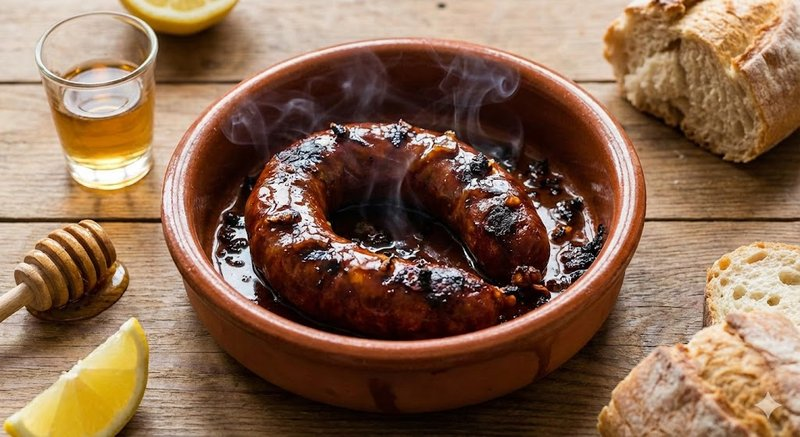

# Chouriço Assado

*Portugal's flame-grilled chorizo: a whole chouriço (smoked paprika pork sausage - distinct from Spanish chorizo, which is harder; Portuguese chouriço is softer and smokier) charred over a small ceramic burner (the assador de barro - a clay pig-shaped dish) doused with aguardente or brandy and set alight at the table. Sliced thick and eaten by hand with bread. The defining Portuguese tasca bar-snack - theatrical, hot, garlicky, smoky.*

**Serves:** 4 (as a snack)

**Prep Time:** 5 minutes

**Cook Time:** 10 minutes

## Overview
A whole Portuguese chouriço (or paprika chorizo as substitute) sits on a clay assador (the pig-shaped dish for the purpose; or any heat-safe dish with high sides). Aguardente (Portuguese brandy / firewater) - or any high-proof brandy / rum - pours over to a depth of 1 cm. Lit with a match at the table. The blue alcohol flames cook and char the chouriço over 8-10 minutes; the sugar in the paprika caramelises; the kitchen fills with a dramatic smoky aroma. Once the flames die, the chouriço slices thick. Served with bread, the rendered oil from the dish, olives, and pickled chillies.

## Ingredients

- 1 whole Portuguese chouriço (about 250 g - sold at Portuguese / Spanish shops; substitute Spanish chorizo if necessary; cured, not fresh)
- 60 ml aguardente or any high-proof spirit (brandy, dark rum, white rum, or vodka - anything 40% or higher)
- A few small slits in the chouriço skin (helps the flames cook through)

### Equipment
- 1 assador de barro (the clay pig-shaped Portuguese dish - sold at Portuguese shops; OR substitute a small heat-safe deep dish, a heavy iron pan, or any flameproof bowl)
- A long match or BBQ lighter

### To serve
- Crusty bread (slices of rustic country loaf)
- Olives (Portuguese black if possible)
- Pickled chillies
- A small dish of olive oil
- A glass of vinho verde (chilled) or a young red

## Method

### Stage 1 - Score the chouriço
1. With a sharp knife, make 4-5 shallow slits along the length of the chouriço (1 cm deep, about 4 cm apart). These let the flames penetrate and the fat render.

### Stage 2 - Set up the dish
1. Place the chouriço in the assador or heat-safe dish.
1. Pour the aguardente / spirit over to a depth of about 1 cm in the dish bottom (the chouriço should sit in a small pool).

### Stage 3 - Light (carefully)
1. **At the table for theatre, with care:** turn off any nearby gas; ensure no flammables overhead; have a saucepan lid nearby to smother flames if needed.
1. Hold a long match or lighter to the spirit; light it.
1. Blue flames will rise - they're hot but controlled because the alcohol level is low and the dish contains them.

### Stage 4 - Cook in the flames
1. The flames cook the chouriço over 8-10 minutes.
1. As the alcohol burns off, the flames die down.
1. Use tongs to turn the chouriço halfway through (carefully - flames can flare).
1. The skin should char in patches; the fat should render and pool below the sausage.

### Stage 5 - When the flames die
1. Once the flames extinguish completely (about 8-10 minutes), the chouriço should be hot through, with charred skin and a pool of paprika-orange rendered fat below.

### Stage 6 - Slice and serve
1. Lift the chouriço onto a board.
1. Slice into 1 cm coins.
1. Arrange on a plate with bread, olives, pickled chillies.
1. Drizzle some of the dish oil over the slices.
1. Mop the rendered oil from the dish with bread - that's the best bit.

### Stage 7 - Serve immediately
1. Eat warm, with the fingers.
1. Pair with vinho verde, a young red, or a glass of Madeira.

## Notes
- **Don't substitute fresh chorizo:** Portuguese chouriço is cured (dried, smoked, sliceable raw). Fresh / raw paprika chorizo (the soft cooking kind) doesn't work for this dish - it'll cook unevenly and lose its shape.
- **Safety:** Lighting alcohol at the table is dramatic but requires care. Don't pour MORE alcohol onto an already-flaming dish (a flame can travel up the stream into the bottle). Use a long match. Have a saucepan lid nearby to smother flames.
- **The rendered fat is the best part:** Don't waste it. Mop with bread, drizzle over the slices, or pool a small spoonful onto each slice.

## Storage
- Eat immediately. Doesn't store.
- An un-flamed chouriço keeps cured for weeks/months wrapped in butcher's paper in the fridge.
