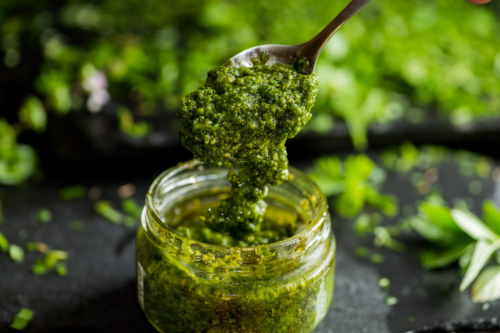

# Molho de Coentros

*Portugal's coriander sauce: a vivid green sauce of fresh coriander, garlic, olive oil, vinegar and salt, Portuguese pesto without the cheese. The everyday Portuguese herb sauce, drizzled over grilled fish, ladled into açorda, or used as a marinade for sardines.*

**Serves:** Makes about 250 ml

**Prep Time:** 10 minutes

**Cook Time:** 0 minutes

## Overview
Molho de coentros is Portugal's iconic coriander sauce and one of the most pervasive Portuguese herb condiments: a vivid green sauce made by blitzing (or pounding in a mortar) a generous amount of fresh coriander leaves and stems with crushed garlic, extra virgin olive oil, white wine vinegar, sea salt and ground black pepper, Portuguese pesto without the pine nuts or cheese, focused entirely on the herb's character. Coriander is the most beloved herb in Portuguese cooking (uniquely so in European cooking, Italians and Spanish use it sparingly, the Portuguese put it on everything), and molho de coentros is the traditional way to celebrate its flavour. Drizzled over grilled fish, ladled into açorda (Alentejo bread soup), used as a marinade for sardines, stirred into rice, mixed into mayonnaise for sandwiches. Plenty of coriander; the sauce is named for the herb, so don't be timid. Fresh garlic, crushed, never powder. Eat fresh; the sauce loses its bright green colour and flavour after 24 hours.

## Ingredients

- 2 large bunches fresh coriander (about 100 g total; leaves and tender stems)
- 8 garlic cloves (crushed)
- 6 tablespoons extra virgin olive oil
- 3 tablespoons white wine vinegar
- 1 teaspoon fine sea salt
- ½ teaspoon ground black pepper

### Optional additions
- 1 fresh green chilli (for warmth)
- 1 tablespoon fresh lemon juice (for brightness)
- 1 teaspoon ground cumin (gives depth)
- 2 tablespoons grated Parmesan (less traditional but works)
- 30 g pine nuts (toasted, blended in, gives Italian-pesto-leaning version)

## Method

### Stage 1 - Wash and prep
1. Rinse the coriander; shake off excess water.
2. Trim any tough stem ends.
3. Roughly chop.

### Stage 2 - Blend
1. Place the coriander, crushed garlic, olive oil, vinegar, salt and pepper in a blender or food processor (or use a mortar and pestle for traditional).
2. Blitz to a vivid green sauce; keep some texture if you prefer (don't fully smooth).

### Stage 3 - Adjust
1. Taste; adjust salt and acid.
2. Add optional additions (chilli, lemon, cumin) as desired.

### Stage 4 - Rest
1. Cover and rest 15-20 minutes for flavours to marry.

### Stage 5 - Use
1. Drizzle over grilled fish, meats, eggs, soups.
2. Stir into mayonnaise for sandwiches.
3. Use as a marinade.

## Notes
- **Lots of coriander:** the dish is named for it.
- **Don't pre-make too far ahead:** loses colour after 24 hours.
- **Adjust olive oil for texture:** thicker or thinner to taste.
- **Use stems too:** they have flavour.

## Variations
- **With parsley:** add 1 small bunch of parsley alongside the coriander; gives a less assertive version.
- **Spicier:** add 1 chopped green chilli.
- **Pesto-style:** add 30 g toasted pine nuts and 2 tablespoons Parmesan; Italian-leaning.
- **Without vinegar (oil-only):** skip the vinegar; gives a richer oilier version.

## Serving
- Drizzle on grilled fish (the traditional use), grilled chicken, açorda, eggs, soups, sandwiches. As a marinade for sardines or pork.

## Storage
- Best eaten the day made; loses colour after 24 hours.
- Keeps refrigerated 3 days but the flavour fades.
- Don't freeze.
- Make in small batches.
