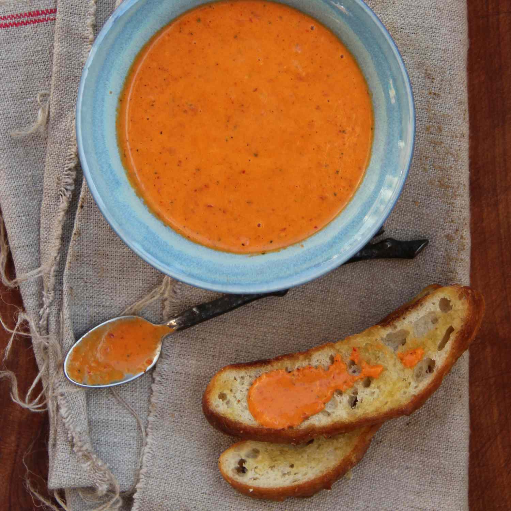

# Molho Piri-Piri

*Portugal's foundational chilli sauce: fresh red bird's-eye chillies (piri-piri) infused in olive oil with garlic, lemon juice, paprika, oregano and salt into a fiery red sauce. The Portuguese (and Mozambican, and Angolan) condiment that goes on grilled chicken, fish, vegetables - anywhere heat is wanted.*

**Serves:** Makes about 250 ml

**Prep Time:** 15 minutes

**Cook Time:** 5 minutes

## Overview
Molho piri-piri is Portugal's foundational hot sauce and the source of the famous "piri-piri chicken" (peri-peri/peri-peri chicken in English/South African vernacular): fresh red bird's-eye chillies (the "piri-piri" - meaning "pepper pepper" in Swahili; named for the chilli variety that arrived in Portugal from former colonies in southeast Africa) blitzed or infused in olive oil with crushed garlic, fresh lemon juice, white wine vinegar, sweet paprika, dried oregano, salt and pepper into a fiery red oil-based sauce. The dish is used as both a marinade (for piri-piri chicken, grilled prawns) and a table condiment (drizzled on grilled meats, on bacalhau, into sauces, on bread). The Portuguese, Mozambican and Angolan versions are essentially the same; the sauce travelled with Portuguese sailors and became a defining flavour across the Lusophone world. Three details define proper piri-piri. First, fresh bird's-eye chillies. Available at most supermarkets; substitute with serrano or red Thai chillies. Second, oil-based. Unlike vinegar-based hot sauces, piri-piri uses olive oil as the carrier - the oil is part of the flavour. Third, briefly cooked or raw. Both versions exist; this recipe gives the briefly-cooked version which has more keeping power.

## Ingredients

- 200 g fresh red bird's-eye chillies (piri-piri); or serrano, or red Thai chillies; with stems removed
- 12 garlic cloves
- 250 ml extra virgin olive oil
- Juice of 3 lemons
- 4 tablespoons white wine vinegar
- 2 tablespoons sweet paprika
- 1 tablespoon smoked paprika (optional)
- 2 tablespoons dried oregano
- 1 teaspoon ground cumin
- 1 ½ teaspoons fine sea salt
- 1 teaspoon ground black pepper
- 1 teaspoon caster sugar (optional; balances acidity)

### Optional additions
- 1 small red bell pepper (for sweetness and colour)
- 1 small handful fresh coriander
- 2 tablespoons fresh lemon zest

## Method

### Stage 1 - Prep the chillies and garlic
1. Cut the stems off the chillies.
2. For milder: cut lengthwise and remove seeds.
3. For fiercer: leave seeds in.
4. Roughly chop.
5. Peel the garlic cloves.

### Stage 2 - Blend
1. Place the chillies, garlic, lemon juice, vinegar, paprikas, oregano, cumin, salt, pepper, sugar (and any optional additions) in a blender.
2. Add half the olive oil.
3. Blitz till smooth (or slightly chunky if you prefer).

### Stage 3 - Cook briefly
1. Heat the remaining olive oil in a saucepan over medium heat (just to warm; not smoking).
2. Pour in the blended sauce.
3. Cook 4-5 minutes, stirring, till the sauce darkens slightly and the colour deepens.
4. Don't let it boil hard; warm-cook only.

### Stage 4 - Cool and rest
1. Take off the heat.
2. Cool to room temperature.
3. Transfer to a clean jar.
4. Refrigerate 1 hour before serving (flavours marry).

### Stage 5 - Use
1. As a marinade for chicken (rub thickly all over, marinate 4+ hours, then grill).
2. As a table sauce drizzled on grilled meats, fish, vegetables.
3. As a dipping sauce.

## Notes
- **Fresh chillies essential:** the flavour comes from fresh, not dried.
- **Olive oil based:** part of the flavour, not just carrier.
- **Adjust heat to taste:** seeds in for fierce, out for mild.
- **Brief cook:** deepens colour and improves keeping.

## Variations
**Raw piri-piri (purist):** skip the cooking step; blend everything raw; gives a brighter fresher sauce but shorter shelf life.
**Mozambican piri-piri:** add 1 tablespoon of grated ginger; gives a warmer African profile.
**Angolan version:** add 2 tablespoons of dried shrimp powder; gives umami depth.
**Sweet piri-piri:** double the sugar and add 1 tablespoon of honey; balances the heat.

## Serving
With piri-piri chicken (the canonical use), grilled prawns, bacalhau, grilled fish, roasted vegetables, sandwiches. At the Portuguese table as a condiment.

## Storage
- Keeps refrigerated 1 month in a sealed jar.
- Don't freeze; oil separates.
- Bring to room temperature before serving (cold piri-piri congeals).
- The flavour develops over 24-48 hours; even better after a day or two.
