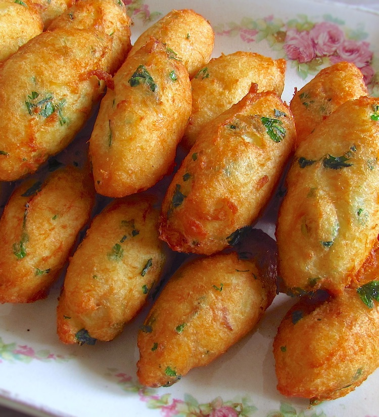

# Pasteis de Bacalhau

*Portugal's defining tapa: small fritters of mashed potato, salt cod, onion and parsley, deep-fried amber-crisp. Eaten warm.*

**Serves:** 6 (makes 24 fritters)

**Prep Time:** 30 minutes (plus 24-36 hours bacalhau desalting)

**Cook Time:** 25 minutes

## Overview
Salt cod (bacalhau) desalts in cold water for 24-36 hours with multiple water changes, this step is non-negotiable and starts a day before. After desalting, the cod simmers gently in water for 8-10 minutes; cooled; flaked finely with fingers (removing all bones and skin). Floury potatoes boil in their skins, peel hot, mash dry. Onion sweats in olive oil; cooled. Everything mixes in a wide bowl with parsley, beaten eggs, white pepper. Shaped between two soup spoons into the iconic three-sided "quenelle" shape (or rolled into walnut-sized balls). Deep-fried at 175°C for 3-4 minutes until amber-gold. Drained and eaten warm.

## Ingredients

### Bacalhau prep
- 400 g salt cod loin / fillet (bacalhau - sold dried at Portuguese / Spanish / Iberian shops)
- Cold water (for the 24-36 hour desalting soak)

### Cooking the cod
- Cold water (fresh, to cover after desalting)

### Potato
- 600 g floury potatoes (Maris Piper, King Edward, Russet)
- 1 teaspoon salt (for boiling water)

### To bind
- 2 tablespoons olive oil
- 1 onion (medium, very finely diced)
- 3 garlic cloves (very finely chopped)
- 3 eggs (large)
- 3 tablespoons fresh flat-leaf parsley (chopped fine)
- ¾ teaspoon white pepper
- ½ teaspoon ground nutmeg
- Salt only IF needed (the bacalhau still has residual salt)

### For frying
- 1 litre vegetable oil

### To serve
- Lemon wedges
- A dish of piri-piri sauce (small, optional)
- Black olives, pickled chillies
- Chilled vinho verde

## Method

### Stage 1 - Desalt the cod (do this 24-36 hours ahead!)
1. Place the salt cod in a deep bowl; cover with cold water.
1. Refrigerate.
1. Change the water every 6-8 hours (4-5 times total over 24-36 hours).
1. After the final water change, taste a tiny piece - it should be lightly salty, not aggressively so. If too salty, continue with another water change.

### Stage 2 - Cook the cod
1. Drain the desalted cod.
1. Place in a saucepan with fresh cold water to cover.
1. Bring slowly to a low simmer (don't boil).
1. Simmer 8-10 minutes - the cod should flake easily.
1. Drain; cool 10 minutes; flake into a wide bowl with fingers, removing ALL bones and skin (be patient - bones in fritters are bad).

### Stage 3 - Potatoes
1. Place potatoes (skins on) in a pot of cold salted water; bring to a boil; cook 25-30 minutes until tender.
1. Drain; peel while warm; mash thoroughly with a potato masher or ricer. DRY mash - no butter, no milk.
1. Let cool slightly.

### Stage 4 - Onion
1. Heat 2 tablespoons olive oil in a small pan over medium-low.
1. Sauté onion 6 minutes until soft, not coloured.
1. Add garlic; cook 1 minute.
1. Off heat; cool.

### Stage 5 - Combine
1. In a wide bowl, combine mashed potato, flaked cod, softened onion-garlic, eggs, parsley, white pepper and nutmeg.
1. Mix thoroughly with a fork until well-blended.
1. Taste a tiny piece (a SMALL bit, raw if you must, or a quick fry-test). Add salt only if the mixture isn't already salty enough from the cod.

### Stage 6 - Shape (the quenelle technique)
1. Wet two soup spoons.
1. Scoop a generous spoonful of mixture into one spoon (about 30 g).
1. Use the second spoon to scrape the mixture from the first, transferring back and forth 3-4 times to form a smooth three-sided oval (a quenelle).
1. Drop directly into the hot oil.

### Stage 7 - Fry
1. Heat oil to 175°C.
1. Drop in 5-6 quenelles at a time.
1. Fry 3-4 minutes, turning, until deep amber-gold.
1. Lift onto kitchen paper.

### Stage 8 - Serve
1. Plate warm with lemon wedges, olives, pickled chillies, piri-piri sauce.
1. Eat warm with a glass of vinho verde.

## Notes
- **Desalt thoroughly:** Under-desalted bacalhau gives painfully salty fritters. 24-36 hours with 4-5 water changes is right. Taste a tiny piece after the final change to verify.
- **Quenelle shape is the technique:** The three-sided oval shape is the Portuguese signature. Two-spoon shaping takes practice but is the right method. Walnut-sized balls work too if the quenelle is beyond you.
- **Don't add salt blind:** The cod brings most of the salt. Always taste-test before salting; otherwise you over-salt.

## Storage
- Best within 30 minutes of frying.
- Cooked: refrigerate 3 days; re-crisp at 200°C 5 minutes (microwave makes them rubbery).
- The raw mixture refrigerates 24 hours; fry fresh.
- Cooked fritters freeze 2 months; reheat from frozen at 200°C 8 minutes.
