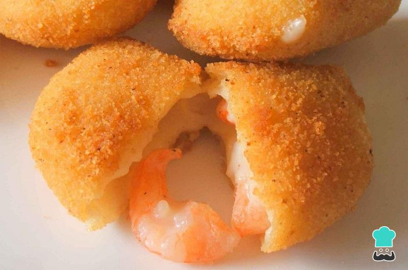

# Rissois de Camarão

*Portugal's snack-bar half-moon: a thin pot-cooked dough wrapped around a creamy béchamel-bound prawn filling, breaded and deep-fried.*

**Serves:** 6 (makes 24 rissois)

**Prep Time:** 1 hour

**Cook Time:** 20 minutes

## Overview
The dough: water, butter, lemon zest and salt bring to a boil; flour dumps in all at once; cooked 1-2 minutes stirring vigorously into a smooth elastic dough. Tipped onto a floured surface; rolled paper-thin. Filling: a quick béchamel makes from butter, flour, milk; cooked prawns chop fine; fold in with parsley, lemon zest, pepper. Filling cools fully (essential). Discs cut from dough; filling spoons on half; folded into a half-moon and crimped. Each rissoi dredges in flour, dips in egg, rolls in breadcrumbs. Deep-fried at 175°C 2 minutes per side until amber. Drained; eaten warm.

## Ingredients

### Dough
- 250 ml water
- 30 g unsalted butter
- ½ teaspoon salt
- Zest of 1 lemon
- 200 g plain flour (sifted)

### Filling
- 30 g unsalted butter
- 30 g plain flour
- 250 ml whole milk
- 1 teaspoon salt
- ½ teaspoon white pepper
- A grating of nutmeg
- 300 g cooked peeled prawns (small or medium; chopped fine)
- 2 tablespoons fresh parsley (chopped fine)
- Zest of 1 lemon
- 1 small shallot (very finely diced, sautéed 3 min in 1 teaspoon butter, optional)

### Breading
- 100 g plain flour (for dredging)
- 2 large eggs (beaten with 1 tablespoon milk)
- 200 g fine dried breadcrumbs (panko works for extra crisp)

### For frying
- 1 litre vegetable oil

### To serve
- Lemon wedges
- A small dish of piri-piri or hot sauce
- Black olives, sliced pickled chillies

## Method

### Stage 1 - Dough
1. In a saucepan, combine water, butter, salt and lemon zest.
1. Bring to a rolling boil over medium heat.
1. Reduce to medium; tip in flour all at once.
1. Stir vigorously with a wooden spoon for 90 seconds until you have a smooth shiny dough that pulls cleanly from the pan walls.
1. Tip onto a lightly floured surface.
1. Knead briefly while still warm (be careful - it's hot) until smooth and pliable.
1. Cover with cling film; cool to room temperature.

### Stage 2 - Filling
1. Melt butter in a saucepan over medium heat.
1. Whisk in flour; cook 1 minute (roux).
1. Slowly whisk in the milk; cook 4 minutes, whisking, until the béchamel thickens to a very thick paste - should be much thicker than a standard sauce.
1. Add salt, white pepper, nutmeg.
1. Off heat; stir in chopped prawns, parsley, lemon zest, and sautéed shallot (if using).
1. Cool fully (warm filling tears the dough).

### Stage 3 - Roll and cut
1. Roll the dough on a lightly floured surface to 2-3 mm thick.
1. Cut out 8 cm rounds (a small bowl or biscuit cutter).
1. Re-roll scraps once.

### Stage 4 - Fill and seal
1. Place a heaped teaspoon of cool filling on half of each round.
1. Fold over into a half-moon.
1. Press the edges together; crimp with a fork.

### Stage 5 - Bread
1. Set up three plates: flour, beaten egg, breadcrumbs.
1. Dredge each rissoi in flour (shake off excess), dip in egg (let drip), roll in breadcrumbs.
1. For an extra-crisp crust: double-bread (egg again, breadcrumb again).
1. Place on a tray.

### Stage 6 - Chill
1. Refrigerate the breaded rissois 15 minutes (helps the crust adhere during frying).

### Stage 7 - Fry
1. Heat oil to 175°C.
1. Fry 4-5 rissois at a time, 2 minutes per side, until deep amber-gold.
1. Lift onto kitchen paper.

### Stage 8 - Serve
1. Pile on a warm platter.
1. Lemon wedges, olives, pickled chillies.
1. Eat warm - within 10 minutes is best.

## Notes
- **Dough must be pliable while warm:** This is a hot-water dough (like for empanadas). Work while still warm - once cooled fully, it can crack when rolled. If it cools, gently warm in the microwave 10 seconds.
- **Cool the filling fully:** Béchamel-based filling that's still warm will tear the soft dough during folding. Cool to room temperature minimum.
- **Double-bread for extra crisp:** A second pass through egg + breadcrumbs gives the iconic crackly amber shell. Skip if you prefer a thinner crust.

## Storage
- Best within 30 minutes of frying.
- Breaded uncooked rissois freeze 2 months on a tray; fry from frozen at 165°C 4-5 minutes per side.
- Cooked: refrigerate 2 days; re-crisp at 200°C 5 minutes.
