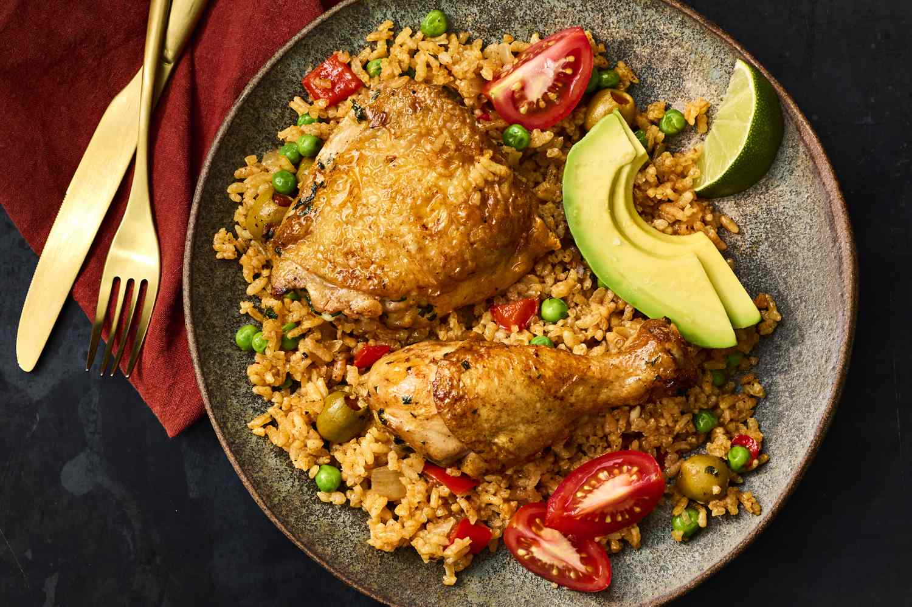

# Arroz con Pollo Puertorriqueño

*Puerto Rico's one-pot chicken and rice: bone-in chicken pieces browned in olive oil, then simmered together with rice in a sofrito-and-sazón base with peas, olives and capers, till the rice absorbs the chicken-flavoured broth and the meat falls from the bone. The Sunday family classic, the canonical Boricua arroz amarillo with chicken.*

**Serves:** 6

**Prep Time:** 25 minutes

**Cook Time:** 1 hour

## Overview
Arroz con pollo is the canonical Latin American one-pot chicken-and-rice dish, with many regional variations across Latin America; the Puerto Rican version distinguishes itself with sofrito and sazón (the Boricua flavour signatures), the addition of green olives and capers (for the canonical Boricua brininess), and the use of medium-grain rice (rather than long-grain): bone-in chicken pieces are browned in olive oil, then slow-cooked in a sofrito-tomato base with sazón, achiote, beer (sometimes), peas, sliced olives and capers; rice is added partway through and absorbs the chicken-flavoured broth; the dish is covered and finished till the rice is tender and the chicken falls from the bone. The whole thing is served family-style from the pot, with sliced avocado, lime wedges and a side of red beans (habichuelas) for the full Boricua Sunday meal. Three details define proper Puerto Rican arroz con pollo. First, sofrito and sazón. The PR seasoning duo is essential; without them, the dish is generic chicken-rice. Second, achiote for colour. Either annatto seeds steeped in oil, or commercial sazón (which contains achiote), gives the proper deep yellow-orange colour. Third, don't lift the lid during the rice cooking. Once the rice goes in and the pot is covered, leave alone for the full 30 minutes. The steam-and-absorption cooks the rice perfectly; lid-lifting ruins it.

## Ingredients

### Chicken and marinade
- 1.2 kg bone-in skin-on chicken pieces (thighs, drumsticks, or whole chicken cut into 8)
- 1 tablespoon adobo seasoning
- 1 tablespoon sazón
- 1 teaspoon dried oregano
- 1 teaspoon ground cumin
- 1 teaspoon fine sea salt
- 1 teaspoon ground black pepper
- Juice of 1 lime
- 4 garlic cloves (crushed)

### Cooking
- 3 tablespoons olive oil
- 4 tablespoons sofrito
- 1 large onion (finely chopped)
- 1 medium green bell pepper (finely chopped)
- 4 garlic cloves (crushed)
- 3 tablespoons tomato paste
- 150 ml beer (optional but very Puerto Rican; or use water)

### Rice and liquid
- 500 g medium-grain rice (or long-grain rice; rinsed 2-3 times)
- 800 ml hot chicken stock
- 2 bay leaves
- 1 tablespoon sazón (additional)
- 1 teaspoon dried oregano
- 1 teaspoon fine sea salt

### Vegetables and additions
- 200 g frozen peas (or fresh)
- 80 g pitted green olives (sliced)
- 2 tablespoons capers (drained)
- 1 small red bell pepper (cut into strips; for garnish)

### To finish
- 1 small bunch fresh coriander (chopped)
- Lime wedges
- Sliced avocado

## Method

### Stage 1 - Marinate the chicken
1. Pat the chicken dry; place in a wide bowl.
2. Combine adobo, sazón, oregano, cumin, salt, pepper, lime juice and crushed garlic; rub into the chicken.
3. Let stand 30 minutes (or overnight in the fridge).

### Stage 2 - Brown the chicken
1. Heat the olive oil in a wide heavy pot over medium-high heat.
2. Brown the chicken pieces 4-5 minutes per side till deep golden.
3. Lift out and set aside.

### Stage 3 - Build the base
1. Reduce heat to medium.
2. Add the sofrito, chopped onion and bell pepper to the pot.
3. Cook 6-7 minutes till soft.
4. Add the crushed garlic; cook 30 seconds.
5. Add the tomato paste; cook 2 minutes till deepened.
6. Pour in the beer (if using); let bubble for 30 seconds.

### Stage 4 - Add rice and liquid
1. Add the rinsed-and-drained rice to the pot; stir to coat in the base.
2. Pour in the hot chicken stock.
3. Add the bay leaves, sazón, oregano and salt.
4. Stir once.
5. Return the browned chicken to the pot; nestle into the rice.
6. The chicken should be partially submerged; the rice fully covered with liquid.

### Stage 5 - Cook covered
1. Bring to a gentle simmer.
2. Reduce heat to lowest.
3. Cover with a tight-fitting lid.
4. Cook 25 minutes without lifting the lid.

### Stage 6 - Add the additions
1. Lift the lid; scatter the peas, olives, capers and red pepper strips over the rice.
2. Cover again; cook 5 minutes more.

### Stage 7 - Rest
1. Take off the heat; keep the lid on.
2. Rest 10 minutes; the rice finishes steaming.

### Stage 8 - Serve
1. Uncover; gently fluff the rice with a fork (don't disturb the chicken too much).
2. Scatter chopped coriander over.
3. Bring the pot to the table; serve family-style with sliced avocado and lime wedges alongside.

## Notes
- **Sofrito + sazón:** the canonical PR duo. Don't skip.
- **Rinse the rice:** removes excess surface starch; gives properly separated cooked grains.
- **Don't lift the lid:** once the rice is in and the pot covered, leave alone for 25 minutes. Every glance loses steam.
- **Achiote/sazón for colour:** the orange-yellow colour is canonical Puerto Rican. Without it the dish looks pale.
- **Medium-grain rice if possible:** gives the proper Boricua texture. Long-grain works too.

## Variations
**With chorizo (arroz con pollo y chorizo):** add 200 g of sliced chorizo to the pot with the onions; gives a richer fattier dish.
**With seafood (arroz con pollo y mariscos):** add 200 g of cooked shrimp or mussels in the last 5 minutes; turns the dish into a paella-leaning special-occasion meal.
**Vegetarian (arroz amarillo):** skip the chicken; use vegetable stock; add 1 tin of chickpeas + extra peas + sliced vegetables (carrot, cubanelle pepper). The rice is what makes the dish; chicken is supplement.
**With wine:** swap the beer for 200 ml of dry white wine; gives a more Spanish-leaning version.

## Serving
Family-style from the pot at the centre of the table. Sliced avocado, lime wedges, habichuelas guisadas, fresh salad. Drink: Medalla beer, mauby, or fresh coconut water.

## Storage
- Keeps refrigerated 4 days; the flavour deepens overnight.
- Reheat gently in a covered pan with a splash of stock or water over low heat.
- Freezes 3 months in portions; defrost in the fridge.
- Day-old arroz con pollo is excellent for lunch; some Boricua cooks deliberately make a day ahead.
