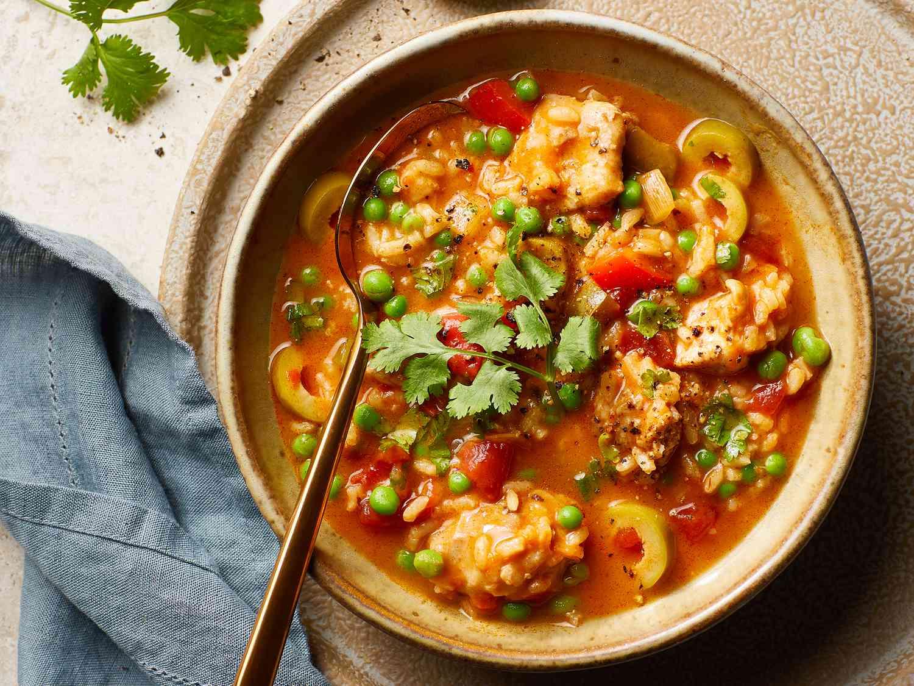

# Asopao de Pollo

*Puerto Rico's chicken-rice soup: bone-in chicken, medium-grain rice, sofrito, sazón, tomato sauce, peas and olives slow-cooked into a thick stew-soup hybrid.*

**Serves:** 6

**Prep Time:** 25 minutes

**Cook Time:** 1 hour 15 minutes

## Overview
Asopao de pollo is Puerto Rico's beloved chicken-and-rice soup-stew, sitting deliciously between arroz con pollo (which is mostly rice with chicken) and caldo (which is mostly broth with bits). Bone-in chicken browns then slow-cooks in chicken broth flavoured with sofrito, sazón, tomato sauce, olives and capers; medium-grain rice goes in partway through and absorbs much of the liquid but stays brothy enough to be called a soup. The texture is what makes it special: brothy enough that you eat it with a spoon, but with enough rice and chicken to feel substantial. The ratio matters: about 3:1 liquid to rice by volume. Too thick and you've made arroz con pollo; too thin and you've made caldo. The dish thickens as it sits because the rice keeps drinking up the broth, so serve immediately and finish in one sitting. Eat on cold rainy days, at family wakes, at late-night parties and weekend brunches.

## Ingredients

### Chicken
- 1.2 kg bone-in skin-on chicken pieces (thighs, drumsticks, wings, or whole chicken cut into 8)
- 1 tablespoon adobo seasoning
- 1 tablespoon [Sazón](../../base-ingredients/spices/sazon.md)
- 1 teaspoon dried oregano
- 1 teaspoon ground cumin
- 1 teaspoon fine sea salt
- 1 teaspoon ground black pepper

### Cooking
- 3 tablespoons olive oil
- 4 tablespoons sofrito
- 1 large onion (finely chopped)
- 1 medium green bell pepper (finely chopped)
- 6 garlic cloves (crushed)
- 3 tablespoons tomato paste
- 200 ml tomato sauce
- 1.5 litres hot chicken stock
- 2 bay leaves
- 1 tablespoon dried oregano
- 1 teaspoon ground cumin
- 1 ½ teaspoons fine sea salt
- 1 teaspoon ground black pepper

### Rice and additions
- 300 g medium-grain rice (or long-grain rice; rinsed 2-3 times)
- 100 g pitted green olives (sliced)
- 2 tablespoons capers
- 200 g frozen peas
- 200 g calabaza pumpkin (cubed; optional)

### To finish
- 1 small bunch fresh coriander (chopped)
- Lime wedges
- Avocado slices

### To serve
- Pique
- Tostones
- Sliced avocado

## Method

### Stage 1 - Season the chicken
1. Pat the chicken dry.
2. Combine adobo, sazón, oregano, cumin, salt, pepper; rub into the chicken.

### Stage 2 - Brown the chicken
1. Heat the olive oil in a large heavy pot over medium-high heat.
2. Brown the chicken pieces 4 minutes per side; work in batches.
3. Lift out and set aside.

### Stage 3 - Build the base
1. Reduce heat to medium.
2. Add the sofrito, onion and bell pepper; cook 7 minutes till soft.
3. Add the crushed garlic; cook 30 seconds.
4. Add the tomato paste; cook 2 minutes.
5. Add the tomato sauce; cook 3 minutes.

### Stage 4 - Add liquid and chicken
1. Pour in the hot chicken stock.
2. Add the bay leaves, oregano, cumin, salt and pepper.
3. Return the browned chicken (and juices) to the pot.
4. Bring to a low simmer.
5. Cover with the lid slightly ajar.
6. Cook 30 minutes till the chicken is just tender.

### Stage 5 - Add rice and continue cooking
1. Add the rinsed rice to the pot.
2. Add the olives, capers and calabaza (if using).
3. Stir gently.
4. Continue cooking uncovered for 20 minutes; stir occasionally to prevent the rice from sticking.

### Stage 6 - Add peas and finish
1. Add the frozen peas.
2. Continue cooking 5 more minutes till the rice is tender and the soup has reduced slightly to a thick brothy consistency.
3. The soup should be brothy, you should be able to eat it with a spoon, not a fork.
4. If too thick, add more hot stock; if too thin, simmer a few more minutes.

### Stage 7 - Finish and serve
1. Take off the heat.
2. Taste; adjust salt.
3. Stir in most of the chopped coriander.
4. Ladle into deep wide bowls.
5. Add the remaining coriander, sliced avocado and lime wedges.
6. Serve immediately with pique and tostones on the side.

## Notes
- **Brothy, not thick:** the traditional asopao is intentionally soupy. 1.5 litres of stock for 300 g of rice gives the right ratio.
- **Sofrito and [Sazón](../../base-ingredients/spices/sazon.md):** the Boricua aromatic duo. Essential.
- **Brown the chicken first:** gives the proper sauce depth.
- **Don't overcook the rice:** 25 minutes total cooking should give properly tender rice. Longer = mushy.
- **Eat immediately:** asopao thickens as it sits. The first serving is the best.

## Variations
- **Asopao de mariscos (seafood asopao):** swap the chicken for 600 g of mixed seafood (shrimp, mussels, white fish); cook for shorter total time (the seafood goes in only at the end). Coastal Puerto Rican specialty.
- **Asopao de gandules (pigeon pea asopao, vegetarian):** swap the chicken for 2 tins of pigeon peas; use vegetable stock; same procedure. Vegetarian Boricua main.
- **With pumpkin and yuca:** add cubed calabaza (pumpkin) and yuca (cassava) along with the rice; gives a more substantial root-vegetable version.
- **Spicier:** add 2 finely chopped habanero peppers to the sofrito; properly Caribbean fierce version.

## Serving
- In wide deep bowls with the chicken on the bone, the brothy rice ladled around it, and avocado, coriander and lime on top. Tostones for mopping the broth. Pique for those who want extra heat. Drink: Medalla beer, mauby, or hot Puerto Rican coffee.

## Storage
- Best eaten fresh; the rice continues to absorb liquid and the dish thickens significantly overnight.
- Keeps refrigerated 3 days; reheat with extra stock to loosen back to soup consistency.
- Freezes 2 months in portions; defrost in the fridge.
- Day-old asopao is delicious but has the texture of arroz con pollo rather than a soup; add stock to restore brothiness when reheating.
