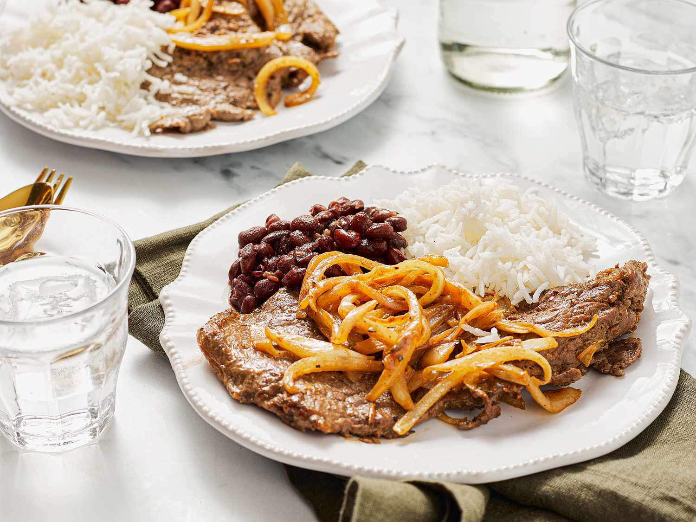

# Bistec Encebollado

*Puerto Rico's steak smothered in onions: thin slices of beef marinated in adobo, lime and garlic, pan-seared then slow-cooked with a heap of sliced onions and vinegar till the onions melt into a tangy sauce.*

**Serves:** 4

**Prep Time:** 20 minutes (plus 30 minutes marinating)

**Cook Time:** 40 minutes

## Overview
Bistec encebollado (literally "steak smothered with onions") is one of Puerto Rico's most beloved dinner-table dishes and a Boricua weeknight staple. Thin slices of beef marinate briefly in adobo, lime juice, garlic and oregano, pan-sear quickly, then come out of the pan so a heap of sliced onions can soften slowly in olive oil and white vinegar till they turn melting and tangy. The beef returns with a splash of stock and everything simmers together till the onions form a glossy sauce and the beef is tender. The cut matters: cube steak (chuck pre-tenderised mechanically) or thin-sliced top sirloin (5 mm) braise properly in the short cook; thicker steaks won't. The dish is as much about the onions as the beef, so use a heap (four or five large onions for four portions). The white vinegar deglazes the pan and gives the proper Boricua tang. Served over white rice with a side of habichuelas, tostones and a fresh salad.

## Ingredients

### Beef and marinade
- 800 g cube steak or thinly sliced top sirloin (about 5 mm thick; or use minute steaks)
- Juice of 3 limes
- 6 garlic cloves (crushed)
- 1 tablespoon adobo seasoning (or substitute: 1 teaspoon garlic powder + 1 teaspoon onion powder + 1 teaspoon oregano + ½ teaspoon turmeric)
- 1 teaspoon dried oregano
- 1 teaspoon ground cumin
- 1 teaspoon fine sea salt
- 1 teaspoon ground black pepper
- 2 tablespoons olive oil

### Cooking
- 4 tablespoons olive oil
- 5 large yellow or red onions (sliced into thin half-moons; about 800 g total)
- 4 garlic cloves (crushed; for the cooking stage)
- 3 tablespoons white vinegar (or apple cider vinegar)
- 200 ml hot beef stock (or water)
- 2 tablespoons tomato paste
- 1 teaspoon dried oregano
- 1 teaspoon fine sea salt
- ½ teaspoon ground black pepper
- 2 bay leaves
- 1 small fresh chilli (optional, sliced)

### To finish
- 2 tablespoons fresh coriander (chopped)
- Lime wedges

### To serve
- Plain white rice
- Habichuelas (red beans)
- Tostones or maduros
- Sliced avocado
- Pique

## Method

### Stage 1 - Marinate the beef
1. Place the beef slices in a wide bowl.
2. Combine the lime juice, crushed garlic, adobo, oregano, cumin, salt, pepper and 2 tablespoons olive oil; pour over the beef.
3. Toss to coat thoroughly.
4. Cover and refrigerate 30 minutes (or up to 2 hours; longer can over-cure the meat).

### Stage 2 - Sear the beef
1. Heat 2 tablespoons of olive oil in a wide heavy frying pan over high heat.
2. Lift the beef slices from the marinade (reserve any leftover marinade).
3. Sear in batches for 1 minute per side; just enough to brown the outside.
4. Transfer to a plate.
5. Don't crowd the pan or the beef will steam.

### Stage 3 - Cook the onions
1. Reduce the heat to medium.
2. Add the remaining 2 tablespoons of olive oil to the same pan (don't wash; the fond stays).
3. Add the sliced onions; cook 12-15 minutes, stirring occasionally, till deeply soft and starting to caramelise.
4. Add the crushed garlic; cook 1 minute.

### Stage 4 - Build the sauce
1. Add the vinegar; let bubble for 30 seconds (deglazes the pan and gives the proper Boricua tang).
2. Add the tomato paste; cook 1 minute.
3. Pour in the hot stock; add the oregano, salt, pepper, bay leaves and chilli (if using).
4. Stir well.

### Stage 5 - Return the beef and simmer
1. Return the seared beef (with any juices) to the pan.
2. Pour any reserved marinade over.
3. Reduce heat to low; cover with the lid slightly ajar.
4. Simmer 20 minutes till the beef is tender (cube steak goes tender quickly; sirloin takes a bit longer).
5. Stir occasionally.

### Stage 6 - Finish
1. Taste; adjust salt and pepper.
2. Lift out the bay leaves.
3. Stir in the chopped coriander.

### Stage 7 - Serve
1. Spoon white rice into deep plates.
2. Lay 2-3 slices of beef over each portion with plenty of the onion-sauce.
3. Tostones or maduros alongside.
4. Sliced avocado, lime wedges, pique on the side.

## Notes
- **Cube steak or thin sirloin:** thick steaks won't work in the time. Cube steak (mechanically tenderised) is the canonical Boricua choice; thin-sliced top sirloin is the equivalent.
- **Generous onions:** the dish is as much about the onions as the beef. 5 large onions for 4 portions is the proper ratio.
- **Vinegar is canonical:** the white vinegar deglaze gives the proper tangy character. Don't skip; balsamic doesn't substitute.
- **Don't overcook:** the beef is meant to be tender but still distinct; over-cooking gives shredded mush.
- **Eat over rice:** the sauce-soaked rice is the best part. Generous rice underneath.

## Variations
**Pollo encebollado:** swap the beef for chicken thigh fillets; cook the same way but increase simmer time to 30 minutes.
**Pork chops encebollado:** swap for thin pork chops; same technique. Common variation in some PR households.
**With bell peppers:** add 2 sliced bell peppers along with the onions; gives a more colourful version.
**Spicier:** add 1 chopped habanero pepper to the cooking onions; properly Caribbean fierce.

## Serving
Over hot white rice with the onion sauce ladled generously over everything. Habichuelas guisadas, tostones or maduros, sliced avocado, lime wedges. Drink: Medalla beer, fresh limeade, or coconut water. As a classic Boricua weeknight dinner.

## Storage
- Keeps refrigerated 4 days; the flavour deepens overnight.
- Reheat gently in a covered pan with a splash of water.
- Freezes 3 months in portions; defrost in the fridge.
- Day-old bistec encebollado makes excellent sandwich filling, especially on Cuban-style bread.
- Don't aggressively reheat; the beef toughens.
