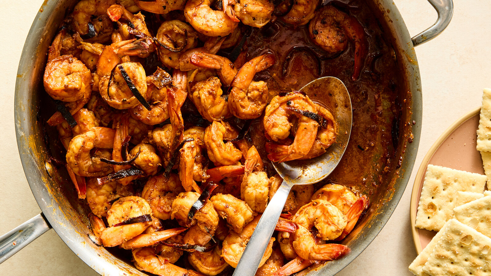

# Camarones al Ajillo

*Puerto Rico's garlic shrimp: large shrimp flash-cooked in a generous amount of olive oil and butter with a heap of crushed garlic, a splash of white wine, fresh parsley and lime juice. The Boricua coastal classic, served sizzling over rice or with crusty bread for soaking up the garlicky oil.*

**Serves:** 4

**Prep Time:** 15 minutes

**Cook Time:** 8 minutes

## Overview
Camarones al ajillo ("garlic shrimp") is one of Puerto Rico's most beloved seafood dishes and a Boricua coastal classic, with origins in Spanish gambas al ajillo but distinctly tropicalised. Large shrimp flash-cook in a wide pan with a generous amount of olive oil and butter, an aggressive heap of crushed garlic (this is not a place to be timid), a splash of dry white wine or Puerto Rican rum, red pepper flakes, fresh parsley and lime juice. The whole dish takes five minutes once the pan is hot, and the shrimp serve sizzling with the garlicky oil-and-butter sauce pooled around them. Don't overcook: shrimp go from sweet to rubbery in sixty seconds, so two or three minutes total is the maximum. Both olive oil and butter matter; the oil gives the Mediterranean-Caribbean character and the butter gives the rich glossy finish. Eat over rice as a main, or with crusty bread for mopping up the sauce as a starter.

## Ingredients

### Shrimp
- 600 g large raw shrimp (16-20 count per kg; peeled and deveined; head-on if you can find them)

### Marinade (brief)
- 1 teaspoon fine sea salt
- ½ teaspoon ground black pepper
- ½ teaspoon paprika
- 1 teaspoon adobo seasoning (or substitute: ½ teaspoon garlic powder + ½ teaspoon oregano)
- Juice of 1 lime

### Cooking
- 60 ml olive oil
- 60 g unsalted butter
- 10 garlic cloves (crushed; that's not a typo)
- 1 teaspoon red pepper flakes (or 1 fresh red chilli, chopped)
- 100 ml dry white wine (or 50 ml Puerto Rican rum + 50 ml chicken stock)
- 1 large bunch fresh flat-leaf parsley (about 30 g; chopped)
- Juice of 1 lime (to finish)
- 1 teaspoon fine sea salt (taste)

### To finish
- Extra chopped parsley
- Lime wedges

### To serve
- Plain white rice
- Crusty bread (for mopping the oil)
- Tostones
- Avocado slices

## Method

### Stage 1 - Marinate the shrimp briefly
1. Place the peeled shrimp in a wide bowl.
2. Add the salt, pepper, paprika, adobo and lime juice; toss.
3. Let stand 10 minutes (no longer; the lime can start to cure the shrimp).

### Stage 2 - Heat the pan
1. Heat the olive oil in a wide heavy frying pan over medium-high heat.
2. When shimmering, add the butter; let it melt and foam (don't let it brown).

### Stage 3 - Bloom the garlic
1. Add the crushed garlic and the red pepper flakes (or chopped chilli).
2. Cook 30 seconds, stirring; the garlic should turn pale gold and fragrant but not brown.

### Stage 4 - Cook the shrimp
1. Add the marinated shrimp in a single layer.
2. Cook 90 seconds on the first side without moving them.
3. Flip; cook 90 seconds on the second side.
4. The shrimp should turn pink and curl; the flesh should be just opaque.

### Stage 5 - Add the wine
1. Pour in the white wine (or rum + stock); let it bubble for 30 seconds and reduce slightly.

### Stage 6 - Finish
1. Take off the heat.
2. Squeeze the lime juice over.
3. Scatter most of the chopped parsley.
4. Toss everything together; the sauce should be a glossy garlic-butter-oil emulsion clinging to the shrimp.
5. Taste; adjust salt.

### Stage 7 - Serve immediately
1. Tip into a warm shallow serving dish (or directly to plates over rice).
2. Scatter the remaining chopped parsley.
3. Place lime wedges around.
4. Serve immediately while sizzling.
5. Provide rice, crusty bread or tostones for soaking up the sauce.

## Notes
- **Lots of garlic:** 10 cloves is not a typo. The dish is named for the garlic.
- **Both oil and butter:** olive oil for character, butter for finish. Don't substitute with all-one.
- **Don't overcook the shrimp:** 3 minutes total maximum. Pink and just-opaque; not rubbery.
- **Don't brown the garlic:** burned garlic ruins the dish. Cook just till fragrant and pale gold; the wine deglazes.
- **Eat immediately:** the sizzling presentation is part of the experience. Don't let it sit.

## Variations
- **With Puerto Rican rum:** swap the white wine for dark rum + chicken stock; gives a sweeter Caribbean depth.
- **Spicier version (al diablo):** double the chillies and add 1 chopped habanero; properly Caribbean fierce.
- **With cilantro:** add 2 tablespoons of chopped fresh culantro (recao) along with the parsley; gives a more aromatic Caribbean version.
- **Camarones enchilados:** add 200 ml of tomato sauce after the wine; turns the dish into a more substantial tomato-based shrimp stew.

## Serving
- In a shallow warm serving dish or directly over rice. Crusty bread on the side for mopping up the garlic oil. Drink: Medalla beer, a cold piña colada (Puerto Rican original cocktail), or fresh sangria.

## Storage
- Best eaten immediately; shrimp goes off-texture as it cools and reheats poorly.
- Keeps refrigerated 1 day; use cold in salads or pasta the next day.
- Don't freeze; the texture suffers completely.
- The sauce alone keeps refrigerated 3 days; use as a base for next-day pasta or to drizzle over grilled fish.
