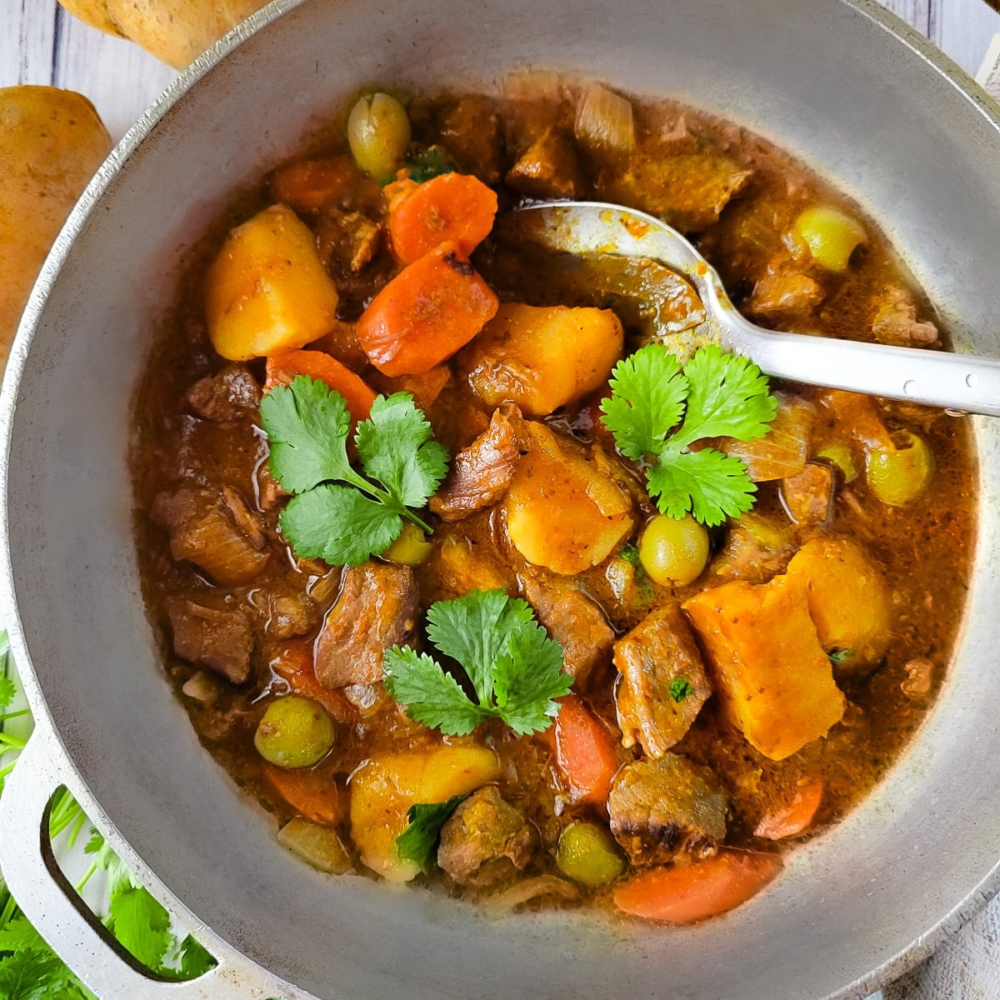

# Carne Guisada Puertorriqueña

*Puerto Rico's beef stew: cubes of beef chuck slow-braised in sofrito, sazón, tomato sauce, olives, potatoes and carrots till the meat falls apart and the sauce reduces into a rich orange-red gravy. The Boricua family-Sunday classic, ladled over rice with a side of red beans.*

**Serves:** 6

**Prep Time:** 25 minutes

**Cook Time:** 2 hours

## Overview
Carne guisada (literally "stewed beef") is Puerto Rico's beef-stew equivalent of pollo guisado, and a similarly central staple of Boricua home cooking. Cubes of beef chuck brown and then slow-cook with sofrito, sazón, tomato sauce, olives, capers, bay leaves, cubed potatoes and chunky carrots in a heavy pot for two hours, until the beef is tender, the vegetables have soaked up the sauce, and the whole pot has reduced into a rich orange-red gravy. Chuck is the right cut here: the connective tissue dissolves over the long cook to give the proper unctuous sauce, while lean cuts go tough and dry. Sofrito and sazón together are what mark the dish as Boricua rather than generic beef stew; both are essential. The slow cook is the other non-negotiable, ninety minutes minimum, two hours better. Eat ladled generously over white rice with habichuelas guisadas, sliced avocado and tostones on the side.

## Ingredients

### Beef
- 1.2 kg beef chuck (or stewing beef; cut into 4 cm cubes)
- 1 ½ teaspoons fine sea salt
- 1 teaspoon ground black pepper
- 1 tablespoon adobo seasoning
- 1 tablespoon [Sazón](../../base-ingredients/spices/sazon.md)
- 1 tablespoon plain flour (for dusting)
- 3 tablespoons olive oil (for browning)

### Cooking base
- 4 tablespoons sofrito
- 1 large onion (finely chopped)
- 1 medium green bell pepper (finely chopped)
- 6 garlic cloves (crushed)
- 3 tablespoons tomato paste
- 300 ml tomato sauce
- 800 ml hot beef stock
- 2 bay leaves
- 1 cinnamon stick (small)
- 1 tablespoon dried oregano
- 1 teaspoon ground cumin
- 1 teaspoon ground turmeric
- 1 teaspoon Aleppo pepper or chilli flakes (optional)

### Vegetables
- 4 medium potatoes (peeled and cubed)
- 3 medium carrots (peeled and sliced into thick rounds)
- 300 g calabaza pumpkin (or butternut squash; cubed; optional but common)
- 100 g pitted green olives (sliced)
- 2 tablespoons capers (drained)

### To finish
- 1 small bunch fresh coriander (chopped)
- Lime wedges

### To serve
- Plain white rice
- Habichuelas (red beans)
- Tostones
- Sliced avocado
- Pique

## Method

### Stage 1 - Season the beef
1. Pat the beef cubes dry; place in a wide bowl.
2. Sprinkle with salt, pepper, adobo, sazón and flour; toss to coat.

### Stage 2 - Brown the beef
1. Heat the olive oil in a heavy casserole over medium-high heat.
2. Brown the beef in batches for 3-4 minutes per side till deeply golden.
3. Don't overcrowd.
4. Lift out and set aside.

### Stage 3 - Build the sauce base
1. Reduce heat to medium.
2. Add the sofrito, chopped onion and bell pepper to the pot.
3. Cook 8 minutes till soft.
4. Add the crushed garlic; cook 30 seconds.
5. Add the tomato paste; cook 2 minutes till deepened.
6. Add the tomato sauce; cook 3 minutes.
7. Stir in the oregano, cumin, turmeric and Aleppo pepper (if using).

### Stage 4 - Return beef and simmer
1. Return the browned beef (and any juices) to the pot.
2. Pour in the hot stock.
3. Add the bay leaves and cinnamon stick.
4. Bring to a low simmer.
5. Cover with the lid slightly ajar.
6. Cook 75 minutes; stir occasionally.

### Stage 5 - Add vegetables
1. Add the cubed potatoes, sliced carrots and cubed pumpkin (if using).
2. Add the olives and capers.
3. Continue simmering 30-40 more minutes till the beef is fork-tender and the vegetables are cooked through.
4. The sauce should have reduced to a thick gravy; if too thick add a splash of stock; if too thin simmer uncovered 5 minutes.

### Stage 6 - Finish
1. Taste; adjust salt.
2. Lift out the bay leaves and cinnamon stick.
3. Stir in most of the chopped coriander.

### Stage 7 - Serve
1. Spoon white rice into deep bowls.
2. Ladle generous portions of carne guisada over.
3. Add a portion of habichuelas alongside.
4. Sliced avocado on the plate; lime wedges and pique on the table.
5. Tostones for mopping up the sauce.

## Notes
- **Beef chuck for tender results:** the connective tissue dissolves over 2 hours; lean cuts won't work.
- **Sofrito and [Sazón](../../base-ingredients/spices/sazon.md):** both are essential for proper Boricua flavour. Don't skip; substitute carefully if needed.
- **Slow cook properly:** 90 minutes minimum, 2 hours better. Don't rush.
- **Layered cooking:** sofrito, then tomato paste, then sauce, then seasonings. Each step adds depth.
- **Olives and capers add Boricua character:** don't skip; they're as important as the sofrito.

## Variations
- **With chickpeas (carne con garbanzos):** add 1 tin of drained chickpeas in the last 30 minutes; gives a more substantial one-pot.
- **With wine:** swap 200 ml of stock for red wine; less traditional but adds depth.
- **Spicier:** double the Aleppo pepper and add 1 habanero (whole, removed before serving); properly Caribbean fierce.
- **With chayote (christophine):** add 2 chayote squash (cubed) along with the carrots; common PR variation when in season.

## Serving
- On wide plates over white rice with the sauce ladled generously, habichuelas alongside, tostones for mopping. Drink: Medalla beer, fresh agua de tamarindo, mauby.

## Storage
- Keeps refrigerated 5 days; flavour deepens overnight.
- Reheat gently in a covered pan with a splash of stock or water over low heat.
- Freezes 3 months in portions; defrost in the fridge.
- Day-old carne guisada is even better; many Boricua cooks deliberately make a day ahead.
