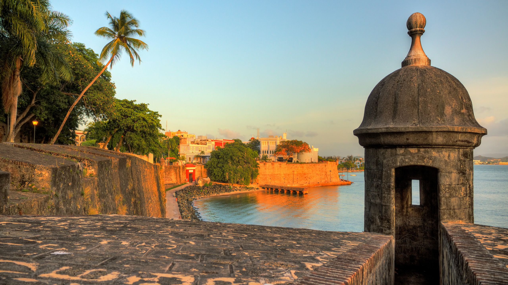

# Puerto Rican Cuisine

Puerto Rican cooking is sofrito-based at its core: the recaíto paste of culantro, cilantro, ajíes dulces, garlic and onion that anchors every stew, every rice, every guiso. Mofongo (fried green plantains mashed with garlic and chicharrón) is the island's identity dish; arroz con gandules (rice with pigeon peas) is the national rice; pernil (slow-roast pork shoulder) is the Christmas centrepiece; pasteles (the masa-and-pork banana-leaf packages) are the December tradition. Alcapurrias, bacalaítos, tostones and maduros fill the snack and side categories. Adobo and sazón seasoning blends do the everyday lifting; cilantro and lime brighten everything.
