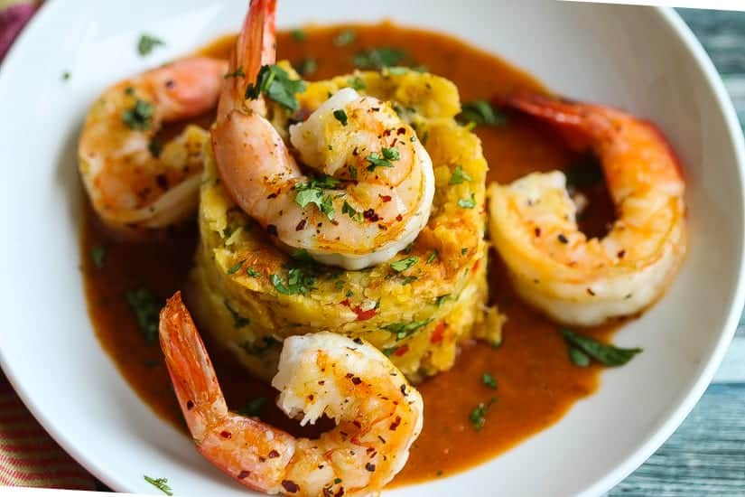

# Mofongo

*Puerto Rico's plantain-and-pork mash: twice-cooked green plantains mashed in a wooden pilón (mortar) with garlic, olive oil, fried pork chicharrón (or bacon), and a touch of broth; shaped into a dome and served with a pool of garlic-broth (caldo) ladled around it. The Boricua signature dish, the absolute heart of Puerto Rican cooking.*

**Serves:** 4

**Prep Time:** 25 minutes

**Cook Time:** 30 minutes

## Overview
Mofongo is Puerto Rico's signature dish, the absolute heart of Boricua cooking and a culinary inheritance from West African fufu (brought by enslaved Africans during the colonial period) blended with Spanish and indigenous Taíno techniques: green (unripe) plantains are first fried in oil till just cooked through, then mashed in a wooden mortar called a "pilón" with crushed garlic, olive oil, salt, and fried pork chicharrón (the crispy pork-skin cracklings; bacon works as a more accessible substitute) till the mixture is cohesive but still chunky-textured, shaped into a dome (or a half-sphere mounded onto a plate), and served with a generous pool of garlic-laced chicken or pork broth (caldo) poured around or over it. The garlic broth seeps into the mofongo as you eat; the contrast of the slightly oily plantain mash, the crispy bits of chicharrón, the pungent garlic and the savoury broth is what makes the dish extraordinary. Often served with stewed shrimp on top (mofongo relleno de camarones), or with sautéed beef (carne mechada), or with stewed chicken (pollo guisado), or just on its own as the canonical accompaniment to grilled meat or fish. Three details define proper mofongo. First, green plantains. Properly green, hard, with not a hint of yellow yet. Yellow plantains give the wrong texture (too soft and sweet); fully ripe ones are completely wrong. Second, fry, don't boil. Fried plantains give the proper Puerto Rican mofongo texture; boiled gives a softer mush. Third, the pilón is canonical but a heavy mortar or sturdy bowl works. Mash by hand with a heavy implement; don't process in a food processor (smooths it too much).

## Ingredients

### Plantains
- 4 large green plantains (very green, no yellow at all; about 800 g total)
- Vegetable oil for frying (about 500 ml; for shallow-frying)

### Mash
- 8 garlic cloves (peeled)
- 3 tablespoons olive oil (extra virgin)
- 100 g pork chicharrón (or 150 g thick-cut streaky bacon, fried crisp and chopped; or 150 g pork rinds crushed coarsely)
- 1 teaspoon fine sea salt
- ½ teaspoon ground black pepper

### Garlic broth (caldo de ajo)
- 500 ml hot chicken broth (or pork broth)
- 8 garlic cloves (crushed)
- 1 tablespoon olive oil
- 2 tablespoons fresh lime juice
- 1 tablespoon fresh coriander (chopped)
- 1 teaspoon ground cumin

### Optional toppings (choose one)
- 300 g cooked shrimp in garlic sauce (mofongo relleno de camarones)
- 300 g stewed chicken (mofongo con pollo)
- 300 g pulled pernil (mofongo with pulled pork)

### To finish
- Fresh coriander leaves
- Lime wedges
- Pique (Puerto Rican vinegar hot sauce)

## Method

### Stage 1 - Peel and slice the plantains
1. Cut off both ends of each plantain.
2. Cut a shallow slice down the length of the skin (just through the skin, not the flesh).
3. Use your thumb to peel back the skin; green plantain skin is tough and won't slip off easily. You may need to work it off in strips.
4. Cut each peeled plantain into 2 cm thick rounds.

### Stage 2 - Fry the plantains
1. Heat 2 cm of vegetable oil in a wide heavy frying pan over medium heat till shimmering (about 175°C / 350°F).
2. Add the plantain rounds in a single layer (work in batches if needed).
3. Fry for 3-4 minutes per side till the outside is golden and the inside is just cooked through (a fork should slide in with slight resistance).
4. Don't overcrowd the pan; the plantains should sizzle but not stew.
5. Lift out with a slotted spoon; drain briefly on kitchen paper.

### Stage 3 - Cook the chicharrón (or bacon)
1. If using bacon: cut the thick-cut bacon into 1 cm pieces.
2. Fry in a dry pan over medium heat for 8-10 minutes till deeply crisp and the fat is rendered.
3. Lift out with a slotted spoon; drain on kitchen paper.
4. Cool slightly; chop finer if needed.
5. If using pork chicharrón (the crispy skin cracklings): crush coarsely with a rolling pin or chop finely.

### Stage 4 - Make the garlic broth
1. Heat the olive oil in a small saucepan over medium heat.
2. Add the crushed garlic; cook 1 minute till fragrant (don't brown).
3. Pour in the hot chicken broth; add the cumin.
4. Bring to a low simmer; cook 3-4 minutes.
5. Take off the heat; stir in the lime juice and chopped coriander.
6. Keep warm.

### Stage 5 - Mash in the pilón
1. Place a large wooden mortar (pilón) or a heavy mixing bowl on the counter.
2. Add the peeled garlic cloves; pound or mash to a rough paste with the pestle (or the back of a heavy wooden spoon).
3. Add the olive oil and salt; mash to combine.
4. Add the fried plantain rounds (still warm) in batches.
5. Mash each batch into the garlic-oil; you want a cohesive but chunky-textured mash (not a smooth purée).
6. Once all the plantains are mashed in, add the chicharrón (or bacon) pieces; fold through gently with a wooden spoon.
7. The mofongo should be a textured mash with visible bits of chicharrón throughout; the colour a pale gold from the plantain and oil.

### Stage 6 - Shape and serve
1. Pack a quarter of the mofongo into a small bowl or measuring cup.
2. Invert onto each plate; lift the bowl off to leave a dome-shaped mound of mofongo at the centre of the plate.
3. Repeat for the remaining servings; 4 mounds total.

### Stage 7 - Add the broth and toppings
1. Ladle 100-125 ml of the warm garlic broth around each mofongo mound.
2. If using a topping (shrimp, chicken, pernil), arrange over or alongside the mofongo.
3. Garnish with fresh coriander leaves and a wedge of lime.
4. Provide pique on the side for those who want extra heat.

## Notes
- **Green plantains, properly green:** the plantain must be hard and green, no yellow. Yellow plantains have started to ripen and will give a too-sweet too-soft mofongo. Buy at the supermarket plantain bin; pick the hardest greenest ones.
- **Fry, don't boil:** the fried plantain has a slightly crisp outside and tender inside which is what mashes into the proper mofongo texture. Boiled plantains give a wet mushy result.
- **Chicharrón is canonical, bacon is the substitute:** pork chicharrón (the crispy fried pork skin) is the proper Puerto Rican ingredient; bacon is the easy substitute that gives similar texture but a smokier flavour. Plain pork rinds (the bagged snack kind, crushed) work too.
- **Mash by hand, not in a processor:** the pilón or hand-mashing gives the proper chunky texture. A food processor smooths it too much and you lose the canonical mouthfeel.
- **Eat warm:** mofongo cools quickly and the texture firms up. Eat immediately.

## Variations
**Mofongo relleno (stuffed mofongo):** form the mash into a bowl shape (hollow centre); fill with stewed shrimp, chicken or beef in a tomato-based sauce. The canonical restaurant serving.
**Trifongo:** make with 1 green plantain + 1 ripe plantain + 1 yuca (cooked); gives a sweeter more complex mash. Variation common in eastern Puerto Rico.
**Mofongo de yuca:** swap the plantains for boiled yuca (cassava); same technique. Less canonical but a related staple.
**Vegetarian mofongo:** skip the chicharrón; use 4 tablespoons of olive oil for richness; serve with sautéed garlic-mushrooms or stewed beans instead of meat topping.

## Serving
On wide plates with the dome at the centre, the broth pooled around. Topped with shrimp, chicken or pernil. With pique on the side. Drink: cold Medalla beer, a rum cocktail (Puerto Rican daiquiri), or fresh agua de coco (coconut water). As a main course; serves 4 generously.

## Storage
- Best eaten immediately while warm; mofongo firms up significantly as it cools.
- Keeps refrigerated 2 days; reheat gently in a covered dish with a splash of broth (microwave covered, or in the oven at 160°C).
- The broth keeps separately for 3 days; freezes 2 months.
- Don't freeze the mofongo; the texture suffers (the plantain goes off-texture when defrosted).
- Day-old leftover mofongo can be reshaped and pan-fried in a little oil for "mofongo croquettes".
