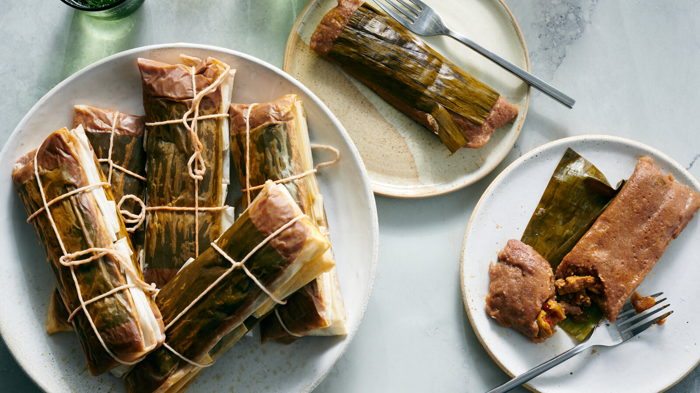

# Pasteles Puertorriqueños

*Puerto Rico's holiday tamale-equivalent: a thick masa of grated green plantain, yautía (taro), pumpkin and green banana wrapped around a spiced pork-and-olive filling, bundled in banana leaves, tied with twine and boiled. The labour-of-love Christmas Eve / Nochebuena dish that every Boricua family makes (and freezes) for the holiday season.*

**Serves:** 12 pasteles

**Prep Time:** 2 hours

**Cook Time:** 1 hour

## Overview
Pasteles is one of Puerto Rico's most iconic and elaborate holiday dishes, a Christmas Eve / Nochebuena tradition that every Boricua family makes by the dozens for the holiday season. A thick savoury masa made from grated green plantains, yautía (taro root), calabaza pumpkin and green banana, mixed with milk, olive oil, achiote-infused oil and salt, spread on rectangles of softened banana leaves, topped with a slow-cooked pork-and-olive filling, folded into rectangular packets, tied with kitchen twine and boiled. The masa is grated vegetable, not corn dough; that's what distinguishes Puerto Rican pasteles from Mexican tamales, and it gives a completely different texture and flavour. Achiote oil tints the masa its characteristic orange-yellow. Banana leaves, softened over a flame or briefly in hot water, are essential for the proper flavour; parchment alone doesn't give the same result. The made packets freeze beautifully and boil fresh from frozen throughout December. Families gather to make them in advance, three generations around a table peeling and grating and assembling for an afternoon.

## Ingredients

### Pork filling (make ahead)
- 800 g pork shoulder (cut into 1.5 cm cubes)
- 3 tablespoons olive oil
- 4 tablespoons sofrito
- 1 large onion (finely chopped)
- 1 medium green bell pepper (finely chopped)
- 6 garlic cloves (crushed)
- 3 tablespoons tomato paste
- 1 tablespoon sazón
- 1 tablespoon ground cumin
- 1 tablespoon dried oregano
- 1 ½ teaspoons fine sea salt
- 1 teaspoon ground black pepper
- 100 ml chicken stock
- 80 g raisins
- 100 g pitted green olives (sliced)
- 2 tablespoons capers
- 1 tin (400 g) chickpeas (drained)
- 50 g blanched almonds (slivered, optional)
- 2 tablespoons fresh coriander (chopped)

### Masa
- 4 large green plantains (very green; about 800 g flesh)
- 500 g yautía (taro root; or substitute with white sweet potato or yuca)
- 500 g calabaza pumpkin (or butternut squash)
- 3 green bananas (about 300 g; very green)
- 200 ml whole milk
- 100 ml achiote oil (see below; or 100 ml olive oil + 1 teaspoon turmeric)
- 1 tablespoon fine sea salt
- 2 tablespoons sazón

### Achiote oil (or use commercial)
- 100 ml olive oil
- 3 tablespoons annatto (achiote) seeds

### Wrapping
- 1 package banana leaves (about 500 g; thawed if frozen; or fresh)
- 100 ml olive oil (for oiling the leaves)
- Kitchen twine (for tying)

### Cooking
- 6 litres water (in a very large pot)
- 4 tablespoons fine sea salt

## Method

### Stage 1 - Make the achiote oil (the night before or several hours ahead)
1. Heat the olive oil and annatto seeds in a small pan over very low heat for 10 minutes till the oil turns deep orange.
2. Strain through a fine sieve; discard the seeds.
3. The oil keeps refrigerated for a month.

### Stage 2 - Make the pork filling
1. Heat the olive oil in a heavy casserole over medium heat.
2. Add the sofrito, chopped onion and bell pepper; cook 6 minutes till soft.
3. Add the crushed garlic; cook 30 seconds.
4. Add the tomato paste; cook 2 minutes.
5. Add the cubed pork; brown for 6-7 minutes.
6. Add the sazón, cumin, oregano, salt and pepper.
7. Pour in the chicken stock.
8. Cover; simmer 30-40 minutes till the pork is tender.
9. Add the raisins, olives, capers, chickpeas and almonds.
10. Cook uncovered 10 more minutes till the sauce has reduced to a thick stew.
11. Stir in the chopped coriander.
12. Cool to room temperature; the filling should be thick (not wet) for the assembly.

### Stage 3 - Grate the masa vegetables
1. Peel the green plantains, yautía, pumpkin and green bananas.
2. Grate all on the fine side of a box grater (or pulse in batches in a food processor till finely grated; not pureed).
3. Mix everything together in a large bowl.

### Stage 4 - Make the masa
1. To the grated vegetables, add the milk, achiote oil, salt and sazón.
2. Mix thoroughly with hands or a wooden spoon till uniform.
3. The masa should be a thick spreadable orange-yellow paste.
4. Taste; adjust salt.

### Stage 5 - Prepare the banana leaves
1. Cut the banana leaves into rectangles about 25 cm × 20 cm; you need 12-14 (allowing for some torn ones).
2. Pass each leaf briefly over an open flame (or dip in boiling water for 5 seconds) to soften and make it more flexible.
3. Wipe dry; brush lightly with olive oil.

### Stage 6 - Assemble the pasteles
1. Lay one banana leaf flat on the work surface, smooth-side up.
2. Spoon 4 tablespoons of masa onto the centre of the leaf; spread into a 12 cm × 8 cm rectangle.
3. Spoon 2 tablespoons of pork filling down the centre of the masa.
4. Fold the bottom edge of the leaf up over the filling.
5. Fold the top edge down over.
6. Fold the two short sides in to form a rectangular packet.
7. Place a second banana leaf around the packet for extra security (or wrap in parchment paper if banana leaves are scarce).
8. Tie firmly with kitchen twine in a cross pattern.
9. Repeat for all the pasteles; you should have 12.

### Stage 7 - Cook
1. Bring 6 litres of salted water to a rolling boil in a very large pot.
2. Lower the pasteles in carefully; they should be fully submerged.
3. Cook 60 minutes; check water levels and top up with boiling water if needed.
4. The pasteles should feel firm when squeezed gently with tongs.

### Stage 8 - Serve
1. Lift out with tongs; let drain briefly.
2. Place one pastel on each plate; the diner unwraps it themselves (the unfolding is part of the experience).
3. Eat with hands or a fork.
4. Serve with arroz con gandules, sliced avocado and pique on the side.

## Notes
- **Make the filling the day before:** the filling needs to be thoroughly cooled and thickened before assembly. Make the day before; refrigerate.
- **Green plantains and bananas:** properly green, hard, no yellow. Ripe ones will give a wrong-sweet masa.
- **Grate, don't process:** the proper texture is finely grated, not pureed. A food processor can over-process; better to grate by hand or use the processor's grating disc.
- **Banana leaves are traditional:** softened over flame or in boiling water briefly. Parchment paper alone gives a different (less aromatic) result; combination is OK.
- **Make in family teams:** pasteles is a labour of love. Family pasteles-making sessions are part of the tradition. Assembly takes 2-3 hours with multiple people.

## Variations
- **Pasteles de yuca:** swap the plantain-yautía-pumpkin mix for pure yuca (cassava) masa; gives a denser starchier pastel. Common variation.
- **Vegetarian pasteles (pasteles de masa):** skip the meat filling; fill with a mixture of roasted vegetables (peppers, onions, mushrooms, olives, raisins, chickpeas) cooked with sofrito and sazón.
- **With chicken instead of pork:** swap the pork for cubed chicken thigh; cook 25 minutes instead of 40.
- **Sweet pasteles (pasteles dulces):** swap to a sweet masa (with sugar instead of salt) and a sweet fruit filling (raisins, almonds, sugar); served at Christmas alongside the savoury version.

## Serving
- Unwrapped at the table, part of the Boricua experience. With arroz con gandules (rice with pigeon peas), pernil (slow-roasted pork), sliced avocado and pique on the side. At Christmas Eve / Nochebuena, Three Kings Day (January 6th), or any major holiday. Drink: coquito (the Puerto Rican Christmas coconut-rum eggnog), or Medalla beer.

## Storage
- Cooked pasteles keep refrigerated 4 days; reheat by re-boiling in water for 15 minutes or microwaving wrapped for 2-3 minutes.
- Uncooked pasteles freeze 6 months; ideal for making in batches in November and cooking through the holiday season. Cook from frozen by boiling for 90 minutes (no need to thaw).
- Don't freeze cooked pasteles; the masa goes off-texture.
- Day-old leftover pasteles are excellent unwrapped, sliced and pan-fried.
