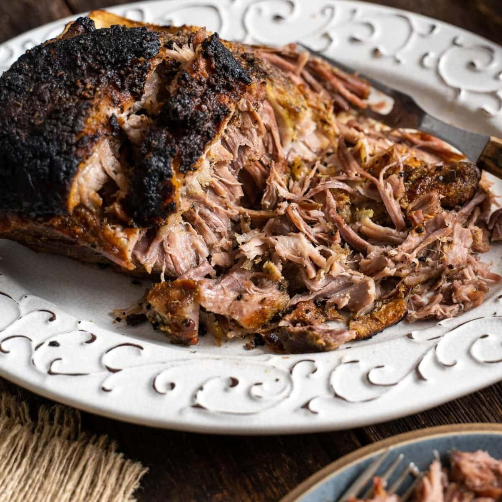

# Pernil

*Puerto Rico's slow-roasted pork shoulder: bone-in pork shoulder marinated overnight in a garlic-oregano-vinegar adobo, slow-roasted for 5 hours till the skin (cuerito) goes crackling-crisp and the meat falls from the bone. The Puerto Rican holiday centrepiece served with arroz con gandules and tostones.*

**Serves:** 8-10

**Prep Time:** 30 minutes (plus overnight marination)

**Cook Time:** 5 hours

## Overview
Pernil is Puerto Rico's most iconic celebration dish and the centrepiece of every Boricua holiday table: Christmas Eve, Three Kings Day, weddings, birthdays. A bone-in pork shoulder marinates overnight in a paste of crushed garlic, dried oregano, olive oil, sour orange juice, salt and pepper, then slow-roasts at low temperature for five hours till the meat is meltingly tender and falls from the bone. A final thirty minutes at high heat crisps the skin into the iconic cuerito (the crackling-crisp pork skin that every Puerto Rican fights over). Two technical moves matter: score the skin diagonally before roasting so the rendered fat can escape and the heat can penetrate, and push the marinade paste underneath the skin and around the bone (not just rubbed on the outside) so the seasoning goes deep. The two-temperature roast is essential too; constant-temperature won't give both tender meat and crispy skin. Served on a wooden board with arroz con gandules, tostones and a small bowl of pique hot sauce.

## Ingredients

### Pork
- 1 bone-in pork shoulder picnic roast (about 3.5-4 kg; skin on)

### Adobo marinade
- 12 garlic cloves (crushed)
- 3 tablespoons dried oregano (preferably Mexican or Caribbean)
- 4 tablespoons olive oil
- 4 tablespoons white wine vinegar
- Juice of 3 limes
- Juice of 2 oranges (or use sour orange / naranja agria if available)
- 2 tablespoons fine sea salt
- 1 tablespoon ground black pepper
- 1 tablespoon ground cumin
- 1 tablespoon paprika
- 2 teaspoons ground coriander
- 1 teaspoon ground turmeric
- 2 tablespoons [Sazón](../../base-ingredients/spices/sazon.md) (or substitute: 1 teaspoon achiote powder + 1 teaspoon garlic powder + 1 teaspoon onion powder)
- 4 sprigs fresh thyme (leaves picked)
- 1 small bunch fresh oregano (chopped; optional, supplements the dried)
- 4 bay leaves (crumbled)

### To finish
- 1 tablespoon olive oil (for rubbing the skin before the final blast)
- 1 teaspoon salt (for the skin)

### To serve
- Arroz con gandules (the traditional accompaniment)
- Tostones (twice-fried green plantains)
- Maduros (sweet plantains)
- Pique (Puerto Rican vinegar hot sauce)
- Sofrito for spooning
- Lime wedges
- Fresh coriander leaves

## Method

### Stage 1 - Score and prep the pork (the night before)
1. Pat the pork shoulder dry with kitchen paper.
2. Score the skin in a diamond pattern with a sharp knife: cut about 5 mm deep into the skin and just into the fat layer, but not into the meat. Make cuts about 2 cm apart.
3. Lift the skin slightly at the edges with the tip of the knife to create small pockets between the skin and the meat.

### Stage 2 - Make the adobo
1. In a wide bowl, combine all marinade ingredients.
2. Mash together with a wooden spoon (or use a pestle and mortar for a smoother paste) till you have a thick wet paste.

### Stage 3 - Apply the marinade
1. Rub the adobo all over the pork shoulder, pressing into the scored skin and around the bone.
2. Use a small knife to make 10-12 deep incisions in the meat (not through the skin); push spoonfuls of the adobo deep into these incisions.
3. Lift the skin slightly where you made the pockets in stage 1; spoon adobo underneath the skin.
4. Place the marinated pork in a large container or zip-lock bag.
5. Cover and refrigerate at least 12 hours, ideally 24-48 hours.

### Stage 4 - Bring to room temperature
1. Take the pork out of the fridge 1 hour before cooking; let warm to room temperature.

### Stage 5 - Start roasting
1. Preheat the oven to 160°C (325°F).
2. Place the pork skin-side-up in a large heavy roasting tin.
3. Cover loosely with foil (to prevent the skin from browning too early).
4. Roast for 4.5 hours.

### Stage 6 - Mid-roast check
1. Check at 3 hours: the meat should be starting to pull from the bone.
2. Baste the meat with the juices from the roasting tin (this keeps it moist and helps the flavours penetrate).

### Stage 7 - Crisp the skin
1. After 4.5 hours, remove the foil.
2. Brush the skin with the additional tablespoon of olive oil; sprinkle with the additional teaspoon of salt.
3. Turn the oven up to 220°C (425°F).
4. Roast uncovered for 25-30 minutes till the skin is deeply golden-brown, bubbled and crackling-crisp.
5. Watch carefully; the skin can burn quickly at high heat.

### Stage 8 - Rest
1. Take the pernil out of the oven.
2. Cover loosely with foil; let rest 20 minutes.
3. The juices redistribute; the meat becomes easier to shred.

### Stage 9 - Carve and serve
1. Place the rested pernil on a wooden carving board.
2. Lift off the crispy skin (cuerito) in pieces; arrange on a separate small plate (this is everyone's favourite part).
3. Use 2 forks to pull the meat apart (it should fall from the bone easily).
4. Or carve into thick slices.
5. Pour some of the pan juices over the meat.

### Stage 10 - Plate
1. Serve at the centre of the table with arroz con gandules, tostones, maduros, pique and a small bowl of sofrito.
2. Pass the cuerito around for everyone to enjoy.
3. Eat with hands or fork; the proper Puerto Rican way is to load a plate with rice, pernil, plantains and a drizzle of pique.

## Notes
- **Score the skin properly:** scoring is essential for crackling-crisp skin. Cut through the skin into the fat layer but not into the meat.
- **Get the adobo under the skin and into the meat:** the deep penetration is what makes pernil distinctive. Use a small knife to make incisions; spoon marinade underneath.
- **Long marinade:** 12 hours minimum, 24-48 hours is the proper Puerto Rican standard. The flavours need time to penetrate the thick cut.
- **Two-temperature roast:** 4.5 hours at 160°C for tender meat; 25-30 minutes at 220°C for crispy skin. Constant temperature won't give both.
- **Rest before carving:** 20 minutes is essential. The juices redistribute and the meat becomes easier to shred.

## Variations
- **Mini pernil (porkette):** swap the whole shoulder for a 1.5 kg pork shoulder portion; reduce cooking to 2.5 hours + 20 minutes high heat. Common modern variation for smaller families.
- **Lechón asado (whole pig):** the related Puerto Rican whole-pig roast, traditionally done over coals for major celebrations. Same adobo, but the whole pig takes 8-10 hours.
- **Pernil de pavo (turkey leg):** swap the pork for whole turkey legs; reduce cooking to 2-2.5 hours. Common for Thanksgiving Puerto Rican-style.
- **Pernil al horno con piña:** add 1 sliced pineapple to the roasting tin in the last hour; the pineapple caramelises and adds a sweet-tart counterpoint.

## Serving
- On a wooden board at the centre of the table, with all the traditional sides arranged around. Drink: cold Medalla (Puerto Rico's local beer), a rum-based cocktail like a pina colada (invented in PR), or coquito (the Puerto Rican Christmas eggnog with coconut and rum). At Christmas Eve / Nochebuena, Three Kings Day, or any major Puerto Rican family celebration.

## Storage
- Keeps refrigerated 5 days; the flavour deepens noticeably overnight.
- Reheat in a covered oven dish at 160°C / 320°F for 25-30 minutes till warmed through.
- The leftover pernil is excellent in sandwiches (the Cubano-style pernil sandwich with pickles and Swiss cheese) or in tacos.
- Freezes 3 months shredded in portions; defrost in the fridge and reheat gently.
- The pan juices (after skimming off excess fat) make excellent gravy for the next day's leftovers.
