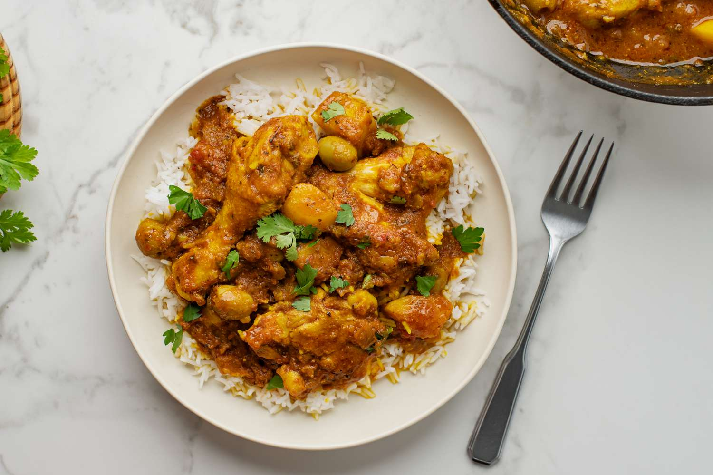

# Pollo Guisado

*Puerto Rico's stewed chicken: bone-in chicken pieces slow-cooked in sofrito, sazón, tomato sauce, olives, capers and cubed potato till the meat falls from the bone and the sauce reduces into a rich orange-red gravy. The Boricua weeknight dinner, ladled over white rice with a side of habichuelas guisadas.*

**Serves:** 4-6

**Prep Time:** 20 minutes

**Cook Time:** 1 hour

## Overview
Pollo guisado is Puerto Rico's everyday stewed chicken and one of the absolute staples of Boricua home cooking. Nearly every Boricua grew up eating their abuela's version, and every Puerto Rican family has slightly different proportions of sofrito and seasoning. Bone-in chicken thighs and drumsticks brown in olive oil, then slow-simmer in a rich base of sofrito, sazón, tomato sauce, sliced olives, capers, fresh coriander and cubed potato until the chicken is meltingly tender and the sauce reduces to a glossy orange-red gravy clinging to the meat. The fragrant sofrito (onions, garlic, cubanelle peppers, recao and coriander) is what makes the dish Puerto Rican rather than generic chicken stew. Bone-in chicken is essential too; the bones release flavour into the sauce that boneless cuts can't match. The olives and capers give the traditional Boricua brininess. Eat ladled over plain white rice, often alongside habichuelas guisadas, with a side of tostones for mopping.

## Ingredients

### Chicken
- 8 bone-in skin-on chicken thighs and drumsticks (about 1.2 kg total)
- 1 ½ teaspoons fine sea salt
- 1 teaspoon ground black pepper
- 1 tablespoon adobo seasoning (or substitute: 1 teaspoon garlic powder + 1 teaspoon onion powder + 1 teaspoon oregano + 1 teaspoon turmeric)
- 1 tablespoon [Sazón](../../base-ingredients/spices/sazon.md) (or 1 teaspoon achiote + 1 teaspoon garlic powder + ½ teaspoon coriander)

### Cooking base
- 3 tablespoons olive oil
- 4 tablespoons sofrito (homemade or shop-bought)
- 1 large onion (finely chopped)
- 1 medium green bell pepper (finely chopped)
- 6 garlic cloves (crushed)
- 200 ml tomato sauce (or 3 tablespoons tomato paste + 200 ml water)
- 400 ml hot chicken stock
- 2 bay leaves
- 1 tablespoon dried oregano
- 1 teaspoon ground cumin
- 1 teaspoon ground turmeric (optional, for colour)

### Vegetables
- 3 medium potatoes (peeled and cubed; about 400 g)
- 2 medium carrots (peeled and sliced into 1 cm rounds; optional)
- 80 g pitted green olives (sliced)
- 2 tablespoons capers (drained)

### To finish
- 1 small bunch fresh coriander (chopped)
- Lime wedges

### To serve
- Plain white rice
- Habichuelas guisadas (stewed pink beans; see existing recipe)
- Tostones or maduros
- Pique (Puerto Rican vinegar hot sauce)

## Method

### Stage 1 - Season the chicken
1. Pat the chicken pieces dry with kitchen paper.
2. Season with the salt, pepper, adobo and sazón; rub thoroughly into the skin.

### Stage 2 - Brown the chicken
1. Heat the olive oil in a large heavy casserole over medium-high heat.
2. Brown the chicken pieces 4-5 minutes per side till deeply golden.
3. Work in batches; don't overcrowd.
4. Lift out and set aside.

### Stage 3 - Build the sauce base
1. Reduce heat to medium.
2. Add the sofrito, chopped onion and chopped green pepper to the pot; cook 6-7 minutes till soft.
3. Add the crushed garlic; cook 30 seconds.
4. Add the tomato sauce; cook 3 minutes till deepened.
5. Add the oregano, cumin and turmeric; cook 1 minute.

### Stage 4 - Return chicken and simmer
1. Return the browned chicken to the pot, nestling into the sauce.
2. Pour in the hot chicken stock.
3. Add the bay leaves.
4. Bring to a low simmer.
5. Cover with the lid slightly ajar.
6. Cook 30 minutes.

### Stage 5 - Add potatoes and finish
1. Add the cubed potatoes (and carrots if using).
2. Add the olives and capers.
3. Continue simmering uncovered for 20-25 more minutes till the potatoes are tender and the sauce has reduced to a glossy orange-red gravy.
4. Stir occasionally.
5. Taste; adjust salt.

### Stage 6 - Serve
1. Spoon white rice into deep bowls.
2. Ladle generous portions of pollo guisado over.
3. Make sure each bowl gets some sauce.
4. Scatter fresh coriander over.
5. Lime wedges and habichuelas guisadas alongside.
6. Pique for those who want extra heat.

## Notes
- **Sofrito is essential:** without it, you have generic chicken stew. Use homemade sofrito if possible; the substitute recipes don't fully replicate the Puerto Rican green-sauce depth.
- **Bone-in chicken for flavour:** the bones release flavour into the sauce. Don't substitute with boneless.
- **Brown before braising:** the fond is the foundation of the sauce. Don't skip.
- **Olives and capers are Boricua:** the brininess gives the dish its character. Don't skip.
- **Don't lift the lid much:** the slow simmer needs covered conditions for the first 30 minutes. Open only when adding the potatoes.

## Variations
- **With chickpeas (pollo guisado con garbanzos):** add 1 tin of drained chickpeas along with the potatoes; gives a more substantial one-pot meal.
- **Spicier:** add 1 finely chopped habanero pepper to the sofrito base; gives a properly Caribbean fierce version.
- **With pumpkin (calabaza):** swap half the potatoes for cubed calabaza pumpkin; common Puerto Rican autumn variation.
- **Without potatoes:** skip the potatoes; serve over rice with a side of mashed plantains (mofongo). More restaurant-style presentation.

## Serving
- Over hot white rice with habichuelas guisadas and tostones alongside. The full PR Sunday dinner. Drink: Medalla beer, agua de tamarindo, or a glass of cold mauby.

## Storage
- Keeps refrigerated 5 days; the flavour deepens noticeably overnight (many Boricuas insist it's better the next day).
- Reheat gently in a covered pan with a splash of stock or water.
- Freezes 3 months in portions; defrost in the fridge.
- Day-old pollo guisado is excellent for lunch over rice or shredded into wraps.
