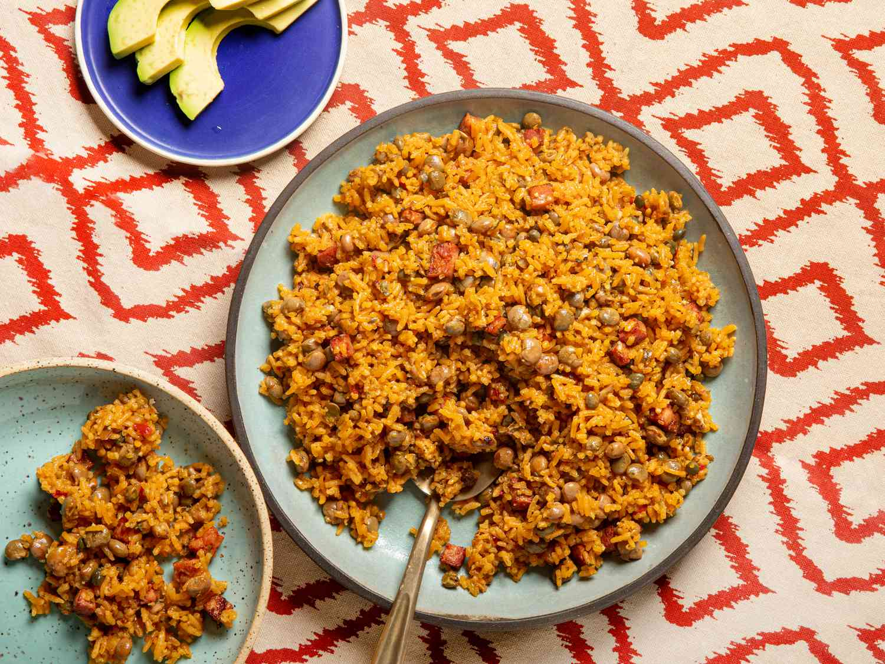

# Arroz con Gandules

*Puerto Rico's national rice: medium-grain rice cooked with pigeon peas, sofrito, achiote-tinted broth, smoked ham or pork shoulder, olives and capers till the grains absorb the savoury broth and turn deep orange-yellow. The unofficial national dish of Puerto Rico, the canonical rice for every Boricua holiday and family meal.*

**Serves:** 6-8

**Prep Time:** 20 minutes

**Cook Time:** 40 minutes

## Overview
Arroz con gandules ("rice with pigeon peas") is Puerto Rico's unofficial national dish and the canonical rice that accompanies every Boricua holiday feast, every family gathering, every Sunday lunch: medium-grain rice is cooked in a base of sofrito, sazón (the Boricua spice blend that gives the rice its characteristic orange-yellow colour), achiote-infused oil, tomato sauce, smoked ham or pork shoulder (for depth; vegetarian versions exist), pitted green olives, capers and the canonical gandules (pigeon peas - Cajanus cajan; the small reddish-brown bean that's a staple across the Caribbean and South Asia), all simmered together till the rice has absorbed the broth and the grains are tender and properly orange-yellow throughout. Served alongside pernil, pollo guisado, carne guisada, lechón asado, or any Boricua main; or even on its own with a fried egg on top as a comforting one-bowl meal. Three details define proper arroz con gandules. First, sofrito and sazón. The PR seasoning duo gives the dish its identity. Second, the gandules. Pigeon peas are non-negotiable; the dish is named for them. Sold canned at Caribbean and Latin markets; sometimes fresh in season. Third, the smoked pork. Either a small piece of smoked ham, salt pork or smoked pork shoulder (jamón de cocinar) gives the proper depth. Vegetarian versions skip and rely on extra sofrito and sazón.

## Ingredients

### Rice and beans
- 500 g medium-grain rice (or long-grain rice; rinsed 2-3 times)
- 1 tin (400 g) pigeon peas / gandules (drained); or 250 g dried pigeon peas pre-soaked and pre-cooked

### Cooking
- 4 tablespoons olive oil (or achiote oil for deeper colour)
- 150 g smoked ham (or salt pork; or smoked pork shoulder; diced into 1 cm cubes; or skip for vegetarian)
- 4 tablespoons sofrito
- 1 medium onion (finely chopped)
- 1 medium green bell pepper (finely chopped)
- 6 garlic cloves (crushed)
- 2 tablespoons tomato paste
- 200 ml tomato sauce
- 1 tablespoon sazón
- 1 tablespoon dried oregano
- 1 teaspoon ground cumin
- 1 ½ teaspoons fine sea salt
- 1 teaspoon ground black pepper
- 80 g pitted green olives (sliced)
- 2 tablespoons capers (drained)
- 2 bay leaves

### Liquid
- 900 ml hot chicken stock (or vegetable stock for vegetarian)

### To serve
- Sliced avocado
- Lime wedges
- Fresh coriander

## Method

### Stage 1 - Render the pork
1. Heat the olive oil in a wide heavy pot (with a tight-fitting lid) over medium heat.
2. Add the diced ham (or salt pork); cook 5-7 minutes till the fat renders and the pieces are slightly crisp.
3. (Skip this stage for vegetarian; just heat the oil.)

### Stage 2 - Build the base
1. Add the sofrito to the pot.
2. Add the chopped onion and green pepper; cook 6 minutes till soft.
3. Add the crushed garlic; cook 30 seconds.
4. Add the tomato paste; cook 2 minutes till deepened.
5. Add the tomato sauce; cook 2 minutes.
6. Stir in the sazón, oregano, cumin, salt and pepper.

### Stage 3 - Add rice and gandules
1. Add the rinsed-and-drained rice to the pot.
2. Stir to coat in the base for 1 minute.
3. Add the drained pigeon peas, olives, capers and bay leaves.

### Stage 4 - Add liquid and cook
1. Pour in the hot chicken stock.
2. Stir once.
3. Bring to a gentle simmer.
4. Reduce heat to lowest; cover with the tight-fitting lid.
5. Cook 22-25 minutes covered (don't lift the lid).

### Stage 5 - Rest off heat
1. Take off the heat; keep the lid on.
2. Rest 10 minutes; the rice finishes steaming.

### Stage 6 - Fluff and serve
1. Uncover; lift out the bay leaves.
2. Fluff with a fork, lifting from the bottom.
3. The rice should be tender, the pigeon peas distributed throughout, the colour a deep orange-yellow.
4. Serve in a wide bowl or on a platter.
5. Scatter chopped coriander over.
6. Sliced avocado and lime wedges alongside.

## Notes
- **Sofrito + sazón:** the canonical PR seasoning duo. Don't skip; substitute if needed.
- **Pigeon peas (gandules) are essential:** the dish is named for them. Canned is fine; dried pre-cooked is better.
- **The smoked pork gives depth:** if vegetarian, skip the meat but add an extra tablespoon of sazón and an extra splash of olive oil.
- **Don't lift the lid:** the rice cooks by absorption-and-steam. 22-25 minutes covered, then 10 minutes resting.
- **Medium-grain rice if possible:** gives the proper Boricua texture. Long-grain works.

## Variations
**With ham hock instead of diced ham:** add a smoked ham hock to the pot in stage 4; cook with the rice. Remove and shred the meat before serving.
**Vegetarian arroz con gandules:** skip the meat; double the sofrito and add 1 extra tablespoon of sazón; use vegetable stock.
**With chicken:** add 8 bone-in chicken thighs to the pot in stage 1 (browned first); turns the dish into a one-pot arroz con pollo y gandules main course.
**Saffron version:** add a generous pinch of saffron threads (infused in 2 tablespoons warm water) to the cooking liquid; gives an extra-luxurious version.

## Serving
On a wide platter as the centre of a Boricua family meal. Alongside pernil, pollo guisado, carne guisada or any main. Sliced avocado and lime wedges. As a one-bowl meal with just a fried egg on top.

## Storage
- Keeps refrigerated 4 days; the flavour deepens overnight.
- Reheat gently in a covered pan with a splash of stock over low heat; or microwave covered.
- Freezes 3 months in portions; defrost in the fridge.
- Day-old arroz con gandules fries beautifully into a Puerto Rican fried-rice; toss in a hot pan with a beaten egg and any leftover meat.
