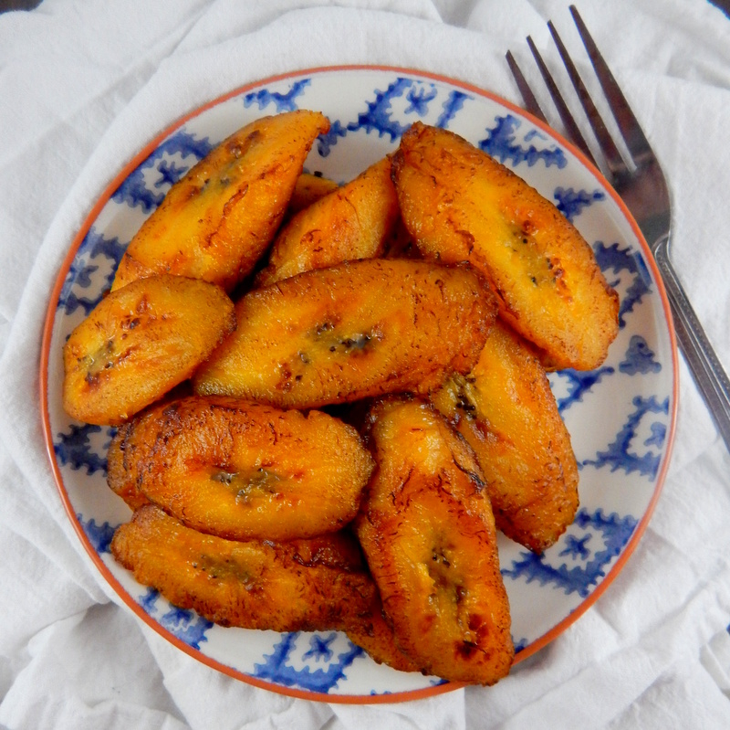

# Maduros

*Puerto Rico's sweet fried plantains: ripe black-spotted plantains sliced on the bias and pan-fried in oil till the cut surfaces caramelise to deep mahogany and the inside turns soft, sweet and almost creamy. The sweet counterpoint to savoury mains, the Boricua sweet side that turns up at every meal alongside the rice and the meat.*

**Serves:** 4

**Prep Time:** 10 minutes

**Cook Time:** 12 minutes

## Overview
Maduros ("ripe ones", sometimes called plátanos maduros or amarillos) is Puerto Rico's sweet fried plantain side and one of the most beloved accompaniments of Boricua cooking. Properly ripe plantains (very yellow with black spots; the kind people unfamiliar with plantains often think are rotten but actually are at perfect ripeness) peel, slice on the bias into 1.5 cm thick ovals, and pan-fry in oil at moderate heat till the cut surfaces caramelise to a deep mahogany-brown and the inside goes soft, sweet and almost creamy. The ripeness matters: yellow-with-significant-black-spotting is the sweet spot, since underripe ones give bland starchy maduros and overripe ones go mushy. The heat matters too; ripe plantains are sugary and high heat burns the sugars before the interior softens. Served as a sweet counterpoint to savoury mains like pernil, pollo guisado or bistec encebollado. Also one of the most kid-friendly Boricua foods; children adore them.

## Ingredients

- 3 large ripe plantains (yellow-with-significant-black-spotting; about 600 g total)
- 4 tablespoons vegetable oil (or coconut oil for a more tropical version)
- A pinch of fine sea salt (optional; brings out the sweetness)
- A pinch of ground cinnamon (optional, for a sweeter dessert-leaning version)

### Optional finishing
- Flaky sea salt
- A drizzle of honey
- A small dollop of crema (or sour cream)

## Method

### Stage 1 - Choose and ripen the plantains
1. Look at the skin: deep yellow with significant black spotting and possibly some all-black patches.
2. The plantain should feel slightly soft when pressed (like a ripe banana), not rock-hard.
3. If your plantains are still green or yellow without spots, leave on the counter for 3-7 days till they go black-spotted (similar to ripening bananas).

### Stage 2 - Peel and slice
1. Cut off both ends of each plantain.
2. Make a shallow cut along the length of the skin (just through the skin).
3. Peel back the skin; ripe plantain peels easily.
4. Slice each plantain on a 45-degree bias into 1.5 cm thick ovals; each piece about 5 cm long.

### Stage 3 - Heat the pan
1. Heat the vegetable oil in a wide heavy frying pan over medium heat till shimmering.

### Stage 4 - Pan-fry in batches
1. Add the plantain slices to the pan in a single layer, leaving space between them.
2. Cook 3-4 minutes per side without moving them so the cut surface caramelises to deep mahogany.
3. Flip with a thin spatula; cook the second side 3-4 minutes till also deeply caramelised.
4. The plantains should be properly soft when pressed (a wooden skewer should slide in easily).
5. Transfer to a warm plate lined with kitchen paper.

### Stage 5 - Finish and serve
1. Sprinkle with a tiny pinch of sea salt (optional; brings out the sweetness).
2. Dust with a pinch of cinnamon for a dessert-leaning version.
3. Serve immediately while warm and the caramelisation is at its peak.

## Notes
- **Ripeness is everything:** the canonical maduros uses yellow-black or mostly-black plantains. Underripe gives bland starchy result; overripe gives mush.
- **Buy ahead:** plantains at most supermarkets are sold green or yellow; plan 3-7 days ahead so they ripen at home.
- **Moderate heat, not high:** plantains burn quickly when ripe. Medium-low to medium is the right heat.
- **Bias-cut for the best caramelisation:** the angle gives more cut surface area exposed to the pan.
- **Cook in batches:** crowded pan steams the plantains instead of frying. Better in 2 batches.

## Variations
**Maduros with cinnamon-sugar:** sprinkle with cinnamon-sugar after cooking; turns the side into a dessert.
**Glazed maduros:** add 2 tablespoons of brown sugar to the pan in the last 30 seconds; the sugar caramelises into a sticky glaze.
**Coconut maduros:** sprinkle with desiccated coconut while still warm; gives a tropical twist.
**Maduros con queso (sweet plantains with cheese):** top with grated queso fresco or feta while warm; the cheese melts slightly. Sweet-salty combination that's a Boricua favourite.

## Serving
Alongside any Puerto Rican main course as the sweet counterpoint. Children love them as snacks. Often eaten with arroz con habichuelas as a one-bowl meal. Drink: Medalla beer, mauby, or fresh coconut water.

## Storage
- Best eaten immediately while warm; the texture suffers as they cool.
- Keep refrigerated 2 days; reheat in a hot dry pan for 1-2 minutes per side, or briefly under a grill.
- Don't microwave; they go rubbery.
- Don't freeze; the texture suffers completely.
- Day-old maduros can be mashed and stirred into rice for a sweet variation.
