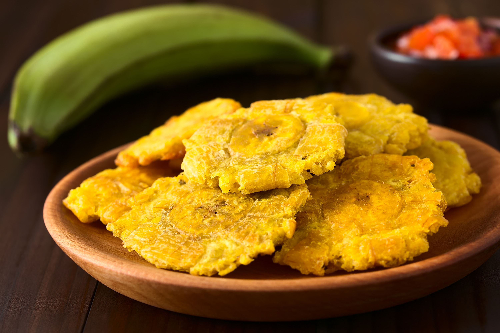

# Tostones

*Puerto Rico's twice-fried green plantains: rounds of green plantain pre-fried in oil till just golden, smashed flat with a tostonera or flat-bottomed glass, then fried again at higher heat till crisp and golden-brown. The Boricua side that accompanies every plate of pernil, pollo guisado or grilled fish, dipped in mayo-ketchup or garlic ajilimójili.*

**Serves:** 4

**Prep Time:** 15 minutes

**Cook Time:** 15 minutes

## Overview
Tostones (called tachinos in Cuba and patacones in Colombia and Venezuela) is one of the most iconic Caribbean side dishes and a fundamental part of Puerto Rican cooking. Green plantains slice into thick rounds and fry in oil at moderate heat till the outsides are pale gold and the insides just cooked. The rounds then smash flat with a tostonera or a flat-bottomed glass, dip briefly in salted water (which dramatically crisps the surface; a crushed garlic clove in the water gives extra flavour), and fry again at higher heat till the outsides are deeply golden-brown and crispy. Properly green, hard, unripe plantains are essential; even slight yellow gives a sweet-soft result that's not quite tostones. The twice-fry is non-negotiable too; single-fried rounds are just "plantain rounds", not tostones. Served immediately with a sprinkle of salt and a small bowl of mayo-ketchup (the Boricua dipping sauce of mayo, ketchup and garlic; better than it sounds), ajilimójili (the traditional garlic-citrus sauce) or just a squeeze of lime.

## Ingredients

- 3 large green plantains (very green, hard; about 600 g total)
- Vegetable oil for frying (about 500 ml; for 2 cm depth)
- 1 ½ teaspoons fine sea salt
- 200 ml warm water (for the brief dip)
- 4 garlic cloves (crushed, optional; added to the salt-water)

### To finish
- Flaky sea salt

### To serve (dipping sauces - pick one or all)
- Mayo-ketchup sauce: 100 g mayonnaise + 50 g ketchup + 2 crushed garlic cloves + a squeeze of lime + pinch of salt (mix together)
- Ajilimójili: 6 crushed garlic cloves + juice of 2 limes + 50 ml olive oil + ½ teaspoon salt + 1 tablespoon fresh coriander (whisked together)
- Sofrito for dipping
- Simply lime wedges

## Method

### Stage 1 - Peel the plantains
1. Cut off both ends of each plantain.
2. Cut a shallow slice down the length of the skin (just through the skin, not the flesh).
3. Use your thumb to peel back the skin in strips. Green plantain skin is tough; you may need to work at it.
4. Cut each peeled plantain into 2-3 cm thick rounds; about 8 rounds per plantain.

### Stage 2 - First fry
1. Pour vegetable oil into a deep heavy pan to a depth of 2 cm.
2. Heat over medium heat till 165°C (330°F); test with a small piece of plantain that should sizzle gently but not brown immediately.
3. Add the plantain rounds in a single layer; fry 3-4 minutes per side till pale gold and the inside is just cooked through (a knife should slide in with slight resistance).
4. Lift out with a slotted spoon; drain briefly on kitchen paper.

### Stage 3 - Smash the plantains
1. Mix the warm water with 1 teaspoon of salt (and crushed garlic if using).
2. Take each fried plantain round; place between two pieces of parchment paper.
3. Press flat with the bottom of a heavy flat-bottomed glass, a tostonera (the traditional wooden tool), or the side of a flat-bottomed pan. Press to about 1 cm thickness.
4. Dip each smashed plantain briefly in the salted water (just a quick dunk).
5. Pat lightly with kitchen paper to remove excess water (it will spit in the hot oil).

### Stage 4 - Second fry
1. Increase the oil heat to 190°C (375°F).
2. Add the smashed plantains in batches; fry 1-2 minutes per side till deeply golden-brown and crispy.
3. Lift out; drain on kitchen paper.
4. Sprinkle generously with flaky sea salt.

### Stage 5 - Serve immediately
1. Pile the hot crispy tostones on a serving plate.
2. Place the dipping sauce(s) in small bowls alongside.
3. Eat hot; tostones lose their crispness as they cool.

## Notes
- **Green plantains, properly green:** unripe, hard, no yellow whatsoever. Yellow plantains give a sweet wrong result.
- **Twice-fry:** the two-fry technique is what makes tostones distinctive. First fry cooks the inside; second fry crisps the outside.
- **Salted water dip:** a brief dunk between fries helps crisp the surface dramatically. Some Boricuas swear by adding crushed garlic to the water.
- **Smash to 1 cm thickness:** thicker doesn't crisp properly; thinner gives a brittle wafer rather than tostones.
- **Eat immediately:** tostones go from crispy to chewy in 10 minutes. Serve hot.

## Variations
- **Stuffed tostones (mofongo cups):** smash the fried plantains into shot-glass-shaped cups using a tostonera; fill with seasoned shrimp, picadillo or shredded chicken; finish briefly in the oven. Common restaurant variation.
- **Tostones rellenos:** stuff with cheese before the second fry; gives a richer cheese-stuffed version.
- **Tostones with garlic-mojo:** brush hot tostones with mojo (garlic-lime sauce) instead of salt; gives the traditional Cuban take.
- **Sweet plantain version (maduros):** use very ripe (black-spotted) plantains; just one fry, sliced longer (5 cm) and thinner (1 cm); see the maduros recipe.

## Serving
- On a serving platter or in a basket lined with kitchen paper. Multiple dipping sauces in small bowls. As a side alongside pernil, pollo guisado, fish, or any Boricua main. Drink: Medalla beer, mauby, or fresh coconut water.

## Storage
- Best eaten immediately; tostones go off-texture as they cool.
- Keep refrigerated 1 day; reheat in a hot oven (200°C / 400°F) for 5-6 minutes to re-crisp.
- Don't microwave; they go rubbery.
- The first-fried (un-smashed) rounds can be made ahead, refrigerated 1 day, then smashed and final-fried just before serving.
- Don't freeze.
