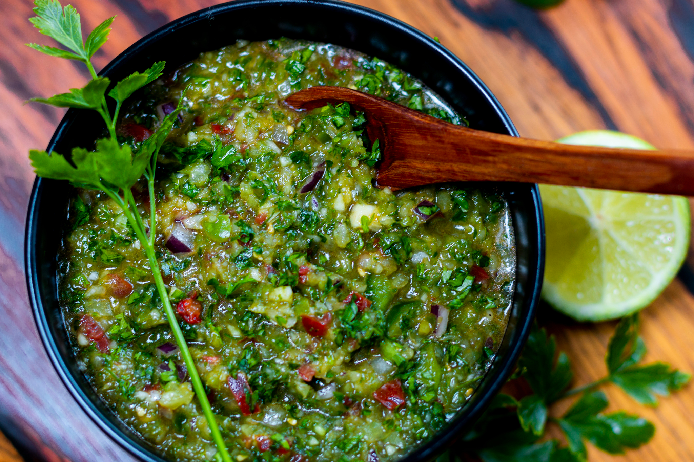

# Puerto Rican Sofrito

*Puerto Rico's foundational green sauce: a bright vivid-green purée of cubanelle peppers, onions, garlic, cilantro, culantro (recao), peppadews and ajies dulces, blitzed together into a paste that goes into every savoury Boricua dish. The flavour-base of the entire Puerto Rican kitchen, made in big batches and frozen for everyday cooking.*

**Serves:** Makes about 500 ml of sofrito

**Prep Time:** 25 minutes

**Cook Time:** 0 minutes

## Overview
Sofrito is the absolute foundation of Puerto Rican cooking and the single most important sauce in the Boricua kitchen. A bright vivid-green raw aromatic paste of cubanelle peppers, onions, garlic, fresh cilantro, culantro (recao), small sweet ajies dulces peppers, tomato, olive oil and salt, processed to a coarse-textured purée that's deeply herbal, vegetable-sweet and unmistakably Boricua. Sofrito is the flavour-base of nearly every savoury Puerto Rican dish: arroz con gandules, pollo guisado, carne guisada, habichuelas guisadas, pasteles. Every Puerto Rican family makes it in big batches (a kilo of vegetables at a time) and freezes it in ice-cube trays for daily cooking. The Puerto Rican version is raw and herbal-dominant, which distinguishes it from Spanish sofrito (cooked, tomato-dominant) and Italian soffritto (onion-carrot-celery based). Both cilantro and culantro together are traditional; cilantro alone is the workable substitute. Ajies dulces (tiny sweet Puerto Rican chillies, like habaneros without the heat) sell frozen at Caribbean markets, or substitute with peppadews.

## Ingredients

### The base
- 4 medium green bell peppers (deseeded and roughly chopped; or 4-6 cubanelle peppers for the proper PR version)
- 8 ajíes dulces (Puerto Rican sweet peppers; or 4 small jarred sweet peppers / peppadews as substitute)
- 2 large onions (roughly chopped)
- 1 whole head garlic (12-15 cloves; peeled)
- 2 large bunches fresh cilantro (about 100 g; rinsed, roots trimmed)
- 1 small bunch fresh culantro / recao (about 30 g; chopped) - or double the cilantro if unavailable
- 1 medium tomato (chopped; optional but common)
- 1 medium red bell pepper (deseeded and roughly chopped; for sweetness and colour)

### Seasonings (optional but common)
- 2 tablespoons olive oil
- 1 teaspoon fine sea salt
- 1 teaspoon dried oregano

## Method

### Stage 1 - Prepare the ingredients
1. Roughly chop the green peppers, ajíes dulces, red bell pepper and onions. They don't need to be small; the processor will handle them.
2. Peel all the garlic cloves.
3. Rinse the cilantro and culantro; trim the roots; roughly chop. Use the stems too; they have flavour.
4. Chop the tomato (if using).

### Stage 2 - Process in batches
1. Place a quarter of the ingredients in a food processor.
2. Pulse 8-10 times till coarsely chopped.
3. Add the next quarter; pulse again to a coarse paste.
4. Continue till all ingredients are processed.
5. The texture should be coarse, not smooth; visible bits of each ingredient should be apparent. Not pureed.
6. If using salt, olive oil and oregano: stir in by hand at the end.

### Stage 3 - Transfer and store
1. Spoon the sofrito into clean glass jars.
2. Top with a thin layer of olive oil (helps preserve it).
3. Refrigerate (use within 2 weeks) or freeze.

### Stage 4 - Freeze for daily use
1. To freeze: spoon the sofrito into ice-cube trays.
2. Freeze solid (about 4 hours).
3. Pop out the frozen cubes; transfer to a freezer-safe bag.
4. Each cube is about 1 tablespoon; the standard recipe call is for 2-4 tablespoons of sofrito = 2-4 cubes.

### Stage 5 - Use in cooking
1. For most Puerto Rican dishes: heat olive oil in a pan over medium heat.
2. Add 2-4 tablespoons (or 2-4 frozen cubes) of sofrito to the hot oil.
3. Cook 2-3 minutes till the sofrito has heated through, the raw smell has been replaced by a deeply aromatic herbal-vegetable scent, and the colour has deepened slightly.
4. Then proceed with the rest of the recipe (add meat, vegetables, etc.).

## Notes
- **Cilantro AND culantro:** for the proper PR sofrito. Culantro (recao) is available frozen at most Caribbean markets in the diaspora. If unavailable, double the cilantro - the result is acceptable but less authentic.
- **Coarse texture:** don't process to a smooth paste; the proper PR sofrito has texture. Pulse, don't run continuously.
- **No tomato in some versions:** some Puerto Rican home cooks don't add tomato to their sofrito; the dish becomes pure-green. Both versions are valid; tomato gives slightly more rounded flavour, no tomato keeps it brighter green.
- **Freeze in cubes:** ice cube trays are the traditional Boricua storage method. Pop one cube per tablespoon of recipe call.
- **Raw, not cooked:** sofrito is stored raw and cooked when added to dishes. Don't pre-cook before storing.

## Variations
**Without tomato (purist sofrito):** skip the tomato; gives a brighter purer green sauce.
**With ají caballero (hot pepper):** add 1-2 fresh hot peppers for a spicier version; less traditional for PR sofrito (PR sofrito is usually mild) but common in Caribbean variations.
**Vegan no-oil version:** skip the olive oil; the sofrito keeps a few days less but is otherwise identical.
**Dominican-style:** add 1 tablespoon of dried oregano and 4 stalks of celery; gives the slightly different Dominican-Republic flavour profile.

## Serving
Used as the foundation in nearly every Puerto Rican savoury dish. Sautéed in oil at the start of pollo guisado, carne guisada, arroz con gandules, habichuelas guisadas, asopao de pollo. Also as a dipping sauce or as a marinade for grilled meat.

## Storage
- Keeps refrigerated 2 weeks in a sealed jar with a thin layer of olive oil on top.
- Freezes 6 months in ice cube trays; pop out and store in bags.
- Don't keep at room temperature; it spoils quickly.
- Make in big batches (kilo of vegetables at a time) and freeze for daily cooking.
- The flavour mellows slightly over the first 24 hours; even better after a day in the fridge.
