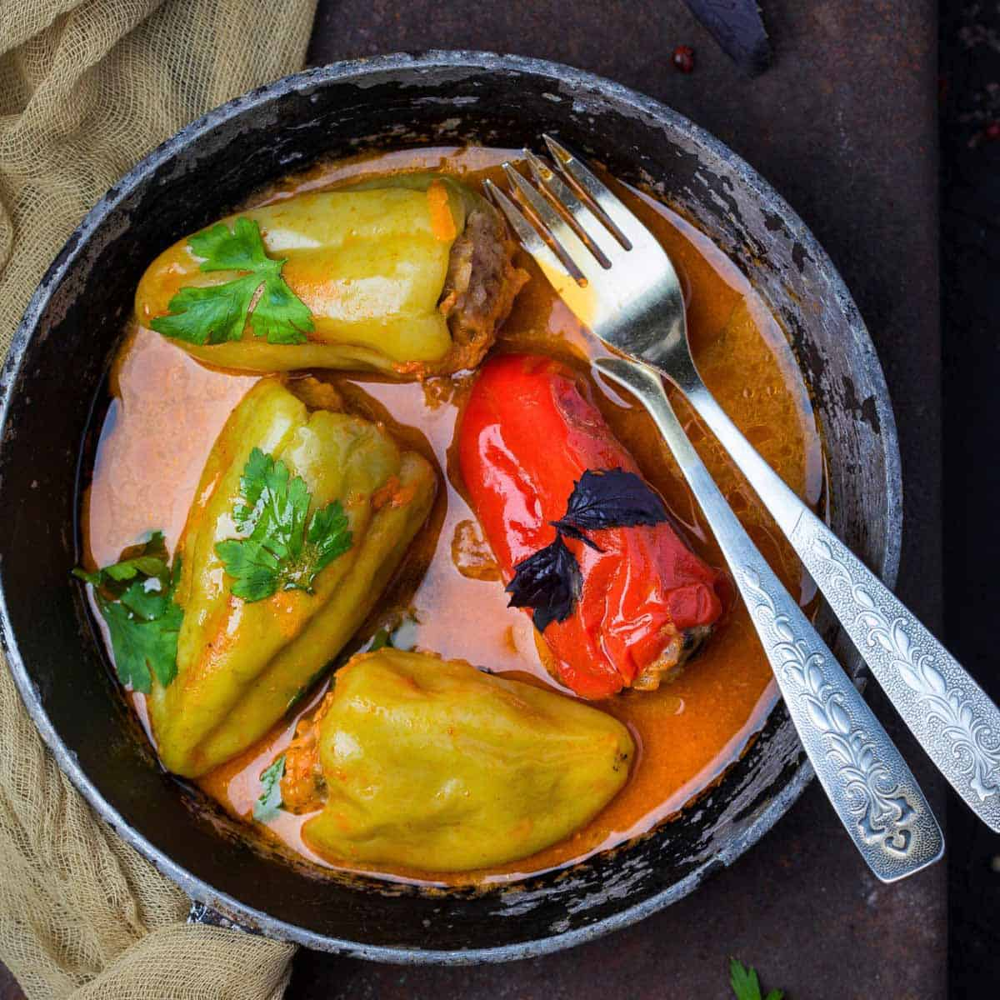

# Ardei umpluți

*Romanian stuffed peppers: gobbet peppers packed with seasoned pork and rice, braised in a tomato-and-dill broth until the flesh is sweet and the filling moist.*

**Serves:** 4 to 6

**Prep Time:** 30 minutes

**Cook Time:** 1 hour 30 minutes

## Overview
Ardei umpluți are the Sunday lunch of any Romanian household once the late summer peppers come in from the market. Squat sweet peppers (called gogoșari when fully ripened and round, or kapia when long and tapered) are cored and filled with the same pork-and-rice base used for sarmale, then stood upright in a wide pot with a tomato-dill broth, weighed down with a plate, and braised slowly until the peppers slump and the filling drinks the tomato. Eat at room temperature with a great spoon of cold sour cream on top and a slice of country bread, the flavours settled and easy after a long simmer.

## Ingredients

### For the peppers and broth
- 8 large sweet peppers (gogoșari, kapia, or red bell)
- 800 ml tomato passata
- 400 ml water
- 1 tbsp sunflower oil
- 2 tbsp tomato puree
- 1 tsp sugar
- 1 tsp salt
- 1 bay leaf
- 3 tbsp chopped fresh dill (plus more to serve)

### For the filling
- 500 g coarsely minced pork (20% fat)
- 80 g long-grain rice (uncooked, rinsed)
- 1 large onion, finely chopped
- 1 medium carrot, grated
- 2 tbsp sunflower oil
- 1 tsp sweet paprika
- 2 tbsp chopped fresh dill
- 2 tbsp chopped flat-leaf parsley
- 1 tsp salt
- 1 tsp ground black pepper

### To serve
- 200 g sour cream

## Method

### Stage 1 - Make the filling
1. Soften the onion in the oil over medium heat 6 minutes.
2. Add the grated carrot; cook 3 minutes more until soft.
3. Stir in the paprika; cook 30 seconds.
4. Tip into a bowl; cool 10 minutes.
5. Add pork, rice, dill, parsley, salt, and pepper; mix with hands.

### Stage 2 - Prepare the peppers
1. Slice the tops off the peppers (keep them as little hats).
2. Pull out the seeds and white pith.
3. Stand the peppers on a board; trim a paper-thin slice off the base only if they will not stand (do not cut through).

### Stage 3 - Fill
1. Spoon filling into each pepper, packing to 1 cm from the top (the rice swells).
2. Replace the pepper hats.

### Stage 4 - Build the pot
1. Choose a wide heavy pot the peppers will stand upright in (about 26 cm).
2. Smear the base with the sunflower oil and tomato puree.
3. Stand the filled peppers in tight, no gaps.
4. Whisk the passata, water, sugar, salt, dill, and bay leaf; pour over the peppers.
5. The broth should reach two-thirds up the peppers; top with water if not.
6. Set a heatproof plate on top to weigh them down.

### Stage 5 - Braise
1. Bring to a gentle bubble; drop to a low simmer.
2. Cook covered for 1 hour 15 minutes; the peppers will slump and the broth thicken.
3. Uncover the last 15 minutes to reduce.

### Stage 6 - Rest
1. Take off the heat; rest 20 minutes (the filling firms, the flavours marry).
2. Serve warm or at room temperature.

## Notes
- **Pepper choice:** thicker-walled red peppers hold the filling best; thin pale-green peppers split.
- **Pack lightly:** stuffed too tight, the filling bursts as the rice swells.
- **The plate trick:** without weight, the peppers float and the tops fall off.
- **Make a day ahead:** the flavour is better on day two.
- **A pinch of sugar in the broth:** balances the acid of the tomato.

## Variations
- **Tomato gogonele (green pickled tomatoes) version:** stuff small green tomatoes alongside the peppers.
- **Lent version:** mushrooms, rice, and walnuts in place of pork, vegetable broth.
- **Beef and pork:** equal split for a richer filling.
- **With a smoked ham-hock bone in the pot:** smoky background note.
- **Stuffed cabbage leaves version:** same filling, wrapped in cabbage (a quick sarmale).

## Serving
Warm or room temperature · with a generous spoon of cold sour cream · with country bread · with extra dill and pepper · with a glass of dry white wine.

## Storage
- Refrigerate up to 4 days; flavour improves overnight.
- Freeze in the broth: 3 months.
- Reheat gently in the oven at 150°C; do not microwave or the peppers go limp.
