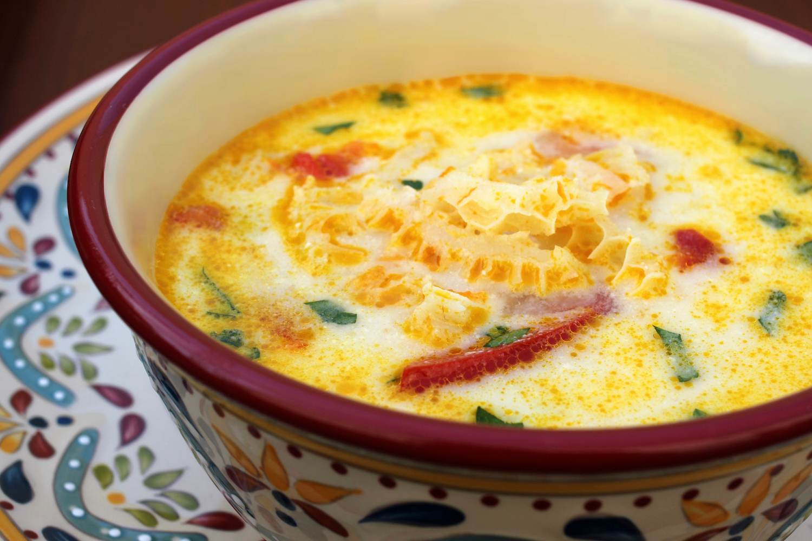

# Ciorbă de burtă

*The Romanian hangover cure: tender strips of tripe in a sour creamy broth, sharpened with vinegar and garlic mujdei, finished with sour cream and yolk.*

**Serves:** 6

**Prep Time:** 20 minutes

**Cook Time:** 3 hours 30 minutes

## Overview
Ciorbă de burtă is the most famous of Romania's sour soups, the bowl ordered after a heavy night at three in the morning in any Bucharest beer hall. Honeycomb tripe is scrubbed, blanched, and simmered for hours with carrot, onion, and bay until tender, then sliced into ribbons. The broth is enriched with a swirl of egg yolk and sour cream, sharpened with white vinegar, and finished at the table with raw garlic crushed in oil (mujdei) and a sprinkle of hot chilli. The colour is pale gold; the flavour is sour, garlicky, restorative. Eat with a slab of country bread and a small glass of țuică to settle the soul.

## Ingredients

- 1 kg honeycomb tripe, cleaned
- 1 veal or beef knuckle bone (about 500 g), for the stock
- 2 medium carrots, halved
- 1 large onion, halved
- 1 parsnip, halved
- 2 bay leaves
- 8 black peppercorns
- 2 tsp salt
- 2 L water

### For finishing
- 3 egg yolks
- 200 ml sour cream (smântână)
- 4 tbsp white wine vinegar (or to taste)
- 1 tsp ground black pepper

### For the mujdei (table sauce)
- 6 garlic cloves, mashed with 1 tsp salt
- 4 tbsp sunflower oil
- 4 tbsp warm water

### To serve
- Hot chilli flakes or a small pickled chilli
- Country bread

## Method

### Stage 1 - First boil
1. Scrub the tripe under cold water; rub with coarse salt; rinse again.
2. Place tripe and bone in a large pot; cover with cold water; bring to a boil.
3. Drain; rinse the tripe and bone under cold water (this removes the strong first smell).

### Stage 2 - Long simmer
1. Return tripe and bone to a clean pot; add the 2 L fresh water.
2. Add carrot, onion, parsnip, bay, peppercorns, and salt.
3. Bring to a gentle simmer; skim the foam.
4. Cook covered at the lowest bubble for 3 hours; the tripe is done when a knife slips through it without resistance.

### Stage 3 - Slice
1. Lift out the tripe; let it cool 10 minutes.
2. Slice into ribbons about 1 cm wide and 5 cm long.
3. Strain the broth through a fine sieve; discard solids; return broth to the pot.
4. Return the sliced tripe to the broth; bring back to a gentle simmer.

### Stage 4 - Enrich
1. Beat the yolks and sour cream together in a bowl.
2. Ladle in 200 ml of the hot broth, whisking, to temper.
3. Pour the tempered mix back into the pot off the heat, stirring.
4. Stir in the vinegar; taste, adjust salt and sour.
5. Add the ground pepper.
6. Do not boil after this point or the yolks will scramble.

### Stage 5 - Make the mujdei
1. Pound the salted garlic in a mortar until smooth.
2. Whisk in the oil drop by drop.
3. Loosen with the warm water to a thin pourable sauce.

### Stage 6 - Serve
1. Ladle the soup into deep bowls.
2. Spoon 1 tbsp of mujdei into each bowl.
3. Add chilli to taste.
4. Eat with country bread.

## Notes
- **The tripe smell:** the first boil and rinse remove most of it; long slow cooking does the rest.
- **The tempering:** never tip cold dairy into a hot soup; always temper or it splits.
- **The sour:** vinegar is the city version; in the country, fermented bran water (borș) is the real sour.
- **Adjust at the table:** more vinegar, more garlic, more chilli, all expected.
- **Bone stock:** a veal knuckle gives proper body; a good beef stock cube works as a shortcut.

## Variations
- **Ciorbă de burtă cu borș:** sour the broth with fermented wheat-bran liquor instead of vinegar.
- **Without cream (for those who do not love it):** finish with yolk only.
- **With smoked paprika:** half a teaspoon at the broth stage for warmth.
- **Quicker (3 hours pressure cooker):** 45 minutes at full pressure replaces the long simmer.
- **Veal-tendon version:** add 300 g veal tendon to the simmer; richer, more gelatinous.

## Serving
Very hot · in a deep bowl · with mujdei and chilli at the table · with country bread · with a small glass of țuică alongside.

## Storage
- Refrigerate up to 3 days; flavour deepens.
- Reheat very gently below boiling.
- Do not freeze; the dairy splits on thaw.
