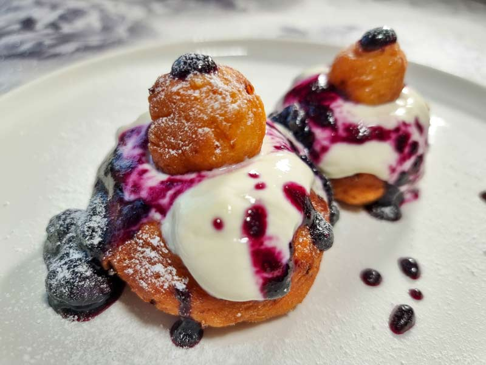

# Papanași

*Fried cottage-cheese doughnuts piled with sour cream and sour cherry jam: a ring with a little ball on top, hot from the pan, the most photographed dessert in any Romanian restaurant.*

**Serves:** 4 (8 doughnuts)

**Prep Time:** 20 minutes

**Cook Time:** 15 minutes

## Overview
Papanași are the deep-fried showstopper of Romanian dessert tables, the dish every tourist photographs at the end of a long meal in Sibiu, Brașov, or Bucharest. A soft dough of fresh cottage cheese (telemea dulce or urdă), eggs, flour, and a hint of lemon zest and rum is shaped into doughnut rings with little balls perched on top, fried in hot sunflower oil until golden and puffed, then piled high on a plate, doused with cold sour cream, and crowned with a great spoonful of sour cherry jam. The texture is somewhere between a doughnut and a baked cheesecake, the contrast hot-cold-sweet-sour is the whole point. Eat at once.

## Ingredients

### For the dough
- 500 g fresh cottage cheese or ricotta (well drained)
- 2 eggs
- 100 g caster sugar
- 1 tsp baking powder
- 1 tsp vanilla extract
- Zest of 1 lemon
- 1 tbsp dark rum
- 250 to 300 g plain flour (until just past sticky)
- Pinch of salt

### For frying
- 1 L sunflower oil (or enough for 5 cm depth)

### To serve
- 300 g sour cream (smântână)
- 300 g sour cherry jam (dulceață de vișine), or any berry jam
- Icing sugar (optional)

## Method

### Stage 1 - Drain the cheese
1. Tip the cottage cheese into a sieve lined with muslin set over a bowl.
2. Press gently with the back of a spoon; let drain 15 minutes.
3. The cheese should be firm and dry, not watery (papanași absorb oil if wet).

### Stage 2 - Make the dough
1. Beat the drained cheese, eggs, sugar, vanilla, lemon zest, rum, and salt in a bowl until smooth.
2. Whisk the baking powder into 250 g of the flour.
3. Add the flour in stages; mix to a soft sticky dough that just holds its shape.
4. Add a little more flour if the dough does not hold (different cheeses need different amounts).
5. Rest 10 minutes.

### Stage 3 - Shape
1. Lightly flour your hands and a board.
2. Take a ball of dough about the size of a small egg (about 80 g).
3. Roll into a ball; flatten slightly; press a thumb through the centre to make a ring; widen the hole with your fingers.
4. From the cut-out, roll a small ball (the cap).
5. Repeat to make 8 rings and 8 small balls.

### Stage 4 - Fry
1. Heat the oil to 170°C in a deep pan (a wooden chopstick should bubble gently when dipped).
2. Slip 2 to 3 rings and matching balls into the oil; do not crowd.
3. Fry 2 to 3 minutes per side, turning once; the papanași puff and turn deep gold.
4. Lift onto kitchen paper.
5. Repeat with the rest, keeping the oil at temperature.

### Stage 5 - Assemble
1. Place a hot ring on each plate.
2. Spoon over cold sour cream.
3. Crown with a small ball.
4. Spoon a generous heap of sour cherry jam over the top, let it run down the sides.
5. Dust with icing sugar.

## Notes
- **Drain the cheese well:** the single biggest mistake is wet cheese and oily papanași.
- **Oil temperature:** 170°C is the sweet spot; hotter and the outside burns before the inside cooks.
- **Do not over-flour:** the dough should be soft and slightly sticky; too much flour gives a dense doughnut.
- **Sour cream cold, papanași hot:** the temperature contrast is the dish.
- **Sour cherry jam (vișine):** the proper topping; bilberry or blueberry are good substitutes.

## Variations
- **Baked papanași:** at 180°C for 20 minutes for a lighter version (lose the crisp).
- **With caster sugar coating:** dusted hot like a doughnut.
- **With raspberry or blackcurrant jam:** redder, sharper note.
- **Lemon-curd version:** the modern Cluj-Napoca restaurant interpretation.
- **Boiled papanași (cu cartofi):** a country version with a potato base, simmered not fried.

## Serving
At once · hot, with cold sour cream and cold jam · with a strong black coffee · at the end of a heavy meal · with a small glass of cherry rachiu.

## Storage
- Best eaten the moment they leave the oil; do not store.
- Leftover dough: refrigerate 24 hours raw; fry to order.
- Refried papanași go tough; do not reheat.
