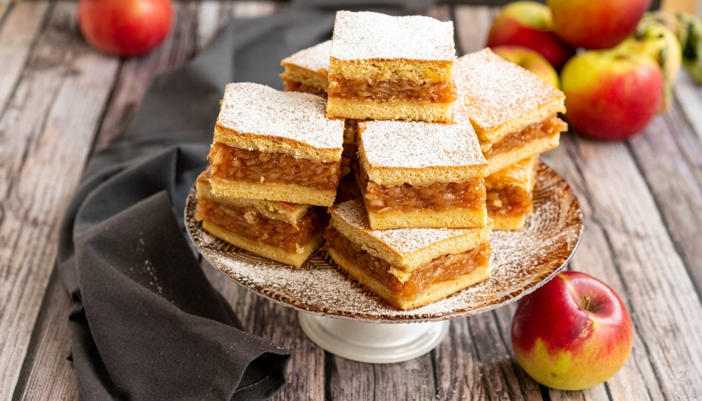

# Plăcintă cu mere

*The Romanian apple pastry: thin layers of stretched dough filled with grated apple, sugar, cinnamon, and breadcrumbs, baked until the top is shattering-crisp and the inside is soft sweet apple.*

**Serves:** 8

**Prep Time:** 45 minutes (plus 30 minutes rest)

**Cook Time:** 35 minutes

## Overview
Plăcintă is the broad Romanian word for any flat pastry, but plăcintă cu mere is the autumn favourite, the smell of every kitchen in Transylvania the day the apple harvest comes in. The dough is a thin elastic flour-and-water stretched almost to translucence (the Saxon and Hungarian influence shows here, this is essentially the strudel tradition), brushed with butter, sprinkled with breadcrumbs, and piled with grated tart apple tossed with sugar, cinnamon, and a little lemon. Folded into a long log or coiled into a snail, baked at high heat until the layers shatter and the apple inside has gone soft and dark. Eat warm, dusted with icing sugar, with a glass of cold milk.

## Ingredients

### For the dough
- 350 g strong white flour
- 200 ml warm water
- 2 tbsp sunflower oil
- 1 tbsp white wine vinegar
- 1 tsp salt
- More flour for dusting

### For the filling
- 1 kg tart apples (Bramley, Granny Smith), peeled and cored
- 100 g caster sugar (more for sweeter apples)
- 1 tbsp ground cinnamon
- Zest of 1 lemon
- 1 tbsp lemon juice
- 80 g fine dry breadcrumbs
- 50 g caster sugar (for the breadcrumb layer)

### For brushing and finishing
- 100 g unsalted butter, melted
- 2 tbsp icing sugar, for dusting

## Method

### Stage 1 - Make the dough
1. Whisk flour and salt in a bowl.
2. Combine warm water, oil, and vinegar in a jug.
3. Pour into the flour; mix and knead 10 minutes to a very smooth elastic dough.
4. Rub a film of oil over the surface; cover; rest 30 minutes (the dough must relax to stretch).

### Stage 2 - Prepare the filling
1. Grate the apples on a coarse grater into a bowl.
2. Toss with the 100 g sugar, cinnamon, lemon zest, and lemon juice.
3. Let stand 10 minutes; the apple will release juice.
4. Drain off the juice (or the pastry goes soggy).
5. In a small pan, toast the breadcrumbs in 30 g of the melted butter until pale gold; mix with the 50 g sugar.

### Stage 3 - Stretch the dough
1. Cover a large table with a clean tea towel; dust with flour.
2. Place the dough in the centre; flatten with a rolling pin to a large oval.
3. Slide your hands under the dough (knuckles down); stretch gently from the centre outward.
4. Keep walking around the table, stretching, until the dough is a thin transparent sheet about 1 m wide (you should see the pattern of the cloth through it).
5. Trim the thick edges with scissors.

### Stage 4 - Fill and roll
1. Brush the stretched dough with melted butter.
2. Sprinkle the buttered breadcrumb mix evenly over two thirds of the dough.
3. Spread the drained apple filling over the breadcrumbs in a long strip along one long edge.
4. Lift the tea towel from the apple side; let the dough roll itself up tight into a long log.
5. Tuck the ends under.

### Stage 5 - Bake
1. Heat the oven to 200°C (fan 180°C).
2. Lay the log on a baking tray lined with parchment (curl it into a U or coil it into a snail to fit).
3. Brush all over with the rest of the melted butter.
4. Bake 30 to 35 minutes until deep gold and crackling.

### Stage 6 - Finish
1. Cool 15 minutes on the tray.
2. Dust thickly with icing sugar.
3. Slice with a serrated knife.

## Notes
- **The stretch:** the secret. A thick dough gives a heavy pastry; thin and translucent gives the shatter.
- **Drain the apples:** wet filling gives wet pastry every time.
- **Buttered breadcrumbs:** absorb any juice that does seep, keep the layers crisp.
- **Vinegar in the dough:** relaxes the gluten and makes the stretch possible.
- **Warm, not hot:** the apple needs a few minutes to settle before slicing.

## Variations
- **Cherry plăcintă (cu vișine):** sour cherries with sugar, no breadcrumbs (drier fruit).
- **Pumpkin plăcintă (cu dovleac):** grated pumpkin with sugar and cinnamon, autumn.
- **Cheese plăcintă (cu brânză):** soft sweet cheese with raisins and sugar.
- **Cabbage plăcintă (cu varză):** savoury version with sautéed cabbage, no sugar.
- **Walnut plăcintă (cu nucă):** ground walnut, sugar, and rum.

## Serving
- Warm · with icing sugar · with a glass of cold milk · with a scoop of vanilla ice cream (modern) · with a small glass of plum țuică.

## Storage
- Best the day it is baked; keeps 2 days wrapped in foil at room temperature.
- Reheat at 160°C for 8 minutes to crisp the layers.
- Freezes baked: 2 months wrapped tight.
