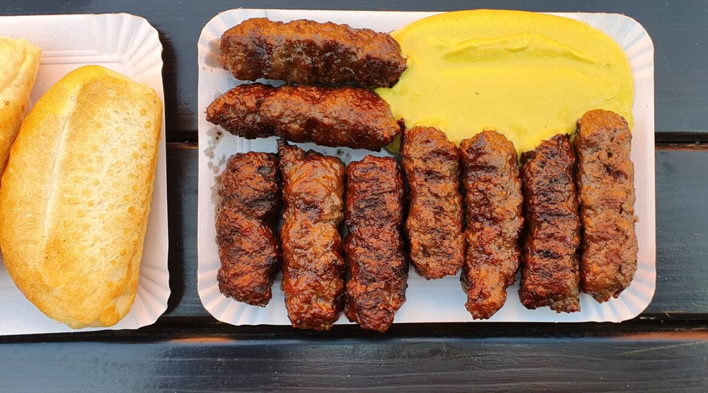

# Mici

*The Romanian grill standard: short skinless sausages of minced beef, garlic, and a pinch of bicarbonate, charred over coals and eaten with mustard, bread, and a cold beer.*

**Serves:** 4 (about 12 mici)

**Prep Time:** 30 minutes (plus 12 hours rest)

**Cook Time:** 10 minutes

## Overview
Mici (also called mititei, meaning "the little ones") are the country's most loved grill food, the smell of summer in any Romanian beer garden. The mix is beef and lamb (or beef and pork), worked with a clatter of garlic, black pepper, thyme, and a pinch of bicarbonate of soda that lifts the texture and gives the finished sausage its springy bite. Rested overnight to let the seasonings settle, the paste is squeezed into short fat fingers about 8 cm long and grilled hard over hot coals until the outsides are dark and the insides juicy. Eat with English mustard, a slab of country bread, and a cold lager. No skins, no fillers, no apologies.

## Ingredients

- 600 g minced beef (20% fat)
- 200 g minced lamb (or 200 g minced pork)
- 6 garlic cloves, mashed to a paste with 1 tsp salt
- 1 tsp bicarbonate of soda
- 2 tsp ground black pepper
- 1 tsp dried thyme
- 1/2 tsp ground allspice
- 1/2 tsp ground coriander
- 1 tsp salt (in addition to garlic salt)
- 100 ml cold beef stock (or water)

## Method

### Stage 1 - Make the paste
1. Put both meats into a wide bowl.
2. Add the mashed garlic paste, bicarbonate, pepper, thyme, allspice, coriander, and salt.
3. Knead hard with your hands for 8 to 10 minutes, gradually adding the cold stock a splash at a time.
4. The mix should turn from chunky to a tacky paste that holds its shape.

### Stage 2 - Rest
1. Cover and refrigerate at least 12 hours (24 is better).
2. The bicarbonate works on the meat in this time; do not skip the rest.

### Stage 3 - Shape
1. Wet your hands.
2. Take a heaped tablespoon of paste (about 70 g); roll into a short fat sausage about 8 cm long and 3 cm thick.
3. Lay on an oiled tray; repeat to make 12 mici.

### Stage 4 - Grill
1. Get a charcoal grill hot, or a heavy ridged pan smoking.
2. Lay the mici across the bars; grill 3 to 4 minutes per side, turning once.
3. The outsides should be dark and the insides cooked through but still juicy.

### Stage 5 - Serve
1. Pile on a board with English mustard, country bread, and pickles.
2. Eat with the fingers, washed down with cold lager.

## Notes
- **Bicarbonate:** Do not skip; it is what makes mici mici. A pinch only; too much tastes soapy.
- **The fat:** Lean mince gives dry mici; 20% fat in the beef is the minimum.
- **The rest:** Overnight in the fridge is non-negotiable; the texture sets up.
- **The squeeze test:** A handful of correctly-mixed paste should ribbon between your fingers when squeezed.
- **Grill or pan:** Coals give the proper smoke; a ripping-hot griddle pan is a good city substitute.

## Variations
- **Bucharest style:** beef and pork (no lamb), heavier on garlic.
- **Transylvanian:** add 1 tsp sweet paprika to the mix.
- **All-beef:** 100% beef shoulder, the modern restaurant cut.
- **Smaller mici (pufuleți):** 4 cm long, eaten as bar food.
- **With a smoked spice:** a quarter-teaspoon of smoked paprika gives a darker note.

## Serving
On a wooden board · with English mustard and country bread · with pickled chillies · with a cold Romanian lager (Ursus, Ciuc, Timișoreana) · at a backyard grill in summer.

## Storage
- Raw paste: refrigerate up to 48 hours; freezes 2 months.
- Cooked mici: refrigerate up to 3 days; reheat on a hot griddle.
- Do not microwave; the texture goes rubbery.
