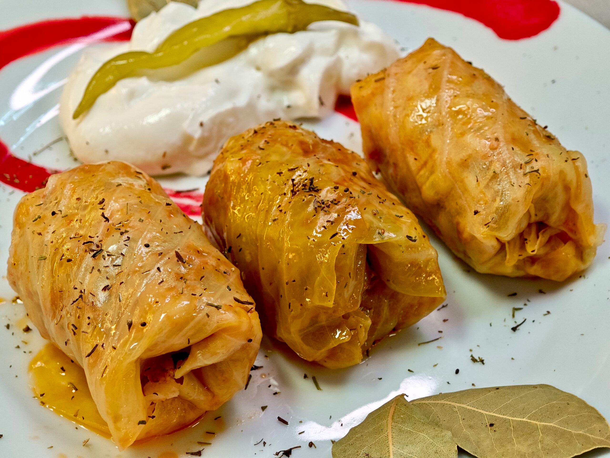

# Sarmale

*The Romanian national dish: pickled cabbage leaves wrapped around a pork-and-rice filling, layered with smoked bacon and slow-simmered for hours, the centrepiece of every Christmas and Easter table.*

**Serves:** 6 to 8

**Prep Time:** 60 minutes

**Cook Time:** 3 hours

## Overview
Sarmale are the soul of Romanian holiday cooking. A whole soured cabbage (varză murată, fermented for weeks in brine) is peeled leaf by leaf and each leaf wrapped around a fist of pork mince, rice, onion, and dill. The little parcels are packed shoulder to shoulder over a bed of smoked bacon and shredded sauerkraut, topped with tomato juice and bay, and pressed down to cook for three hours until the leaves are soft and the filling has drunk the smoke. Every Romanian grandmother makes them slightly differently (some add a little smoked ham hock, some a pinch of paprika), but the structure is fixed. Eat with mămăligă, sour cream, and a small green chilli on the side.

## Ingredients

### For the cabbage and pot
- 1 whole soured cabbage (about 1.5 kg drained weight), leaves separated
- 200 g shredded sauerkraut (from the same cabbage, the inner bits)
- 200 g smoked streaky bacon, in thick slices
- 2 bay leaves
- 6 black peppercorns
- 500 ml tomato juice (passata thinned with water)
- 500 ml water (approx, to cover)

### For the filling
- 800 g coarsely minced pork (20% fat)
- 100 g long-grain rice (uncooked, rinsed)
- 2 medium onions, finely chopped
- 2 tbsp sunflower oil
- 1 tbsp sweet paprika
- 1 tsp dried thyme
- 2 tbsp chopped fresh dill
- 1 tsp salt
- 1 tsp ground black pepper

## Method

### Stage 1 - Prepare the filling
1. Soften the chopped onion in the sunflower oil over medium heat for 8 minutes until pale and translucent.
2. Stir in the paprika; cook 30 seconds.
3. Tip the onion into a large bowl and let it cool 10 minutes.
4. Add the minced pork, rinsed rice, thyme, dill, salt, and pepper.
5. Mix with your hands until evenly combined.

### Stage 2 - Prepare the cabbage leaves
1. Rinse the soured cabbage leaves under cold water to remove excess salt.
2. Cut out the thick central rib from each leaf with a small knife.
3. Halve very large leaves; small leaves stay whole.
4. Pat the leaves dry on a tea towel.

### Stage 3 - Roll the sarmale
1. Place a leaf flat, rib-side down.
2. Place a heaped tablespoon of filling near the stem end.
3. Fold the stem end over the filling, fold the sides in, roll up tight into a cigar shape about 7 cm long.
4. Repeat with all leaves and filling (you should get 25 to 30 rolls).

### Stage 4 - Layer the pot
1. Line the base of a large heavy pot (4 L capacity) with half the smoked bacon slices.
2. Scatter half the shredded sauerkraut over the bacon.
3. Pack the sarmale in tight concentric circles, seam-side down.
4. Tuck the remaining bacon between the rolls.
5. Scatter the rest of the sauerkraut over the top.
6. Tuck in the bay leaves and peppercorns.
7. Pour over the tomato juice and enough water to just cover the rolls.
8. Set a heatproof plate on top to weigh them down.

### Stage 5 - Simmer
1. Bring to a gentle bubble over medium heat, then drop to the lowest simmer.
2. Cook covered for 2.5 to 3 hours; the leaves should be very tender and the rice fully cooked.
3. Uncover for the last 30 minutes to reduce the liquid.

### Stage 6 - Rest
1. Take off the heat; let the pot sit 20 minutes before serving (the flavour deepens as it stands).
2. Sarmale are even better the next day reheated.

## Notes
- **Sour cabbage:** Romanian shops sell it in vacuum bags or whole brined heads; sauerkraut leaves work but are usually too small.
- **Pork fat content:** Lean mince gives dry sarmale; 20% fat is the minimum.
- **Tomato top:** Some cooks add a thin layer of tomato puree on the very top to brown into a crust.
- **Pressure cooker:** 45 minutes at full pressure works for a midweek shortcut.
- **The leftovers test:** Sarmale are reheated for at least three days running and improve every time.

## Variations
- **Vine-leaf sarmale (sarmăluțe în foi de viță):** smaller rolls in brined vine leaves, summer version.
- **Moldavian:** add a handful of dried mushrooms to the filling.
- **Transylvanian:** add a layer of smoked ribs (afumătură) on top.
- **Lent version (de post):** mushrooms and rice in place of pork, no bacon, vegetable stock.
- **Olt valley:** a little chopped smoked sausage worked into the filling.

## Serving
Hot with mămăligă · a dollop of sour cream · a small green chilli on the side · a glass of țuică before the meal · slice of dark country bread.

## Storage
- Cover and refrigerate up to 5 days; flavour improves daily.
- Freezes well: 3 months in the cooking liquid.
- Reheat gently on the stove or in the oven at 150°C, do not microwave (the leaves toughen).
