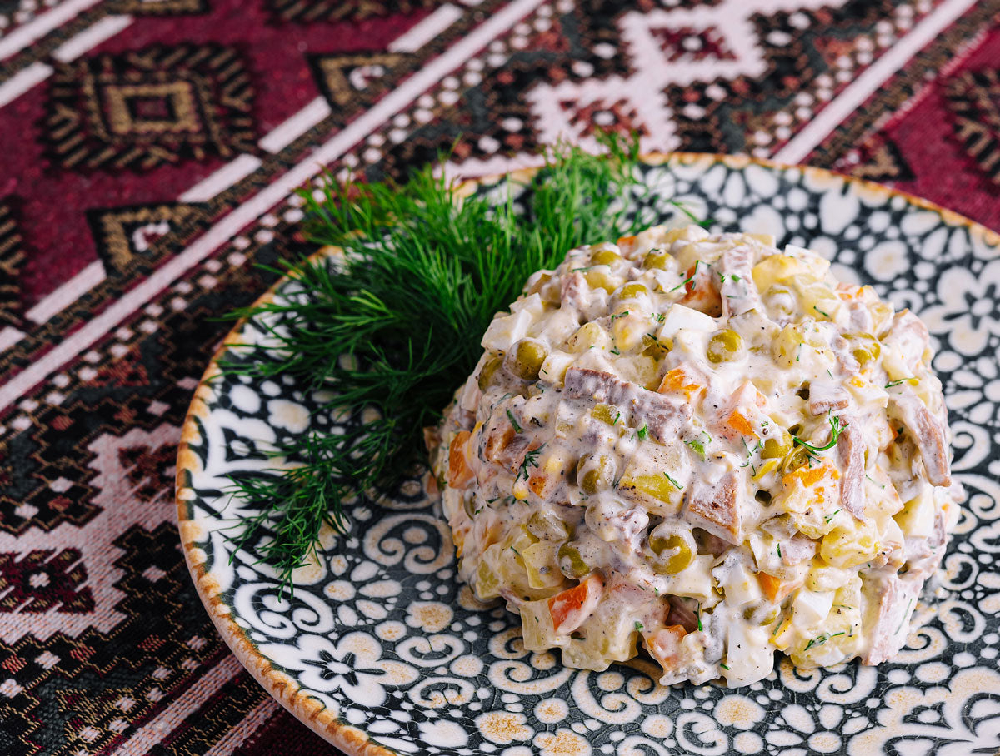

# Salată de boeuf

*Romania's holiday salad: finely diced boiled beef, potato, carrot, peas, and gherkin bound in mayonnaise and piped into a smooth dome, the cold centrepiece of every Christmas and Easter table.*

**Serves:** 8 to 10

**Prep Time:** 60 minutes

**Cook Time:** 1 hour

## Overview
Salată de boeuf is the Romanian relative of the Russian Olivier salad, brought west and made into a high-feast dish in its own right. The name comes from the French (boeuf, beef) and the dish was once a sign of bourgeois Bucharest, today it is on every grandmother's holiday table from Brașov to Constanța. Boiled beef and root vegetables are cut into a fine dice (the work is in the knife, not the shopping), bound with mayonnaise and a little mustard, packed onto a platter, smoothed into a dome, and decorated with strips of red pepper, olive, gherkin, and parsley into geometric patterns. Make a day ahead, the flavour settles overnight.

## Ingredients

### For the boiled base
- 500 g beef shin or chuck
- 3 medium potatoes
- 3 medium carrots
- 1 parsnip
- 1 small celeriac (or 2 sticks of celery)
- 1 bay leaf
- 1 tsp salt

### For the salad
- 300 g cooked peas (frozen, defrosted)
- 4 medium pickled gherkins, finely diced
- 2 tbsp capers, drained and chopped
- 3 hard-boiled eggs, finely chopped (optional)

### For the dressing
- 300 g mayonnaise (homemade is traditional)
- 2 tsp Dijon mustard
- 2 tbsp pickle brine
- 1 tsp salt
- 1 tsp ground black pepper

### To decorate
- 1 red pepper, in strips
- 8 black olives, halved
- 2 gherkins, sliced thin
- 2 tbsp chopped parsley
- 1 hard-boiled egg, sliced

## Method

### Stage 1 - Boil the meat and roots
1. Place the beef in a pot; cover with cold water; bring to a boil; skim.
2. Add bay leaf and salt; simmer 50 minutes.
3. Add potatoes, carrots, parsnip, and celeriac (whole, peeled).
4. Simmer 25 to 30 minutes until everything is tender (a knife slips in).
5. Lift everything out; cool completely (faster on a tray spread out).

### Stage 2 - Dice
1. Cut the cold beef, potatoes, carrots, parsnip, and celeriac into very small even cubes (4 to 5 mm).
2. The fine dice is the dish; rush it and the texture is wrong.
3. Tip all the dice into a large bowl.

### Stage 3 - Combine
1. Add the peas, gherkins, capers, and chopped boiled eggs (if using).
2. Whisk the mayonnaise, mustard, pickle brine, salt, and pepper.
3. Fold the dressing through until everything is bound but not drowning (hold back a quarter for finishing).

### Stage 4 - Mould
1. Pack the salad onto a large serving platter.
2. Smooth into a low dome with a palette knife.
3. Spread a thin layer of the held-back mayonnaise over the top to make a clean white surface.

### Stage 5 - Decorate
1. Lay strips of red pepper into a geometric pattern (lines, crosses, lattices).
2. Add olive halves, gherkin slices, and egg slices.
3. Scatter the chopped parsley at the edges.

### Stage 6 - Chill
1. Cover loosely and refrigerate at least 4 hours, ideally overnight.
2. Serve cold straight from the fridge.

## Notes
- **The dice:** practise the knife work; 4 to 5 mm is the target. Larger and the salad is clumsy.
- **Cool everything first:** dicing warm potato gives mush, not cubes.
- **Mayonnaise:** homemade with sunflower oil is correct; good shop-bought works.
- **Pickle brine:** the secret seasoning, sharpens the whole bowl.
- **A day ahead:** the flavour deepens overnight; the dish was made for it.

## Variations
- **Chicken instead of beef:** lighter, modern Bucharest version.
- **With apple:** a finely diced tart apple folded through, Transylvanian.
- **Without eggs:** lighter texture.
- **Lent version (de post):** mushrooms in place of meat, no egg, oil-and-mustard dressing.
- **With pickled red peppers diced through:** sweeter, brighter.

## Serving
- Cold, in a slice from the dome · with toasted country bread · alongside zacuscă and salată de vinete on the holiday cold table · with a glass of dry white wine.

## Storage
- Refrigerate up to 4 days; flavour deepens but the colour dulls.
- Decorations wilt after a day; re-trim before re-serving.
- Do not freeze; the mayonnaise splits.
