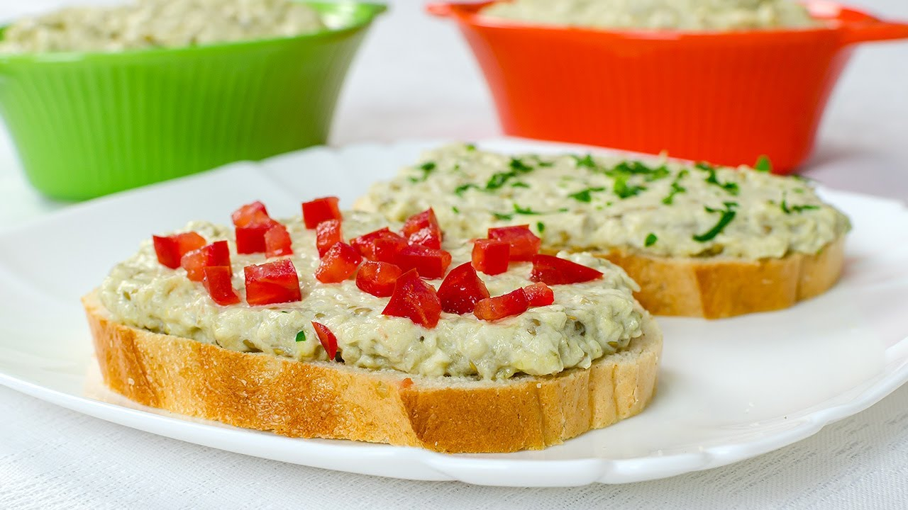

# Salată de vinete

*Romanian smoked aubergine spread: aubergines blackened over open flame, peeled, chopped with a wooden knife, and beaten with sunflower oil and onion into a creamy spread for warm bread.*

**Serves:** 4 to 6

**Prep Time:** 30 minutes

**Cook Time:** 30 minutes

## Overview
Every Romanian summer ends with sacks of aubergines roasting black over open grills, balconies smelling of smoke, and big jars of salată de vinete cooling in every fridge. The aubergines are charred whole until the skins are crisp and the flesh inside is collapsing and full of smoke, then drained, peeled, and chopped (always with a wooden knife on a wooden board, metal turns the flesh grey). The chopped flesh is beaten with sunflower oil and very finely chopped onion into a pale grey-green spread the texture of soft butter. Eat thick on a slice of warm country bread, topped with a slice of tomato and a pinch of salt. The smoke is the dish.

## Ingredients

- 1.5 kg aubergines (4 medium), as fresh and shiny as possible
- 1 small onion, very finely chopped (about 60 g)
- 100 to 150 ml sunflower oil (light, neutral)
- 1 tsp salt (or to taste)
- 1 tbsp lemon juice (optional)

### To serve
- Country bread
- 2 ripe tomatoes, sliced
- A pinch of flaky salt

## Method

### Stage 1 - Char the aubergines
1. Get a gas hob or a barbecue grill very hot.
2. Lay the whole aubergines directly over the flame (or on the bars of the grill).
3. Turn every 4 to 5 minutes until the skins are black and crisp on all sides and the flesh is collapsing (about 20 to 25 minutes).
4. The aubergines should feel light and hollow in the hand when done.

### Stage 2 - Drain and peel
1. Lay the charred aubergines on a board tilted into the sink (or onto a draining rack over a tray).
2. Slit each one lengthwise; let the bitter brown liquid run out for 15 minutes.
3. With your fingers (and a teaspoon), peel away the black skin completely; any flecks left will turn the spread grey.
4. Scoop the pale flesh onto a wooden board.

### Stage 3 - Chop
1. With a wooden knife (a flat wooden spatula or the edge of a wooden spoon) chop the flesh in long strokes.
2. Do not use a metal blade or a food processor; both bruise the flesh and dull the colour.
3. Continue until you have a coarse fluffy pulp.

### Stage 4 - Beat in the oil
1. Scrape the pulp into a wide bowl.
2. Add the chopped onion and a pinch of salt.
3. Pour the oil in a slow steady thread, beating constantly with a wooden spoon or fork.
4. The mix lightens and turns pale grey-green, the texture of soft whipped butter.
5. Stop adding oil when the spread holds together but is still light (you may not need all of it).
6. Stir in the lemon juice if using; check the salt.

### Stage 5 - Serve
1. Mound on a flat plate; drag a fork over the top to ridge.
2. Top with a slice of tomato and a pinch of flaky salt.
3. Eat with warm country bread.

## Notes
- **The char:** open flame is the only way to get the smoke. An oven roast gives no smoke and the dish is not the same.
- **Wooden knife:** non-negotiable for the proper texture and colour.
- **Drain well:** undrained aubergines give a bitter wet spread.
- **Onion ratio:** less is more; the onion should not dominate.
- **Make a day ahead:** the flavour settles, the colour deepens.

## Variations
- **With mayonnaise:** a Bucharest restaurant style, lighter and paler (1 tbsp mayo folded in).
- **With finely chopped roast red pepper:** brighter, sweeter version.
- **With a splash of vinegar instead of lemon:** sharper Moldavian style.
- **With garlic:** a small clove crushed in, country version.
- **Bell pepper salad (salată de ardei copți):** same method with charred red peppers in place of aubergine.

## Serving
- On warm country bread · with a slice of tomato and salt · alongside other cold mezze (zacuscă, salată de boeuf) · with a glass of cold white wine.

## Storage
- Refrigerate up to 4 days in a sealed jar.
- A thin film of oil on top keeps the surface from darkening.
- Do not freeze; the texture goes watery.
