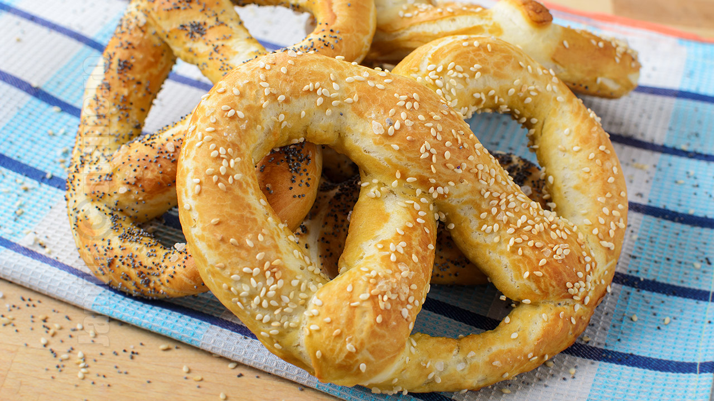

# Covrigi

*Romanian street pretzels: soft-but-chewy knots of yeasted dough boiled briefly in baking-soda water and baked with a heavy crust of poppy or sesame seeds, sold hot from kiosks all over Bucharest.*

**Serves:** 8 covrigi

**Prep Time:** 30 minutes (plus 90 minutes rising)

**Cook Time:** 18 minutes

## Overview
Covrigi are the everyday Romanian pretzel, sold from glass kiosks on every street corner in Bucharest, Brașov, and Cluj, eaten hot in the hand walking to the metro. The dough is plain yeasted bread, hand-rolled into long thin ropes, twisted into the classic figure-eight knot, dipped briefly in a bath of bicarbonate-of-soda water (the trick that gives every pretzel its mahogany crust and chewy bite), and baked at high heat under a heavy coat of poppy seeds, sesame, or coarse salt. The fresh covrig is soft inside and salty-crisp outside; the day-old covrig is sold cheaper at half the price and eaten dunked in coffee. The Buzău covrigi are the famous regional ones, larger, plainer, with the bite to last a long walk.

## Ingredients

### For the dough
- 500 g strong white flour (12% protein)
- 300 ml warm water (35°C)
- 7 g instant yeast
- 1 tbsp caster sugar
- 1 tbsp sunflower oil
- 1.5 tsp salt

### For the baking-soda bath
- 1.5 L water
- 3 tbsp bicarbonate of soda

### For topping
- 2 tbsp poppy seeds
- 2 tbsp sesame seeds
- 1 tbsp coarse sea salt
- 1 egg, beaten with 1 tbsp water (for glaze)

## Method

### Stage 1 - Mix the dough
1. Whisk flour, yeast, sugar, and salt in a large bowl.
2. Combine warm water and oil in a jug.
3. Pour into the flour; mix to a shaggy dough.
4. Turn onto a lightly floured surface; knead 10 minutes to a smooth elastic dough.
5. Place in an oiled bowl; cover; rise 60 minutes until doubled.

### Stage 2 - Shape
1. Knock back the dough; turn out; divide into 8 equal pieces (about 100 g each).
2. Roll each piece into a long rope about 45 cm long, slightly thicker in the middle, thinner at the ends.
3. Form into the classic pretzel knot: U-shape; cross the two ends; twist once; bring the ends down and press onto the bottom of the U.
4. Lay the shaped covrigi on a tray lined with parchment.
5. Cover loosely; rest 25 minutes.

### Stage 3 - Heat the oven and prepare the bath
1. Heat the oven to 210°C (fan 190°C).
2. Bring the water to the boil in a wide pan; stir in the bicarbonate of soda (it will fizz).
3. Drop the heat so the water is at a gentle simmer.

### Stage 4 - Bath the covrigi
1. Working two at a time, lower the covrigi into the bath with a slotted spoon.
2. Boil 20 to 30 seconds per side, turning once.
3. Lift out; drain briefly; return to the lined tray.

### Stage 5 - Top and bake
1. Brush each covrig with the egg glaze.
2. Sprinkle generously with poppy seeds, sesame seeds, or coarse salt (mix and match).
3. Score a shallow slash across the thickest part of the U.
4. Bake 15 to 18 minutes until deep mahogany and shining.

### Stage 6 - Cool briefly and eat
1. Cool on a rack 5 minutes.
2. Eat warm; the soft inside is the pleasure.

## Notes
- **Bicarbonate bath:** the alkaline bath is what makes a pretzel a pretzel; without it, you get plain bread.
- **The shape:** practise the figure-eight; the second twist gives the proper knot.
- **Rope length:** longer thinner ropes give thinner more chewy covrigi; shorter thicker ropes give softer Bucharest-style.
- **Score the slash:** opens up to show the pale crumb against the dark crust.
- **Toppings:** poppy is the most traditional in Bucharest, salt is the salty Buzău style.

## Variations
- **Sweet covrigi (cu mac dulce):** add 2 tbsp sugar to the dough, top with poppy seed paste.
- **Garlic covrigi:** rub with cut garlic and brush with butter after baking.
- **With cumin:** scatter cumin seeds among the toppings, country style.
- **Smaller covrigei:** half-size, party canapé.
- **Lye bath (proper Bavarian crust):** 4% food-grade lye in place of bicarbonate, deeper colour and flavour (handle lye with gloves and care).

## Serving
- Hot in the hand · from a paper bag · with strong sweet coffee · alongside a glass of milk · as a road-trip snack out of the kiosk.

## Storage
- Eat the day they are baked; the crust softens overnight.
- Refresh stale covrigi in the oven at 180°C for 5 minutes.
- Freeze baked, wrapped tight: 2 months; re-crisp in the oven.
