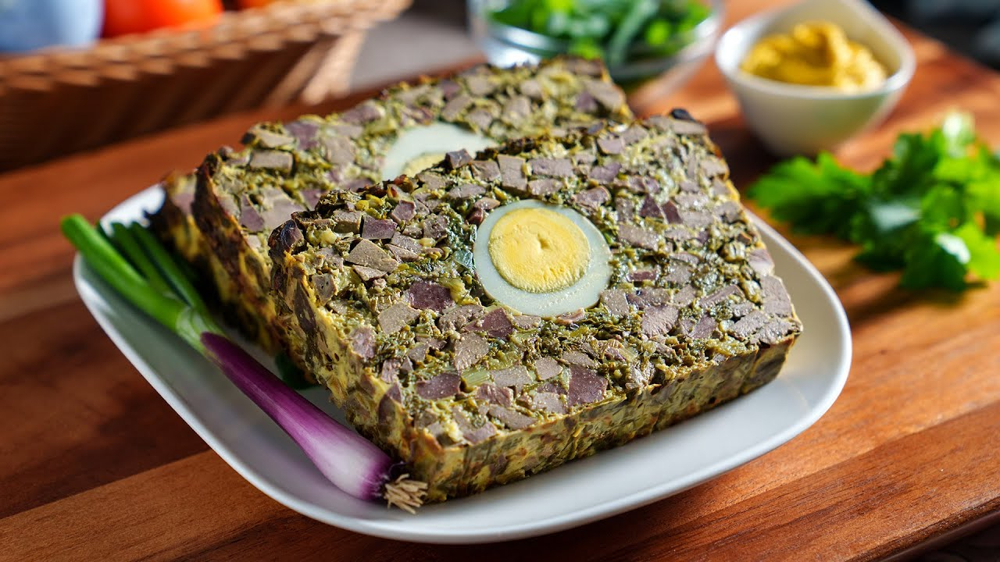

# Drob de miel

*The Romanian Easter terrine: minced lamb offal mixed with spring herbs and eggs, baked inside a wrap of caul fat or cabbage leaves, sliced cold for the Easter table.*

**Serves:** 8 (one terrine)

**Prep Time:** 45 minutes

**Cook Time:** 1 hour 15 minutes

## Overview
Drob de miel is the Romanian answer to Easter, the dish every grandmother makes on Holy Saturday from the offal of the lamb that will be roasted whole on Sunday. The heart, liver, lungs, and a portion of the shoulder meat are chopped fine, mixed with masses of green spring herbs (dill, parsley, green garlic, spring onion), bound with bread soaked in milk and beaten eggs, and pressed into a loaf shape with hard-boiled eggs hidden lengthwise inside. The whole thing is wrapped in caul fat (prapore) or large blanched cabbage leaves, baked slowly until just set, and cooled. Sliced cold, the cross-section shows the dark forcemeat shot with green herbs and the bright yellow rings of the hidden eggs. Eat cold with horseradish and country bread on Easter morning.

## Ingredients

### For the forcemeat
- 300 g lamb liver
- 200 g lamb heart
- 100 g lamb lung (or 100 g extra liver if not available)
- 200 g lamb shoulder, trimmed
- 2 medium onions, finely chopped
- 3 tbsp sunflower oil
- 100 g day-old white bread, crust off
- 150 ml whole milk
- 3 raw eggs (in addition to the boiled ones below)
- 4 tbsp finely chopped fresh dill
- 4 tbsp finely chopped flat-leaf parsley
- 3 tbsp finely chopped spring onion (green parts)
- 2 stalks of green garlic (or 3 garlic cloves), finely chopped
- 2 tsp salt
- 1 tsp ground black pepper
- 1/2 tsp ground allspice

### For wrapping and assembly
- 250 g lamb caul fat (prapore), soaked in warm water 10 minutes; or 6 large blanched cabbage leaves with ribs trimmed
- 4 hard-boiled eggs, peeled (kept whole)
- 1 tbsp butter, soft, for the tin

## Method

### Stage 1 - Blanch the offal
1. Place liver, heart, lung, and shoulder in a pot; cover with cold water; bring to a boil.
2. Drain; rinse under cold water (removes the strong first taste).
3. Return to a clean pot of fresh water; simmer 25 minutes until tender.
4. Lift out; cool 15 minutes.

### Stage 2 - Mince
1. Cut the cooked offal and shoulder into chunks.
2. Mince through a coarse plate (or pulse in a food processor; do not puree).
3. Tip into a wide bowl.

### Stage 3 - Combine
1. Soften the onion in the sunflower oil 6 minutes; cool.
2. Soak the bread in the milk 5 minutes; squeeze out excess; crumble into the bowl.
3. Add the softened onion, the herbs, salt, pepper, and allspice.
4. Beat the 3 raw eggs lightly; stir in.
5. Mix everything thoroughly with your hands (the bread binds the loaf).

### Stage 4 - Wrap and assemble
1. Heat the oven to 170°C (fan 150°C).
2. Butter a loaf tin (about 25 x 11 cm).
3. Spread the caul fat (or overlapping cabbage leaves) in the tin, letting the edges hang over.
4. Press half the forcemeat into the lined tin.
5. Lay the 4 hard-boiled eggs in a single row along the centre, end to end.
6. Top with the rest of the forcemeat, pressing in to seal the eggs.
7. Fold the overhanging caul or cabbage over the top to wrap completely.

### Stage 5 - Bake
1. Cover loosely with foil.
2. Bake 45 minutes covered, then 20 minutes uncovered to brown the top.
3. The drob is done when the internal temperature is 75°C and the juices run clear.

### Stage 6 - Cool
1. Cool in the tin 30 minutes.
2. Lift out; cool completely on a rack.
3. Wrap and refrigerate at least 4 hours, ideally overnight (the slice firms up).

## Notes
- **Sourcing offal:** a real butcher will sell lamb offal in spring; supermarkets rarely stock it.
- **Cabbage wrap:** if caul is hard to find, large blanched cabbage leaves work and give a different texture.
- **The slice test:** cold drob slices cleanly through the eggs; warm drob falls apart.
- **Herb-heavy:** do not skimp on the dill and parsley, they are the spring in the dish.
- **Make a day ahead:** the flavour and the slice both improve overnight.

## Variations
- **All-liver version:** liver only, smoother and richer.
- **With pine nuts:** 50 g pine nuts folded through for a Balkan touch.
- **Country herbs:** add lovage (leuștean) and tarragon for an Olt valley version.
- **Mini drob:** baked in muffin tins for canapés.
- **Saxon Transylvanian:** with a teaspoon of caraway in place of allspice.

## Serving
- Cold, sliced thin · with horseradish cream or English mustard · with country bread · on the Easter cold-meats table · with a glass of dry red wine.

## Storage
- Refrigerate up to 5 days; flavour deepens.
- Freezes 2 months wrapped tight; defrost in fridge overnight.
- Do not microwave; eat cold or at room temperature.
