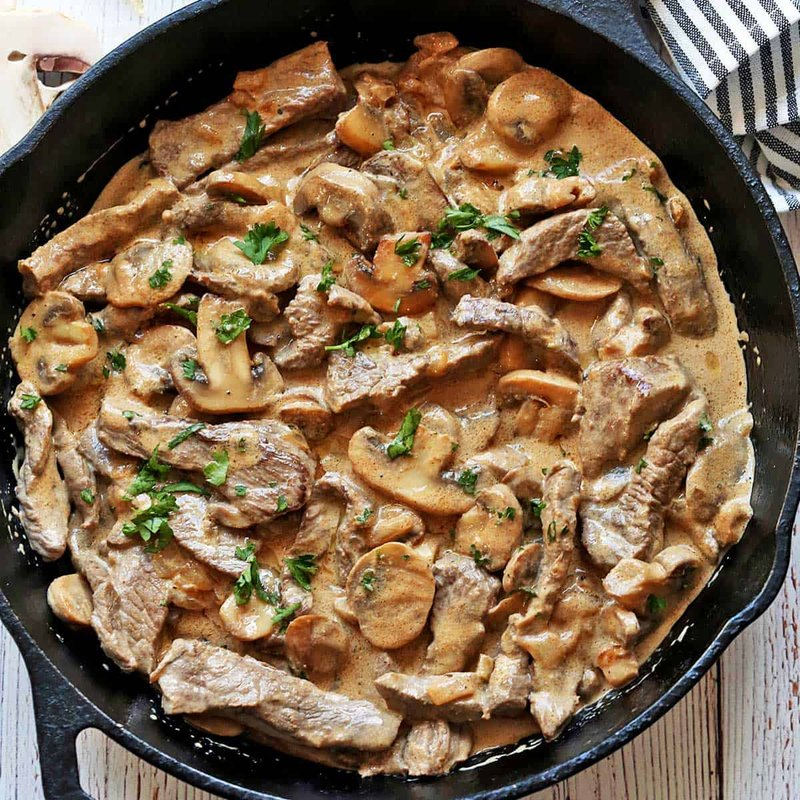

# Beef Stroganoff

*Russian dish of beef strips in a mustard-soured-cream sauce with mushrooms and onions. Quick to cook, deeply savoury, served over buttered egg noodles or rice. Originally a 19th-century court dish; now international comfort food.*

**Serves:** 4

**Prep Time:** 15 minutes

**Cook Time:** 25 minutes

## Overview
Beef stroganoff started life as a 19th-century Russian court dish and somehow became the international comfort dinner of every cold-weather Tuesday, strips of seared beef in a mustard-and-soured-cream sauce with mushrooms and onions, spooned over buttered egg noodles. The whole technique is about timing: the beef cooks for sixty seconds total and no more, or it tightens into shoe leather. Slice fillet or sirloin into thin strips against the grain (perpendicular to the muscle fibres so each piece stays tender), toss in flour with salt and pepper, then sear in batches in a screaming-hot pan with butter and oil till just brown on the outside, lifting onto a plate before the centre cooks through. In the same pan, soften an onion for five minutes, add sliced chestnut mushrooms and cook till golden and any liquid has evaporated, then deglaze with brandy or white wine and let it bubble away. Pour in beef stock and reduce by half, stir in Dijon mustard, then take the pan off the heat before stirring in the soured cream (boiling splits it, so keep things gentle). Return the beef and any resting juices, warm through for thirty seconds, finish with parsley and a small squeeze of lemon. Spoon over buttered egg noodles or fluffy rice, scatter more parsley, eat hot.

## Ingredients

- 600 g beef fillet (or sirloin, cut into 1 cm strips against the grain)
- 2 tablespoons plain flour
- salt
- pepper
- 30 g unsalted butter (split)
- 2 tablespoons vegetable oil
- 1 onion (finely sliced)
- 300 g chestnut mushrooms (sliced)
- 50 ml brandy (or dry white wine)
- 250 ml beef stock
- 1 tablespoon Dijon mustard
- 200 ml soured cream
- A small bunch of flat-leaf parsley (chopped)
- Lemon juice, to finish

### To serve
- 400 g egg noodles (or 250 g long-grain rice, cooked)

## Method

### Stage 1 - Sear the beef
1. Toss the beef strips with the flour, salt and pepper.
1. Heat half the butter and the oil in a wide heavy pan over high heat until smoking.
1. Sear the beef in batches for 1 minute, just to brown the outside; lift onto a plate. Don't crowd or it'll steam.

### Stage 2 - Onion and mushrooms
1. Add the remaining butter to the pan.
1. Cook the onion 5 minutes until soft.
1. Add the mushrooms; cook 6-7 minutes until any liquid has evaporated and they're golden.

### Stage 3 - Sauce
1. Pour in the brandy; let it bubble away for 30 seconds (flame off if you wish).
1. Add the stock; reduce by half.
1. Stir in the mustard.
1. Take off the heat; stir in the soured cream.
1. Return to gentle heat; warm through without boiling.

### Stage 4 - Combine
1. Return the beef and any juices on the plate; stir through gently.
1. Heat for 30 seconds, just to warm - don't cook the beef further.
1. Stir in most of the parsley; squeeze in a little lemon juice.
1. Taste; season.

### Stage 5 - Serve
1. Spoon over buttered noodles or rice.
1. Scatter remaining parsley.

## Notes
- **Slice against the grain:** Long strips of fillet stay tender when cut perpendicular to the muscle fibres.
- **Don't boil the cream:** Soured cream splits on hard heat. Keep gentle.
- **Brief beef return:** It only needs to warm through. Keep cooking and you turn fillet into shoe leather.

## Storage
- Best fresh. Keeps 1 day refrigerated; reheat very gently. Doesn't freeze well (the cream sauce splits).
